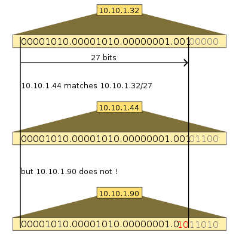

# Introduction

# VPC

https://worlf.tistory.com/34

# Subnet

# Routing Table

  https://yoo11052.tistory.com/40

https://tommypagy.tistory.com/106

# Internet Gateway(IGW)

# NAT

# Security Group

https://perfectacle.github.io/2018/08/30/aws-security-group-reference-another-security-group/

# 용어 사전

## CIDR

> Classless Inter-Domain Routing, 사이더

CIDR는 기본적으로 비트단위, 접두어기반의 IP 주소 표준 분석방식이다. 이는 일련의 주소를 무리 지어 하나의 [라우팅 테이블](https://ko.wikipedia.org/wiki/라우팅_테이블) 항목에 넣는 것으로 [라우팅](https://ko.wikipedia.org/wiki/라우팅)을 실행한다

# 기타

- 5000만건 이상의 row를 가지고 있는 테이블에 대해 Index 생성을 시도한 이후, Read Replica들의 복제 지연 및 IOPS 문제가 발생한 이유

AWS RDS Cluster에서 Primary에 Index를 생성하는 경우, 생성이 완료된 이후 각 Read Replica에서 해당 명령어가 실행되는 형태로 작동되므로 테이블 사이즈에 따라서 IOPS가 치솟을 수 있다. Binlog를 읽거나 완성된 Index 데이터를 가져가는 형태로 동작하는 것이 아니다.

