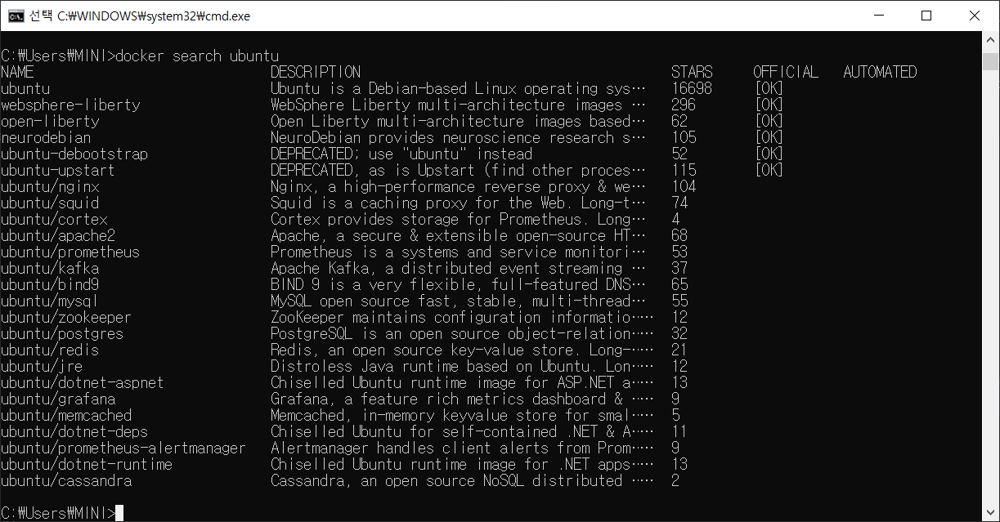
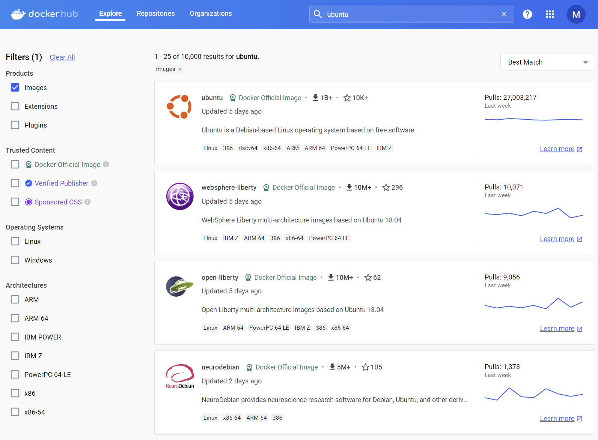
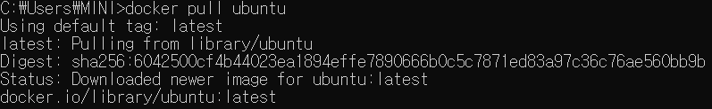
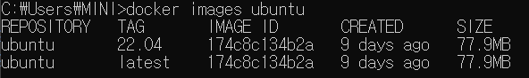
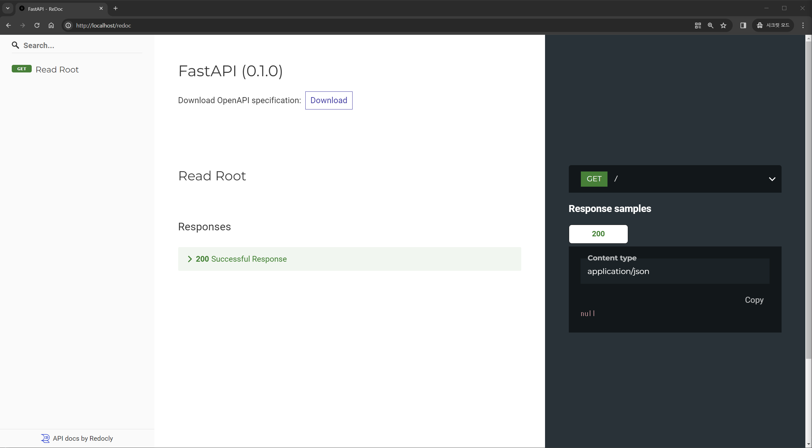
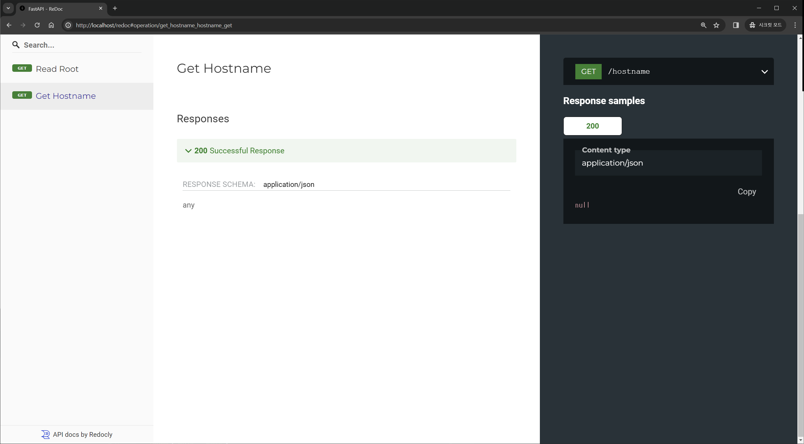
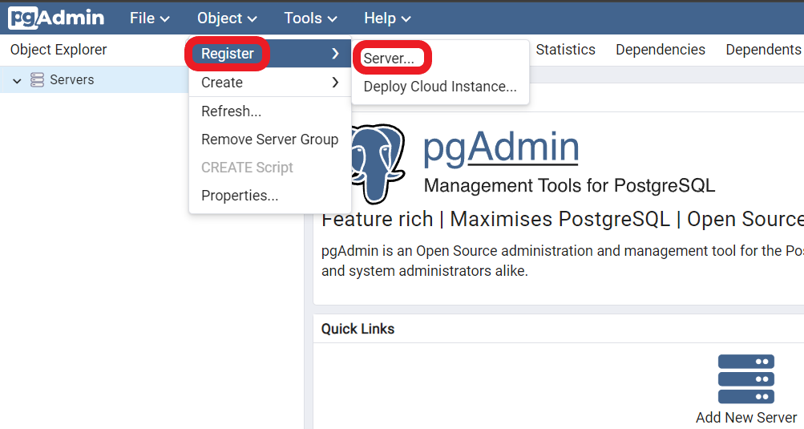
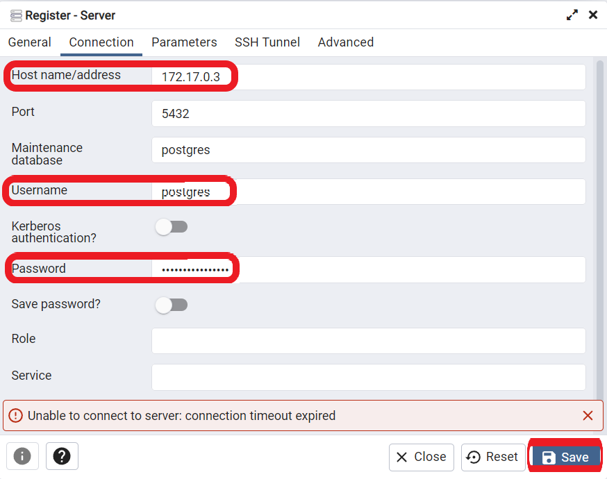
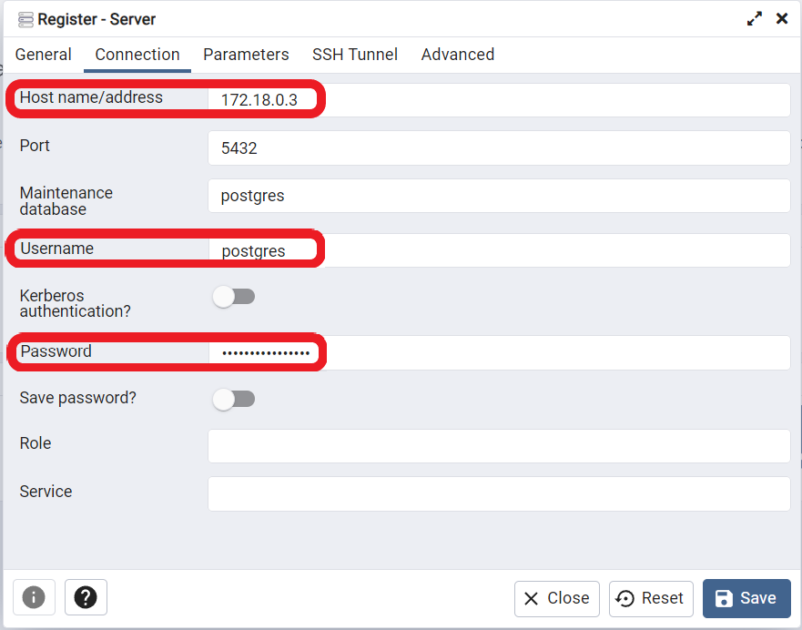
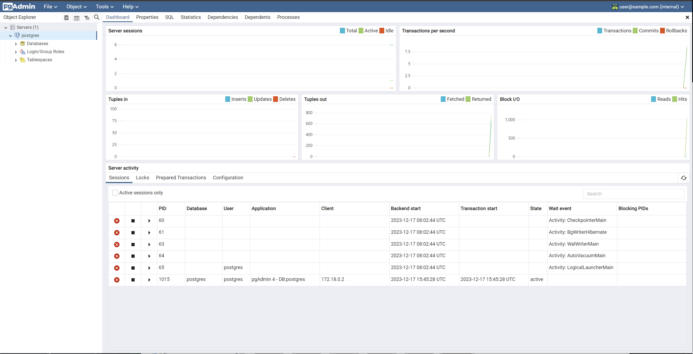

---

실습환경

AWS (By Terraform)

-> EC2 (Docker & Docker Compose)

-> EKS (Kubernetes)

---


# 0. 시작하기 전에

일부 실습은 AWS 환경에서 진행되며 `Terraform`을 통해서 전개할 예정입니다. 

자세한 세팅방법은 `Appendix`를 참조해주세요.


## Docker 설치하기

### Windows

> 다운로드 [링크](https://desktop.docker.com/win/main/amd64/Docker%20Desktop%20Installer.exe)

Docker Desktop을 설치합니다. 


### Ubuntu

```shell
sudo apt-get update
sudo apt-get install docker.io
sudo ln -sf /usr/bin/docker.io /usr/local/bin/docker

# 권한 변경 
sudo chmod 666 /var/run/docker.sock
```


# 1. Docker

## 1.1. Docker 이미지 관리

### 이미지 검색

> https://docs.docker.com/engine/reference/commandline/search/

```shell
docker search [OPTIONS] <Keyword>
```


다음은 `ubuntu` 이미지를 검색한 결과입니다. 




CLI 대신 Web에서도 사용할 이미지를 검색할 수 있습니다. 

> https://hub.docker.com/




### 이미지 다운로드

> https://docs.docker.com/engine/reference/commandline/pull/

```shell
# Default - Download the `latest` tag
docker pull <IMAGE_NAME>

# By Tag
docker pull <IMAGE_NAME>:<TAG>

# By digest
docker pull <IMAGE_NAME>@<DIGEST>
```


**Option 목록**

| Option                    | Short | Default | Description                                      |
| ------------------------- | ----- | ------- | ------------------------------------------------ |
| `--all-tags`              | `-a`  |         | Download all tagged images in the repository     |
| `--disable-content-trust` |       | `true`  | Skip image verification                          |
| `--platform`              |       |         | Set platform if server is multi-platform capable |
| `--quiet`                 | `-q`  |         | Suppress verbose output                          |


`Tag` 또는 `Digest`를 사용하지 않는 경우 기본적으로 `latest` 이미지를 다운로드 받습니다. 




**주의사항**

- 동일한 `Tag`를 가진 이미지가 존재하는 경우, 이미지를 교체하지 않습니다.
- 동일한 이미지더라도 `Tag`가 다른 경우 이미지가 추가됩니다. 


### 이미지 목록 보기

> https://docs.docker.com/engine/reference/commandline/images/

```shell
docker images [OPTIONS] [REPOSITORY[:TAG]]

# Alias
docker image list
docker image ls
```


`Repository`를 명시한 경우, 해당 이름을 가진 이미지만 검색합니다. 




### 이미지 삭제하기

> https://docs.docker.com/engine/reference/commandline/rmi/

`docker rmi`는 한 개 이상의 명시된 이미지들을 삭제하는 명령입니다. 

```shell
docker rmi [OPTIONS] IMAGE [IMAGE...]

# Alias
docker image rm

```

**주요 Options**

| Option       | Short | Default | Description                               |
| ------------ | ----- | ------- | ----------------------------------------- |
| `--force`    | `-f`  |         | 컨테이너가 존재할 경우 강제로 삭제합니다. |
| `--no-prune` |       |         | Do not delete untagged parents            |


> https://docs.docker.com/engine/reference/commandline/image_prune/

`volume prune`은 사용하지 않는 모든 볼륨을 삭제하는 명령어 입니다.

```sh
# Remove the dangling or unused images
docker image prune
docker image prune --all
```

**주요 Options**

| Option     | Short | Default | Description                                      |
| ---------- | ----- | ------- | ------------------------------------------------ |
| `--all`    | `-a`  |         | Remove all unused images, not just dangling ones |
| `--filter` |       |         | Provide filter values (e.g. `until=<timestamp>`) |
| `--force`  | `-f`  |         | Do not prompt for confirmation                   |


### 이미지 정보 조회

```shell
docker inspect [OPTIONS] <IMAGE_NAME_OR_ID> [<IMAGE_NAME_OR_ID>...]
```


다음은 `ubuntu:22.04`의 이미지 정보입니다. 

```cmd
$ docker inspect ubuntu:22.04
[
    {
        "Id": "sha256:174c8c134b2a94b5bb0b37d9a2b6ba0663d82d23ebf62bd51f74a2fd457333da",
        "RepoTags": [
            "ubuntu:22.04",
            "ubuntu:latest"
        ],
        "RepoDigests": [
            "ubuntu@sha256:6042500cf4b44023ea1894effe7890666b0c5c7871ed83a97c36c76ae560bb9b"
        ],
        "Parent": "",
        "Comment": "",
        "Created": "2023-12-12T11:38:59.637410824Z",
        "Container": "24376bd380dd052e15c3e218153b3ba996b290ab24a579085cb3dd4d4b44e5ad",
        "ContainerConfig": {
            "Hostname": "24376bd380dd",
            "Domainname": "",
            "User": "",
            "AttachStdin": false,
            "AttachStdout": false,
            "AttachStderr": false,
            "Tty": false,
            "OpenStdin": false,
            "StdinOnce": false,
            "Env": [
                "PATH=/usr/local/sbin:/usr/local/bin:/usr/sbin:/usr/bin:/sbin:/bin"
            ],
            "Cmd": [
                "/bin/sh",
                "-c",
                "#(nop) ",
                "CMD [\"/bin/bash\"]"
            ],
            "Image": "sha256:76cebcaf36a483db6a1f4eeebafda25bcfd25839a3c97101aa578d3120a8b0f8",
            "Volumes": null,
            "WorkingDir": "",
            "Entrypoint": null,
            "OnBuild": null,
            "Labels": {
                "org.opencontainers.image.ref.name": "ubuntu",
                "org.opencontainers.image.version": "22.04"
            }
        },
        "DockerVersion": "20.10.21",
        "Author": "",
        "Config": {
            "Hostname": "",
            "Domainname": "",
            "User": "",
            "AttachStdin": false,
            "AttachStdout": false,
            "AttachStderr": false,
            "Tty": false,
            "OpenStdin": false,
            "StdinOnce": false,
            "Env": [
                "PATH=/usr/local/sbin:/usr/local/bin:/usr/sbin:/usr/bin:/sbin:/bin"
            ],
            "Cmd": [
                "/bin/bash"
            ],
            "Image": "sha256:76cebcaf36a483db6a1f4eeebafda25bcfd25839a3c97101aa578d3120a8b0f8",
            "Volumes": null,
            "WorkingDir": "",
            "Entrypoint": null,
            "OnBuild": null,
            "Labels": {
                "org.opencontainers.image.ref.name": "ubuntu",
                "org.opencontainers.image.version": "22.04"
            }
        },
        "Architecture": "amd64",
        "Os": "linux",
        "Size": 77850032,
        "VirtualSize": 77850032,
        "GraphDriver": {
            "Data": {
                "MergedDir": "/var/lib/docker/overlay2/08fca0476137c27031e67bdadf559dd8e4d5e5fcebeec0c5e0534024e880c322/merged",
                "UpperDir": "/var/lib/docker/overlay2/08fca0476137c27031e67bdadf559dd8e4d5e5fcebeec0c5e0534024e880c322/diff",
                "WorkDir": "/var/lib/docker/overlay2/08fca0476137c27031e67bdadf559dd8e4d5e5fcebeec0c5e0534024e880c322/work"
            },
            "Name": "overlay2"
        },
        "RootFS": {
            "Type": "layers",
            "Layers": [
                "sha256:a1360aae5271bbbf575b4057cb4158dbdfbcae76698189b55fb1039bc0207400"
            ]
        },
        "Metadata": {
            "LastTagTime": "0001-01-01T00:00:00Z"
        }
    }
]
```


---

### 연습 문제

#### ARM용 Ubuntu 다운로드하기

> 조건
>
> - Tag: `22.04`
> - platform: `linux/arm`


```cmd
$ docker pull ubuntu:22.04 --platform linux/arm
```


#### PostgreSQL 이미지의 Layer 갯수 확인하기

> 조건
>
> - digest: `sha256:a2282ad0db623c27f03bab803975c9e3942a24e974f07142d5d69b6b8eaaf9e2`

이미지 다운로드하기

```cmd
$ docker pull postgres@sha256:a2282ad0db623c27f03bab803975c9e3942a24e974f07142d5d69b6b8eaaf9e2
```


```cmd
$ docker images postgres
REPOSITORY   TAG             IMAGE ID       CREATED        SIZE
postgres     <none>          391a00ec7cac   13 days ago    425MB
```


```cmd
$ docker inspect 391a00ec7cac
...
# filter
$ docker inspect 391a00ec7cac -f "{{range $v := .RootFS.Layers}}{{println $v}}{{end}}"
```


---

## 1.2. Docker 컨테이너 관리

### 컨테이너 실행하기

> https://docs.docker.com/engine/reference/commandline/run/

```shell
docker run [OPTIONS] IMAGE [COMMAND] [ARG...]
```


**주요 Options**

| Option          | Short | Default | Description                                        |
| --------------- | ----- | ------- | -------------------------------------------------- |
| `--name`        |       |         | Assign a name to the container                     |
| `--add-host`    |       |         | Add a custom host-to-IP mapping (host:ip)          |
| `--detach`      | `-d`  |         | Run container in background and print container ID |
| `--env`         | `-e`  |         | Set environment variables                          |
| `--env-file`    |       |         | Read in a file of environment variables            |
| `--expose`      |       |         | Expose a port or a range of ports                  |
| `--publish`     | `-p`  |         | Publish a container's port(s) to the host          |
| `--rm`          |       |         | Automatically remove the container when it exits   |
| `--interactive` | `-i`  |         | Keep STDIN open even if not attached               |
| `-tty`          | `-t`  |         | Allocate a pseudo-TTY                              |
| `--volume`      | `-v`  |         | Bind mount a volume                                |


**주의사항** #TODO

- `platform` 의미
- `command` 의미


#### [Publish or expose port (-p, --expose)](https://docs.docker.com/engine/reference/commandline/run/#publish)

```console
$ docker run -p 127.0.0.1:80:8080/tcp ubuntu bash
```

This binds port `8080` of the container to TCP port `80` on `127.0.0.1` of the host machine. You can also specify `udp` and `sctp` ports. The [Docker User Guide](https://docs.docker.com/network/links/) explains in detail how to use ports in Docker.

Note that ports which are not bound to the host (i.e., `-p 80:80` instead of `-p 127.0.0.1:80:80`) are externally accessible. This also applies if you configured UFW to block this specific port, as Docker manages its own iptables rules. [Read more](https://docs.docker.com/network/iptables/)


#### [예제] `Ubuntu`에서 명령어 실행하기

```cmd
$ docker run ubuntu:22.04 /bin/bash -c "whoami && date"
root
Sun Dec 17 07:06:20 UTC 2023
```


#### [예제] `nginx` 실행하기

```cmd
$ docker run -d -p 80:80 nginx:latest

# Result
$ CURL localhost:80
<!DOCTYPE html>
<html>
<head>
<title>Welcome to nginx!</title>
<style>
html { color-scheme: light dark; }
body { width: 35em; margin: 0 auto;
font-family: Tahoma, Verdana, Arial, sans-serif; }
</style>
</head>
<body>
<h1>Welcome to nginx!</h1>
<p>If you see this page, the nginx web server is successfully installed and
working. Further configuration is required.</p>

<p>For online documentation and support please refer to
<a href="http://nginx.org/">nginx.org</a>.<br/>
Commercial support is available at
<a href="http://nginx.com/">nginx.com</a>.</p>

<p><em>Thank you for using nginx.</em></p>
</body>
</html>
```


### 컨테이너 목록 보기

> https://docs.docker.com/engine/reference/commandline/ps/

```shell
docker ps [OPTIONS]

# Include stopped container
docker ps -a
```

**주요 Options**

| Option     | Short | Default | Description                                      |
| ---------- | ----- | ------- | ------------------------------------------------ |
| `--all`    | `-a`  |         | Show all containers (default shows just running) |
| `--filter` | `-f`  |         | Filter output based on conditions provided       |
| `--size`   | `-s`  |         | Display total file sizes                         |


#### [예제] 종료된 컨테이너도 포함하여 목록 보기

```cmd
$ docker ps -a 
CONTAINER ID   IMAGE          COMMAND                   CREATED         STATUS                      PORTS     NAMES
803739f30047   nginx:latest   "/docker-entrypoint.…"   5 minutes ago   Exited (0) 17 seconds ago             stoic_diffie
```


#### [예제] 이름에 `server`가 들어간 컨테이너만 보기

```cmd
$ docker ps -a -f "name=server"
CONTAINER ID   IMAGE          COMMAND       CREATED      STATUS                     PORTS     NAMES
1e0d665497a7   ubuntu:22.04   "/bin/bash"   4 days ago   Exited (255) 3 hours ago             server3
939184ad2fe4   ubuntu:22.04   "/bin/bash"   4 days ago   Exited (255) 3 hours ago             server2
5c2817a20a00   ubuntu:22.04   "/bin/bash"   4 days ago   Exited (255) 3 hours ago             server
```


#### [예제] 컨테이너가 사용중인 볼륨(사이즈) 확인하기

```cmd
# 이미지를 실행한 직후
$ docker ps -s
CONTAINER ID   IMAGE          COMMAND       CREATED       STATUS       PORTS     NAMES                SIZE
a2306aa1de21   ubuntu:22.04   "/bin/bash"   3 hours ago   Up 3 hours             blissful_engelbart   0B (virtual 77.9MB)

# `apt-get update && apt-get upgrade` 실행 후
$ docker ps -s
CONTAINER ID   IMAGE          COMMAND       CREATED       STATUS       PORTS     NAMES                SIZE
a2306aa1de21   ubuntu:22.04   "/bin/bash"   3 hours ago   Up 3 hours             blissful_engelbart   46.8MB (virtual 125MB)
```


### 컨테이너 로그 확인하기

> https://docs.docker.com/engine/reference/commandline/logs/

```shell
docker logs [OPTIONS] <NAME_OR_ID>
```


**주요 Options**

| Option         | Short | Default | Description                                                  |
| -------------- | ----- | ------- | ------------------------------------------------------------ |
| `--details`    |       |         | Show extra details provided to logs                          |
| `--follow`     | `-f`  |         | Follow log output                                            |
| `--since`      |       |         | Show logs since timestamp (e.g. `2013-01-02T13:23:37Z`) or relative (e.g. `42m` for 42 minutes) |
| `--tail`       | `-n`  | `all`   | Number of lines to show from the end of the logs             |
| `--timestamps` | `-t`  |         | Show timestamps                                              |
| `--until`      |       |         | API 1.35+ Show logs before a timestamp (e.g. `2013-01-02T13:23:37Z`) or relative (e.g. `42m` for 42 minutes) |


#### [예제] `nginx`의 마지막 로그 확인하기

`nginx` 컨테이너를 실행합니다. 

```cmd
$ docker run --rm -d -p 80:80 --name nginx nginx:latest
```


다음 명령어를 통해 `nginx` 컨테이너에 API를 호출합니다. 

```cmd
$ curl 127.0.0.1:80 
```


`nginx`의 마지막 로그를 확인합니다. 

```cmd
$ docker logs --tail 1 nginx
172.17.0.1 - - [21/Dec/2023:15:47:34 +0000] "GET / HTTP/1.1" 200 615 "-" "curl/8.4.0" "-"
```


#### [예제] 특정 기간의 로그 확인하기

매초마다 날짜를 출력하는 컨테이너를 다음과 같이 실행합니다. 

```cmd
$ docker run --name clock -d busybox sh -c "while true; do $(echo date); sleep 1; done"
```


현재 시간으로부터 `20초` 전부터 `10초`간 발생한 로그를 다음과 같이 확인합니다. 

```cmd
$ docker logs -f --since 20s --until 10s clock && echo current time is %time%
```


### 컨테이너 접속하기

#### Attach

> https://docs.docker.com/engine/reference/commandline/attach/

```shell
docker attach [OPTIONS] CONTAINER
```

Use `docker attach` to attach your terminal's standard input, output, and error (or any combination of the three) to a running container using the container's ID or name. This allows you to view its ongoing output or to control it interactively, as though the commands were running directly in your terminal.


**주의사항**

- `Ctrl+C`를 통해 프로세스를 종료하게 되면 컨테이너도 종료됩니다. 
- 컨테이너를 종료하지 않고 접속을 종료하기 위해서는 `Ctrl + P + Q`를 사용해야합니다. 


#### Exec

> https://docs.docker.com/engine/reference/commandline/exec/

```
docker exec -it [OPTIONS] <ID_OR_NAME> /bin/bash|sh|...
```

The `docker exec` command runs a new command in a running container.

The command started using `docker exec` only runs while the container's primary process (`PID 1`) is running, and it is not restarted if the container is restarted.


**주의사항**

- 일부 컨테이너는 `bash`, `sh`와 같은 `shell`이 없을 수 있습니다. 
  - ex) `Scracth` 이미지, ... 

- `-it` 옵션이 없다면 원격으로 명령어를 실행하고 프로세스가 종료됩니다.  

```cmd
# `-it` 옵션이 없는 경우
$ docker exec clock sh -c "echo $$"
3031
$ docker exec clock sh -c "echo $$"
3039
$ docker exec clock sh -c "echo $$"
3047

# `-it` 옵션을 사용한 경우
$ docker exec -it clock sh
root@963c4fdec415:/ # echo $$
3221
root@963c4fdec415:/ # echo $$
3221
```


#### `Attach`와 `Exec` 차이점 # TODO

|                | Attach                                               | Exec                      |
| -------------- | ---------------------------------------------------- | ------------------------- |
| 접근 터미널    | 실행중인 Process의 standard input, output, and error | 새로운 process의 Terminal |
| 접속 종료 방법 | `Ctrl + p + q`                                       | `Ctrl + c`                |
| PID            | 1 (Main Process)                                     | > 1                       |

Attach는 실행중인 Process의 standard input, output, and error에 접근 -> Ctrl+c 할 경우 메인 프로세스가 종료되므로 Container 종료

Exec는 새로운 process의 Terminal에 접근 -> Ctrl+c를 사용하여도 메인 프로세스가 살아있으므로 Container 유지

**테스트 환경**

```
docker run --rm -it -d --name server ubuntu
```


**Attach 사용한 경우**

`PID` 출력 시 메인 프로세스인 `1`이 출력됩니다. 

```cmd
$ docker attach server
root@89834e856287:/# ps -aux
root@89834e856287:/# echo $$
1
```


**Exec 사용한 경우**

`PID` 출력 시 `1`이 아닌 다른 값이 출력되는 것을 볼 수 있습니다. 

```cmd
$ docker exec -it server /bin/bash
root@89834e856287:/# echo $$
21
```


### 컨테이너 명령어 실행하기

> https://docs.docker.com/engine/reference/commandline/exec/

```shell
docker exec [OPTIONS] CONTAINER COMMAND [ARG...]
```


**주의사항**

- 명령어는 `Working Directory`에서 실행되므로 파일 사용 시 주의가 필요합니다. 

```cmd
$ docker exec clock sh -c "pwd"
/

$ docker exec --workdir /bin clock sh -c "pwd"
/bin
```


### 컨테이너 중지 & 재실행

> https://docs.docker.com/engine/reference/commandline/pause/
>
> https://docs.docker.com/engine/reference/commandline/unpause/

```shell
# 중지
docker pause <NAME_OR_ID>
# 재실행
docker unpause <NAME_OR_ID>
```

On Linux, this uses the cgroups freezer. Traditionally, when suspending a process the SIGSTOP signal is used, which is observable by the process  being suspended

Send `SIGSTOP`(pause signal)

The `docker unpause` command un-suspends all processes in the specified containers. On Linux, it does this using the freezer cgroup.

**주의사항**

- 재실행하는 경우 정지되어 있던 모든 프로세스가 재실행됩니다. 

```cmd
$ docker run -d --name server ubuntu
$ docker exec -d server /bin/bash -c "while true; do $(echo date); sleep 1; done"
$ docker exec server ps -ef
UID        PID  PPID  C STIME TTY          TIME CMD
root         1     0  0 16:57 pts/0    00:00:00 /bin/bash
root         9     0  0 17:05 pts/1    00:00:00 /bin/sh
root       225     0  0 17:08 ?        00:00:00 /bin/bash -c while true; do $(echo date); sleep 1; done

$ docker pause server
$ docker unpause server
$ docker exec server ps -ef
UID        PID  PPID  C STIME TTY          TIME CMD
root         1     0  0 16:57 pts/0    00:00:00 /bin/bash
root         9     0  0 17:05 pts/1    00:00:00 /bin/sh
root       225     0  0 17:08 ?        00:00:00 /bin/bash -c while true; do $(echo date); sleep 1; done
```


### 컨테이너 종료 & 시작

> https://docs.docker.com/engine/reference/commandline/stop/
>
> https://docs.docker.com/engine/reference/commandline/start/

```shell
# 종료
docker stop <NAME_OR_IP>
# 시작
docker start <NAME_OR_ID>
```

The main process inside the container will receive `SIGTERM`, and after a grace period, `SIGKILL`. The first signal can be changed with the `STOPSIGNAL` instruction in the container's Dockerfile, or the `--stop-signal` option to `docker run`.


**주의사항**

- `Dockerfile`을 통해 실행되지 않은 프로세스들은 종료 후 재시작할 경우 살아나지 않습니다. 

```cmd
$ docker run -d --name server ubuntu
$ docker exec -d server /bin/bash -c "while true; do $(echo date); sleep 1; done"
$ docker exec server ps -ef
UID        PID  PPID  C STIME TTY          TIME CMD
root         1     0  0 16:57 pts/0    00:00:00 /bin/bash
root         9     0  0 17:05 pts/1    00:00:00 /bin/sh
root       225     0  0 17:08 ?        00:00:00 /bin/bash -c while true; do $(echo date); sleep 1; done

$ docker stop server
$ docker start server
$ docker exec server ps -ef
UID        PID  PPID  C STIME TTY          TIME CMD
root         1     0  0 17:11 pts/0    00:00:00 /bin/bash
root         9     0  0 17:11 ?        00:00:00 ps -ef
```


### 컨테이너 리소스 사용량 조회

```shell
docker stats [OPTIONS] [CONTAINER...]
```


**예시**

> `docker run --rm -it -d --name server ubuntu`

```cmd
$ docker stats --no-stream server
CONTAINER ID   NAME      CPU %     MEM USAGE / LIMIT   MEM %     NET I/O     BLOCK I/O   PIDS
5c2817a20a00   server    0.00%     896KiB / 15.56GiB   0.01%     586B / 0B   0B / 0B     1
```


---

### 연습 문제

#### [연습] Ubuntu 실행 및 Package 업데이트

> 조건
>
> - Ubuntu 이미지 Tag = 22.04
> - Container 이름 = server
> - 업데이트 이후 컨테이너가 종료되면 안됩니다. 


**Ubuntu 실행하기**

```cmd
$ docker run -it -d --name server ubuntu:22.04
89834e856287c0875da2a9dddc5aa2905a8ad601f9348e014855badc9b345ccc
```


**Package 업데이트하기**

**방법 1 - Exec 사용하기**

- Interactive 모드

```cmd
$ docker exec -it server /bin/bash
root@89834e856287:/# apt-get update && apt-get ugrade
...
```

- Non-Interactive

```cmd
# Single Command
$ docker exec server apt-get update
Get:1 http://security.ubuntu.com/ubuntu jammy-security InRelease [110 kB]
...
$ docker exec server apt-get upgrade
Reading package lists...
Building dependency tree...
...

# Or Multiple Command
$ docker exec server /bin/bash -c "apt-get update && apt-get upgrade"
Get:1 http://security.ubuntu.com/ubuntu jammy-security InRelease [110 kB]
...
Reading package lists...
Building dependency tree...
...
```


**방법 2 - Attach 사용하기**

> Ubuntu 이미지의 경우 기본적으로 `/bin/bash`를 실행하므로 attach를 사용하여도 무방합니다. 

```cmd
$ docker attach server
root@89834e856287:/# apt-get update && apt-get ugrade
...
```


**방법 3 - Container 실행시 Command 입력하기**

```cmd
$ docker run -it -d --name server ubuntu:22.04 /bin/bash -c "apt-get update && apt-get upgrade && /bin/bash"
Hit:1 http://security.ubuntu.com/ubuntu jammy-security InRelease
Hit:2 http://archive.ubuntu.com/ubuntu jammy InRelease
Hit:3 http://archive.ubuntu.com/ubuntu jammy-updates InRelease
Hit:4 http://archive.ubuntu.com/ubuntu jammy-backports InRelease
Reading package lists...
Reading package lists...
Building dependency tree...
Reading state information...
Calculating upgrade...
0 upgraded, 0 newly installed, 0 to remove and 0 not upgraded.
Done
```


#### [실습] PostgreSQL DB에 Table 생성하기

>조건
>
>- 이미지 = postgres:16.1-bullseye
>- Container 이름 = db
>- Container 생성시 다음 환경변수가 설정되어야 합니다. 
>  - POSTGRES_PASSWORD

1. `PostgreSQL` DB 컨테이너를 실행하세요
2. `exec`를 사용하여 컨테이너 터미널에 접근하세요
3. `psql -U postgres`를 입력하여 `PostgreSQL`에 접속하세요
4. 다음 `Query`를 실행하세요

```sql
CREATE TABLE IF NOT EXISTS cloud_wave (
    id SERIAL PRIMARY KEY,
    timestamp timestamp
);
```

5. `\dt`를 실행하여 다음 결과값이 보이는지 확인하세요

```
postgres=# \dt
               List of relations
 Schema |        Name        | Type  |  Owner
--------+--------------------+-------+----------
 public | savepaint_img_data | table | postgres
(1 row)
```


---


## 1.3. Docker 이미지 생성하기

### 이미지 생성하기

> Cache & Layer 설명 필요
>
> Scratch 설명
>
> https://medium.com/analytics-vidhya/dockerizing-a-rest-api-in-python-less-than-9-mb-and-based-on-scratch-image-ef0ee3ad3f0a

```cmd
# docker build [OPTIONS] PATH | URL | - [-f <PATH_TO_FILE>]
$ docker build . [-f <PATH_TO_FILE>]

# or
$ docker buildx build [OPTIONS] PATH | URL | - [-f <PATH_TO_FILE>]
```


#### Scratch 이미지란?

This image is most useful in the context of building base images (such as [`debian`](https://registry.hub.docker.com/_/debian/) and [`busybox`](https://registry.hub.docker.com/_/busybox/)) or super minimal images (that contain only a single binary and whatever it requires, such as [`hello-world`](https://registry.hub.docker.com/_/hello-world/)).

As of Docker 1.5.0 (specifically, [`docker/docker#8827`](https://github.com/docker/docker/pull/8827)), `FROM scratch` is a no-op in the `Dockerfile`, and will not create an extra layer in your image (so a previously 2-layer image will be a 1-layer image instead).


#### Alpine linux 이미지란?

##### ABOUT

Alpine Linux is an independent, non-commercial, general purpose Linux distribution designed for power users who appreciate security, simplicity and resource efficiency.

##### SMALL

Alpine Linux is built around musl libc and busybox. This makes it small and very resource efficient. A container requires no more than 8 MB and a minimal installation to disk requires around 130 MB of storage. Not only do you get a fully-fledged Linux environment but a large selection of packages from the repository.

Binary packages are thinned out and split, giving you even more control over what you install, which in turn keeps your environment as small and efficient as possible.

##### SIMPLE

Alpine Linux is a very simple distribution that will try to stay out of your way. It uses its own package manager called apk, the OpenRC init system, script driven set-ups and that’s it! This provides you with a simple, crystal-clear Linux environment without all the noise. You can then add on top of that just the packages you need for your project, so whether it’s building a home PVR, or an iSCSI storage controller, a wafer-thin mail server container, or a rock-solid embedded switch, nothing else will get in the way.

##### SECURE

Alpine Linux was designed with security in mind. All userland binaries are compiled as Position Independent Executables (PIE) with stack smashing protection. These proactive security features prevent exploitation of entire classes of zero-day and other vulnerabilities.

알파인 리눅스는 가볍고 간단한, 보안성을 목적으로 개발한 리눅스 배포판입니다.

용량을 줄이기 위해 시스템의 기본 C runtime을 [glibc](https://ko.wikipedia.org/wiki/GNU_C_라이브러리) 대신 [musl libc](https://en.wikipedia.org/wiki/Musl) 를 사용하며 다양한 쉘 명령어는 GNU util 대신 [busybox](https://en.wikipedia.org/wiki/BusyBox) 를 탑재하였습니다.

용량이 80M인 초경량화된 배포판이므로 Embbeded 나 네트웍 서버등 특정 용도에 적합하며 특히 도커(docker)에 채택되어 5M 크기의 리눅스 이미지로 유명합니다.


### Dockerfile

| Instruction                                                  | Description                                                 |
| :----------------------------------------------------------- | :---------------------------------------------------------- |
| [`ADD`](https://docs.docker.com/engine/reference/builder/#add) | Add local or remote files and directories.                  |
| [`ARG`](https://docs.docker.com/engine/reference/builder/#arg) | Use build-time variables.                                   |
| [`CMD`](https://docs.docker.com/engine/reference/builder/#cmd) | Specify default commands.                                   |
| [`COPY`](https://docs.docker.com/engine/reference/builder/#copy) | Copy files and directories.                                 |
| [`ENTRYPOINT`](https://docs.docker.com/engine/reference/builder/#entrypoint) | Specify default executable.                                 |
| [`ENV`](https://docs.docker.com/engine/reference/builder/#env) | Set environment variables.                                  |
| [`EXPOSE`](https://docs.docker.com/engine/reference/builder/#expose) | Describe which ports your application is listening on.      |
| [`FROM`](https://docs.docker.com/engine/reference/builder/#from) | Create a new build stage from a base image.                 |
| [`HEALTHCHECK`](https://docs.docker.com/engine/reference/builder/#healthcheck) | Check a container's health on startup.                      |
| [`LABEL`](https://docs.docker.com/engine/reference/builder/#label) | Add metadata to an image.                                   |
| [`MAINTAINER`](https://docs.docker.com/engine/reference/builder/#maintainer-deprecated) | Specify the author of an image.                             |
| [`ONBUILD`](https://docs.docker.com/engine/reference/builder/#onbuild) | Specify instructions for when the image is used in a build. |
| [`RUN`](https://docs.docker.com/engine/reference/builder/#run) | Execute build commands.                                     |
| [`SHELL`](https://docs.docker.com/engine/reference/builder/#shell) | Set the default shell of an image.                          |
| [`STOPSIGNAL`](https://docs.docker.com/engine/reference/builder/#stopsignal) | Specify the system call signal for exiting a container.     |
| [`USER`](https://docs.docker.com/engine/reference/builder/#user) | Set user and group ID.                                      |
| [`VOLUME`](https://docs.docker.com/engine/reference/builder/#volume) | Create volume mounts.                                       |
| [`WORKDIR`](https://docs.docker.com/engine/reference/builder/#workdir) | Change working directory.                                   |


 #TODO multi stage

> https://docs.docker.com/build/building/multi-stage/

 #TODO platform별 이미지 제작 -> buildx


#### Dockerfile 작성 Tip

- 가급적 이미지는 작게 -> 보안성 증대, CICD시 cache를 못쓰는 경우도 있음
- 캐시를 적극적으로 활용하기 위해서 변동성이 큰것은 나중으로
- 


#### 주의사항


---

### 연습문제

#### [연습] Go 서버용 이미지 제작하기

> - Ubuntu
> - Alpine
> - Scratch

폴더 구조는 다음과 같습니다. 

```
.
├── src
│   ├── go.mod
│   └── main.go
└── Dockerfile
```

**go.mod**

```go
module example/hello
go 1.19
```

**main.go**

```go
package main

import (
    "io"
    "net/http"
    "log"
)

func HelloServer(w http.ResponseWriter, req *http.Request) {
    io.WriteString(w, "Hello, Worlds!\n")
}

func main() {
    http.HandleFunc("/", HelloServer)
    log.Fatal(http.ListenAndServe(":80", nil))
}

```

##### Debian (bullseye)을 이용한 Dockerfile

```dockerfile
FROM golang:1.19-bullseye

WORKDIR /app

COPY src ./

RUN CGO_ENABLED=0 go build -o main

CMD ["/app/main"]
```

##### Alpine을 이용한 Dockerfile

```dockerfile
FROM golang:1.19-alpine

WORKDIR /app

COPY src ./

RUN CGO_ENABLED=0 go build -o main

CMD ["/app/main"]
```

##### Scratch를 이용한 Dockerfile

```dockerfile
FROM golang:1.19-alpine as build
WORKDIR /app
COPY src ./
RUN CGO_ENABLED=0 go build -o main

FROM scratch as release
COPY --from=build /app/main /app/
WORKDIR /app
CMD ["/app/main"]
```


`Dockerfile`들을 이용하여 이미지를 생성합니다. 

``` cmd
$ docker build -t go:<TAG_NAME> .
```


생성된 이미지는 다음과 같이 실행하여 확인해볼 수 있습니다. 

```cmd
$ docker run -d -p 80:80 go:scratch
$ curl localhost:80
Hello, Worlds!
```


각 이미지별 크기는 다음과 같이 확인할 수 있습니다. 

```cmd
$ docker build -t go:<TAG_NAME> .
$ docker images go
REPOSITORY   TAG       IMAGE ID       CREATED              SIZE
go           debian    7b5f70dd7edf   About a minute ago   1.02GB
go           alpine    ac6365a46643   6 minutes ago        378MB
go           scratch   97bcb5fd82c5   26 seconds ago       6.47MB
```


#### [연습] 실습용 `ubuntu` 이미지 제작하기

파일 구조는 다음과 같습니다. 

```tex
.
├── install_docker_engine.sh
└── Dockerfile
```


**install_docker_engine.sh**

```shell
apt-get update && apt-get upgrade
apt-get install -y ca-certificates curl gnupg
install -m 0755 -d /etc/apt/keyrings
curl -fsSL https://download.docker.com/linux/ubuntu/gpg | gpg --dearmor -o /etc/apt/keyrings/docker.gpg
chmod a+r /etc/apt/keyrings/docker.gpg

# Add the repository to Apt sources:
echo \
  "deb [arch=$(dpkg --print-architecture) signed-by=/etc/apt/keyrings/docker.gpg] https://download.docker.com/linux/ubuntu \
  $(. /etc/os-release && echo "$VERSION_CODENAME") stable" | \
  tee /etc/apt/sources.list.d/docker.list > /dev/null
apt-get update && apt-get upgrade
```

**Dockerfile**

```dockerfile
FROM ubuntu:22.04

RUN mkdir -p /scripts
COPY install_docker_engine.sh /scripts

WORKDIR /scripts

RUN chmod +x install_docker_engine.sh
RUN ./install_docker_engine.sh

RUN apt-get install -y docker-ce docker-ce-cli
```


다음 명령어를 통해서 `cloudwave:base.v1` 이미지를 빌드합니다. 

```cmd
$ docker build -t cloudwave:base.v1 .
```

`docker`가 설치되었다면 다음과 같은 결과를 얻을 수 있습니다. 

```cmd
$ docker run cloudwave:aws-cli docker version
Client: Docker Engine - Community
 Version:           24.0.7
 API version:       1.43
 Go version:        go1.20.10
 Git commit:        afdd53b
 Built:             Thu Oct 26 09:07:41 2023
 OS/Arch:           linux/amd64
 Context:           default
Cannot connect to the Docker daemon at unix:///var/run/docker.sock. Is the docker daemon running?
```


#### TODO [실습] Web Application 실행하기


---

## 1.4. Docker 이미지 업로드 하기

### 이미지 태그 변경하기

> https://docs.docker.com/engine/reference/commandline/tag/

```shell
docker tag SOURCE_IMAGE[:TAG] TARGET_IMAGE[:TAG]
```


#### **예시**

```cmd
$ docker tag ubuntu:22.04 my-ubuntu:v1
$ docker images
REPOSITORY                         TAG             IMAGE ID       CREATED         SIZE
my-ubnutu                          v1              174c8c134b2a   9 days ago      77.9MB
ubuntu                             22.04           174c8c134b2a   9 days ago      77.9MB
```


### 이미지 업로드하기

```
docker push [OPTIONS] NAME[:TAG]
```

**주요 Options**

| Option       | Short | Default | Description                                 |
| ------------ | ----- | ------- | ------------------------------------------- |
| `--all-tags` | `-a`  |         | Push all tags of an image to the repository |


**주의사항**

- `Docker hub`가 아닌 `ECR` 또는 자체 구축한 `Hub`와 같이 별도의 `registry`에 업로드하려는 경우, 
  이름이 `full image name` 형식으로 작성되어야 합니다. 
- `Push`전 `docker login`을 통해서 사용할 `registry`에 인증해야 합니다.


#### full image name 포맷

```tex
[HOST[:PORT_NUMBER]/]PATH
# namespace를 명시하는 경우
[HOST[:PORT_NUMBER]/][NAMESPACE/]REPOSITORY
```


`full image name`의 예시는 다음과 같습니다.

```tex
# Example - ECR
<aws_account_id>.dkr.ecr.ap-northeast-2.amazonaws.com/cloudwave:v1

# Example - private registry
my.registry.com:5000/cloudwave/spring:v1
```


| 컴포넌트    | 설명                                                         |
| ----------- | ------------------------------------------------------------ |
| HOST        | `registry`의 HOST을 의미합니다.                              |
| PORT_NUMBER | `registry` 서버의 포트를 의미합니다.                         |
| NAMESPACE   | 논리적 구분 단위입니다.<br />값이 설정되지 않은 경우, `library`로 설정됩니다. |
| REPOSITORY  | 이미지의 이름을 의미합니다.                                  |


### `Registry` 로그인하기

```shell
docker login [OPTIONS] [SERVER[:PORT]]
```


**주요 Options**

| Option             | Short | Default | Description                  |
| ------------------ | ----- | ------- | ---------------------------- |
| `--password`       | `-p`  |         | Password                     |
| `--password-stdin` |       |         | Take the password from stdin |
| `--username`       | `-u`  |         | Username                     |


---

### 연습 문제

#### [연습] Docker hub에 이미지 업로드하기

`Docker hub`에 로그인합니다. 

```cmd
$ docker login -u <USERNAME>
Login with your Docker ID to push and pull images from Docker Hub. If you don't have a Docker ID, head over to https://hub.docker.com to create one.
Username: <USERNAME>
Password: 
WARNING! Your password will be stored unencrypted in /root/.docker/config.json.
Configure a credential helper to remove this warning. See
https://docs.docker.com/engine/reference/commandline/login/#credentials-store

Login Succeeded
```


`ubuntu:22.04` 이미지의 이름을 `<USERNAME>/cloudwave:ubuntu.22.04`로 변경합니다. 

```cmd
$ docker tag ubuntu:22.04 <USERNAME>/cloudwave:ubuntu.22.04
```

이미지를 `Push`합니다.

```cmd
$ docker push <USERNAME>/cloudwave:ubuntu.22.04
```


업로드한 이미지는 `search` 명령어를 통해 다음과 같이 확인할 수 있습니다. 

```cmd
$ docker search <USERNAME>/cloudwave
NAME                   DESCRIPTION   STARS     OFFICIAL   AUTOMATED
<USERNAME>/cloudwave                  0
```


#### [연습] ECR에 이미지 업로드하기

> - 연습하기에 앞서 AWS IAM 및 ECR 생성이 필요합니다.
>
> - `1.3`에서 제작한 `ubuntu`이미지(`cloudwave:base.v1`)를 사용합니다. 

다음 명령어를 통해 `Host`에 설치된 Docker Daemon을 컨테이너에 바인드합니다. 

> Volume은 다음 챕터에서 자세히 다룰 예정입니다.

```cmd
# Windows
$ docker run --rm -it -d -v "//var/run/docker.sock://var/run/docker.sock" --name practice cloudwave:docker.v1 /bin/bash
```

컨테이너에서 `docker images` 명령을 실행할 시, 다음과 같이 `host`와 동일한 이미지 목록을 가져오는 것을 확인할 수 있습니다. 

```cmd
# Container
$ docker images
REPOSITORY                         TAG             IMAGE ID       CREATED         SIZE
busybox                            latest          9211bbaa0dbd   3 days ago      4.26MB
...

# Host Machine - Windows
$ docker images
REPOSITORY                         TAG             IMAGE ID       CREATED         SIZE
busybox                            latest          9211bbaa0dbd   3 days ago      4.26MB
...
```


`practice` 컨테이너에 접속하여 `aws-cli`를 설치합니다. 

```cmd
$ docker run -it -d cloudwave:base.v1
$ docker exec -it practice /bin/bash
root@6ed755e5c292:/scripts# apt install -y awscli
...
Geographic area: 6
...
Time zone: 69
```


`aws-cli`가 설치되었다면 다음 명령어를 통해 버전을 확인할 수 있습니다. 

```cmd
$ aws --version
aws-cli/1.22.34 Python/3.10.12 Linux/5.15.133.1-microsoft-standard-WSL2 botocore/1.23.34
```


사용할 AWS 계정을 설정합니다. 

- 방법 1 - 환경 변수

```cmd
$ export AWS_ACCESS_KEY_ID=<ACCESS_KEY>
$ export AWS_SECRET_ACCESS_KEY=<SECRET_KEY>
$ export AWS_DEFAULT_REGION=ap-northeast-2
```

- 방법 2 - `aws configure`

```cmd
$ aws configure
AWS Access Key ID [None]: <ACCESS_KEY>
AWS Secret Access Key [None]: <SecretKey>
Default region name [None]: ap-northeast-2
Default output format [None]: json
```


정상적으로 AWS 계정을 설정하였다면, 다음 명령어를 통해서 `ECR private registry`에 로그인할 수 있습니다. 

```cmd
$ aws ecr get-login-password --region ap-northeast-2 | docker login --username AWS --password-stdin <AWS_ACCOUNT_ID>.dkr.ecr.ap-northeast-2.amazonaws.com

WARNING! Your password will be stored unencrypted in /root/.docker/config.json.
Configure a credential helper to remove this warning. See
https://docs.docker.com/engine/reference/commandline/login/#credentials-store

Login Succeeded
```


업로드할 이미지의 `Tag`를 다음과 같이 설정합니다.

> Host 정보는 `aws ecr describe-repositories` 명령어를 통해서 확인할 수 있습니다. 

```cmd
$ docker tag cloudwave:base.v1 <AWS_ACCOUNT_ID>.dkr.ecr.ap-northeast-2.amazonaws.com/cloudwave:base.v1
```


만약 ECR Repository 정보(Host)를 모르겠다면,  `aws ecr describe-repositories` 명령어를 통해서 확인할 수 있습니다. 

```cmd
# Example
$ aws ecr describe-repositories
{
    "repositories": [
        {
            "repositoryArn": "arn:aws:ecr:ap-northeast-2:300274840224:repository/cloudwave",
            "registryId": "300274840224",
            "repositoryName": "cloudwave",
            "repositoryUri": "300274840224.dkr.ecr.ap-northeast-2.amazonaws.com/cloudwave",
            "createdAt": 1703210889.0,
            "imageTagMutability": "MUTABLE",
            "imageScanningConfiguration": {
                "scanOnPush": false
            },
            "encryptionConfiguration": {
                "encryptionType": "AES256"
            }
        }
    ]
}
```

`ECR`에 이미지를 업로드합니다. 

> Docker Hub Public Registry와 다르게 `repository`이름이 일치하지 않는 경우 에러가 발생합니다. 

```
docker push <AWS_ACCOUNT_ID>.dkr.ecr.ap-northeast-2.amazonaws.com/cloudwave:base.v1

4293f97defd8: Pushed 
base.v1: digest: sha256:e61678f5601ef33803093805be4ae474105d6f6e86b8d268e8688f5c1c9bad35 size: 529
```


업로드한 이미지는 `AWS Console` 또는 `aws cli`를 통해서 확인할 수 있습니다. 

> https://docs.aws.amazon.com/cli/latest/reference/ecr/

```cmd
$ aws ecr list-images --repository-name cloudwave
{
    "imageIds": [
        {
            "imageDigest": "sha256:e61678f5601ef33803093805be4ae474105d6f6e86b8d268e8688f5c1c9bad35",
            "imageTag": "base.v1"
        }
    ]
}
```


#### TODO [실습] EC2에서 Web Application 실행하기


---


## 1.5. Docker 볼륨

```
Usage:  docker volume COMMAND

Manage volumes

Commands:
  create      Create a volume
  inspect     Display detailed information on one or more volumes
  ls          List volumes
  prune       Remove all unused local volumes
  rm          Remove one or more volumes
```

볼륨이란 무엇일까요? 볼륨은 컨테이너와 관련된 특별한 유형의 디렉터리 입니다. 일반적으로 볼륨은 모든 데이터 유형을 저장할 수 있기 때문에 데이터 볼륨이라고 합니다. 코드가 될 수도 있고 로그파일 일 수도 있습니다. 볼륨을 사용하면 컨테이너 간에 데이터를 공유할 수 있고 여러 큰 이너가 볼륨에 쓰게 하거나, 하나 이상의 볼륨의 쓰기 작업을 수행하는 단일 컨테이너만 존재할 수도 있습니다.
이러한 것들에 대한 장점은 이미지가 업데이트 될 때 데이터 볼륨에 영향을 미치지 않는다는 것입니다. 따라서 컨테이너가 컴퓨터에서 삭제된 경우에도 데이터 볼륨은 남아서 여전히 제어가 가능하게 할 수 있습니다.


### 볼륨 생성

> https://docs.docker.com/engine/reference/commandline/volume_create/

```shell
docker volume create [OPTIONS] [VOLUME]
```


**주요 Options**

| Option   | Description         |
| -------- | ------------------- |
| `--name` | Specify volume name |


### 볼륨 목록 보기

> https://docs.docker.com/engine/reference/commandline/volume_ls/

```shell
docker volume ls [OPTIONS]
```


#### [예제] 사용하지 않는 볼륨 목록 보기

```cmd
$ docker volume ls -f "dangling=true"  # or "dangling=1"
DRIVER    VOLUME NAME
local     fecea4ffd139a0d85b735f9ea8fe247bfabc9227df31ac9ff1d8e66f6b77d229
```


### 볼륨 정보 보기

> https://docs.docker.com/engine/reference/commandline/volume_inspect/

```shell
docker volume inspect [OPTIONS] VOLUME [VOLUME...]
```


#### [예제] 볼륨 생성 일자 확인하기

```cmd
$ docker volume inspect --format "{{ .CreatedAt }}" fecea4ffd139a0d85b735f9ea8fe247bfabc9227df31ac9ff1d8e66f6b77d229
2023-12-22T01:23:07Z
```


### 볼륨 삭제

> https://docs.docker.com/engine/reference/commandline/volume_rm/

`volume rm`은 한 개 이상의 명시된 볼륨들을 삭제하는 명령입니다. 

```shell
docker volume rm [OPTIONS] VOLUME [VOLUME...]
```


> https://docs.docker.com/engine/reference/commandline/volume_prune/

`volume prune`은 사용하지 않는 모든 볼륨을 삭제하는 명령어 입니다.

```sh
docker volume prune [OPTIONS]
```


---

### Practice

#### [연습] Volume에 DB 데이터 저장하기

>조건
>
>- 이미지 = postgres:16.1-bullseye
>- Container 이름 = db
>- Container 생성시 다음 환경변수가 설정되어야 합니다. 
>     - POSTGRES_PASSWORD
>- Container는 `--rm` 옵션을 부여하여 생성합니다. 
>- 생성한 Volume은 컨테이너의 `/var/lib/postgresql/data`에 마운트합니다. 


`DB`에서 사용할 volume을 다음과 같이 생성합니다. 

```cmd
$ docker volume create db_data
db_data
```


생성된 volume은 `docker volume list` 명령어를 통해서 확인할 수 있습니다. 

```cmd
$ docker volume list
DRIVER    VOLUME NAME
local     db_data
```


PostgreSQL의 데이터는 `/var/lib/postgresql/data`에 저장되므로 해당 디렉토리에 `db_data` 볼륨을 마운트 시킵니다. 

```cmd
$ docker run --rm -d --name db -v db_data:/var/lib/postgresql/data -e POSTGRES_PASSWORD=mysecretpassword postgres:16.1-bullseye
```


DB에 접속하여 테이블을 생성해줍니다. 

```cmd
$ docker exec -it db /bin/bash
root@7523c983f729:/# psql -U postgres
psql (16.1 (Debian 16.1-1.pgdg110+1))
Type "help" for help.
```


```sql
CREATE TABLE IF NOT EXISTS cloud_wave (
    id SERIAL PRIMARY KEY,
    timestamp timestamp
);
```

**output**

```cmd
postgres=# \dt
               List of relations
 Schema |    Name    | Type  |  Owner
--------+------------+-------+----------
 public | cloud_wave | table | postgres
(1 row)
```


DB를 종료합니다. 

```cmd
$ docker stop db
db

# 컨테이너 이름에 `db`가 포함된 컨테이너 목록을 보여줍니다. 
$ docker ps -a -f name=db
CONTAINER ID   IMAGE     COMMAND   CREATED   STATUS    PORTS     NAMES
```


컨테이너를 재생성 합니다.

```cmd
$ docker run --rm -d --name db -v db_data:/var/lib/postgresql/data -e POSTGRES_PASSWORD=mysecretpassword postgres:16.1-bullseye
```


컨테이너 내부에서 DB 테이블이 남아있는 것을 확인합니다. 

```cmd
$ docker exec -it db2 /bin/bash
root@3f19c9efb04b:/# psql -U postgres
psql (16.1 (Debian 16.1-1.pgdg110+1))
Type "help" for help.

# Table 목록
postgres=# \dt
               List of relations
 Schema |    Name    | Type  |  Owner
--------+------------+-------+----------
 public | cloud_wave | table | postgres
(1 row)
```


#### [연습] bind mount를 사용하여 Source Code 변경하기

> 조건
>
> - `./app` 폴더는 `/code/app` 폴더와 바인드 되어야 합니다. 
>- 이미지 이름은 `was`로 설정합니다. 

폴더 구조는 다음과 같습니다. 

```
.
├── app
│   ├── __init__.py
│   └── main.py
├── Dockerfile
└── requirements.txt
```


**main.py**

```python
from typing import Union

from fastapi import FastAPI

app = FastAPI()


@app.get("/")
def read_root():
    return {"Hello": "World"}
```


**Dockerfile**

```
FROM python:3.9

WORKDIR /code

COPY ./requirements.txt /code/requirements.txt

RUN pip install --no-cache-dir --upgrade -r /code/requirements.txt

CMD ["uvicorn", "app.main:app", "--host", "0.0.0.0", "--port", "80", "--reload"]
```


`Dockerfile`이 위치한 폴더에서 다음 명령어를 실행하여 이미지를 빌드합니다.

```cmd
$ docker build -t was:fast.2 .
```


다음 명령어를 통해서 `FastAPI` 서버를 실행합니다. 

```cmd
$ docker run --name bind -p 80:80 -v <FOLDER_PATH>\app:/code/app was:fast.2
INFO:     Will watch for changes in these directories: ['/code']
INFO:     Uvicorn running on http://0.0.0.0:80 (Press CTRL+C to quit)
INFO:     Started reloader process [1] using statreload
INFO:     Started server process [8]
INFO:     Waiting for application startup.
INFO:     Application startup complete.
```


`http://localhost/redoc`에 접속하여 API 목록을 확인합니다. 




**File 업데이트 하기**

`main.py`를 다음과 같이 수정합니다.

```python
import socket
from typing import Union

from fastapi import FastAPI

app = FastAPI()


@app.get("/")
def read_root():
    return {"Hello": "World"}


@app.get("/hostname")
def get_hostname():
    return {"name": socket.gethostname()}
```


`http://localhost/redoc`에 접속하여 `get_hostname` API가 추가된 것을 확인합니다.




---

## 1.6. Docker 네트워크

```
Usage:  docker network COMMAND

Manage networks

Commands:
  connect     Connect a container to a network
  create      Create a network
  disconnect  Disconnect a container from a network
  inspect     Display detailed information on one or more networks
  ls          List networks
  prune       Remove all unused networks
  rm          Remove one or more networks
```


#TODO

- 복수개의 Network가 컨테이너에 할당될 수 있음
- Driver 종류? => 이 내용이 필요한가?


- `bridge`: The default network driver. If you don't specify a driver, this is the type of network you are creating. Bridge networks are commonly used when your application runs in a container that needs to communicate with other containers on the same host. See [Bridge network driver](https://docs.docker.com/network/drivers/bridge/).
- `host`: Remove network isolation between the container and the Docker host, and use the host's networking directly. See [Host network driver](https://docs.docker.com/network/drivers/host/).
- `overlay`: Overlay networks connect multiple Docker daemons together and enable Swarm services and containers to communicate across nodes. This strategy removes the need to do OS-level routing. See [Overlay network driver](https://docs.docker.com/network/drivers/overlay/).
- `ipvlan`: IPvlan networks give users total control over both IPv4 and IPv6 addressing. The VLAN driver builds on top of that in giving operators complete control of layer 2 VLAN tagging and even IPvlan L3 routing for users interested in underlay network integration. See [IPvlan network driver](https://docs.docker.com/network/drivers/ipvlan/).
- `macvlan`: Macvlan networks allow you to assign a MAC address to a container, making it appear as a physical device on your network. The Docker daemon routes traffic to containers by their MAC addresses. Using the `macvlan` driver is sometimes the best choice when dealing with legacy applications that expect to be directly connected to the physical network, rather than routed through the Docker host's network stack. See [Macvlan network driver](https://docs.docker.com/network/drivers/macvlan/).
- `none`: Completely isolate a container from the host and other containers. `none` is not available for Swarm services. See [None network driver](https://docs.docker.com/network/drivers/none/).

### 네트워크 생성

> https://docs.docker.com/engine/reference/commandline/network_create/

```sh
docker network create [OPTIONS] NETWORK
```


#### 네트워크 드라이버

- `bridge`: 하나의 호스트 컴퓨터 내에서 컨테이너들간 소통할 수 있도록 한다.
- `host`: 컨터이너를 호스트 컴퓨터와 동일한 네트워크 상에 올린다.
- `overlay`: 여러 호스트에 분산되어 있는 컨테이너들 간에 연결을 위해 사용한다.


**주의사항**

- `host` 네트워크는 인스턴스 별로 한 개만 생성할 수 있습니다. 


#### [예제] `bridge` 네트워크 생성하기

```cmd
$ docker network create -d bridge private
```


### 네트워크 목록 보기

>https://docs.docker.com/engine/reference/commandline/network_ls/

```sh
docker network ls [OPTIONS]

Aliases:
  docker network ls, docker network list
```


#### [예제] `host` 네트워크만 조회하기

```cmd
$ docker network ls -f driver=host
NETWORK ID     NAME      DRIVER    SCOPE
b107e82764b5   host      host      local
```


### 네트워크 정보 보기

> https://docs.docker.com/engine/reference/commandline/network_inspect/

```sh
docker network inspect [OPTIONS] NETWORK [NETWORK...]
```


**output**

```cmd
$ docker network inspect private
[
    {
        "Name": "private",
        "Id": "04f294f613b357014305f09af1ae31fded48ae663ad451ed65f6c4043045fb9d",
        "Created": "2023-12-23T05:29:53.303432435Z",
        "Scope": "local",
        "Driver": "bridge",
        "EnableIPv6": false,
        "IPAM": {
            "Driver": "default",
            "Options": {},
            "Config": [
                {
                    "Subnet": "172.19.0.0/16",
                    "Gateway": "172.19.0.1"
                }
            ]
        },
        "Internal": false,
        "Attachable": false,
        "Ingress": false,
        "ConfigFrom": {
            "Network": ""
        },
        "ConfigOnly": false,
        "Containers": {},
        "Options": {},
        "Labels": {}
    }
]
```


### 네트워크 연결

> https://docs.docker.com/engine/reference/commandline/network_connect/

```sh
docker network connect [OPTIONS] NETWORK CONTAINER
```


### 네트워크 연결 제거

> https://docs.docker.com/engine/reference/commandline/network_disconnect/

```sh
docker network disconnect [OPTIONS] NETWORK CONTAINER
```


### 네트워크 삭제

> https://docs.docker.com/engine/reference/commandline/network_rm/

`network rm`은 한 개 이상의 명시된 네트워크들을 삭제하는 명령입니다. 

```sh
docker network rm NETWORK [NETWORK...]
```


> https://docs.docker.com/engine/reference/commandline/network_prune/

`network prune`은 **사용하지 않는** 모든 네트워크들을 삭제하는 명령어 입니다.

```sh
docker network prune [OPTIONS]
```


---

### 연습 문제

#### [연습] `bridge` 네트워크를 이용하여 컨테이너 연결하기

사용할 네트워크를 다음과 같이 생성합니다. 

```cmd
$ docker network -d bridge create private
private
```


생성된 네트워크는 `docker network list` 명령어를 통해서 확인할 수 있습니다. 

```cmd
$ docker network list
NETWORK ID     NAME      DRIVER    SCOPE
71bf83fc2d7c   bridge    bridge    local
00c55e1a5560   host      host      local
ceedb973ae73   none      null      local
5bce335632dc   private   bridge    local
```


`PostgreSQL`과 `PgAdmin` 컨테이너를 생성합니다. 이 때, `PgAdmin` 컨테이너는 위에서 생성한 네트워크를 사용하여 생성합니다. 

```cmd
# PostgreSQL DB 생성
$ docker run --rm -d --name db -e POSTGRES_PASSWORD=mysecretpassword postgres:16.1-bullseye

# PgAdmin Application 생성
$ docker run --rm -d -p 80:80 --name pgadmin -e PGADMIN_DEFAULT_EMAIL=user@sample.com -e PGADMIN_DEFAULT_PASSWORD=SuperSecret --network private dpage/pgadmin4:7.4
```


다음 명령어를 통해서 `db` 컨테이너의 `network`별 IP 주소를 확인합니다. 

```cmd
$ docker inspect db -f '{{range $k, $v := .NetworkSettings.Networks}}{{print $k}}={{println $v.IPAddress}}{{end}}'
bridge=172.17.0.3
```


`bridge` 네트워크에 할당된 `IP`를 이용하여 `PgAdmin`에서 연결을 시도합니다. 

- `PgAdmin` 페이지에 접속합니다. 
  - http://localhost:80


- 좌측 상단 `Object > Register > Server`를 클릭합니다. 




- 접속할 `DB`서버 정보를 입력합니다. 
  - host: `bridge` 네트워크에서 할당된 IP
  - Username: `postgres`
  - Password: 컨테이너 실행시 입력한 `POSTGRES_PASSWORD` 



- `DB` 연결에 실패한 것을 확인할 수 있습니다. 


이번엔 위에서 생성한 `private` 네트워크를 `DB`에 연결한 이후, `private` 네트워크에서 할당된 `IP` 주소를 확인합니다. 

```cmd
$ docker network connect private db

$ docker inspect db -f '{{range $k, $v := .NetworkSettings.Networks}}{{print $k}}={{println $v.IPAddress}}{{end}}'
bridge=172.17.0.3
private=172.18.0.3

```


해당 `IP`를 이용하여 `PgAdmin`에서 연결의 시도합니다. 




정상적으로 연결이 되는 것을 확인할 수 있습니다. 




#### [연습] `alias`를 이용하여 `ip`없이 컨테이너 통신하기

다음과 같이 `ubuntu` 컨테이너를 생성하고 필요한 `Package`를 생성합니다. 

```cmd
$ docker run --name main -itd ubuntu:22.04
$ docker exec main /bin/bash -c "apt-get update && apt-get upgrade && apt-get install -y wget dnsutils"
```


`nginx` 컨테이너를 다음과 같이 3개 생성합니다. 

```cmd
$ docker run --rm -d --net private --net-alias web_app --name nginx1 nginx:latest
$ docker run --rm -d --net private --net-alias web_app --name nginx2 nginx:latest
$ docker run --rm -d --net private --net-alias web_app --net-alias ready --name nginx3 nginx:latest
```


`main` 컨테이너에서 `web_app`에 대해 `dig`을 사용하면, 다음과 같이 `DNS` 질의에 대한 응답이 없는 것을 확인할 수 있습니다. 

> `nslookup web_app`을 이용하여 확인해도 됩니다. 

```cmd
$ docker exec main dig web_app

; <<>> DiG 9.18.18-0ubuntu0.22.04.1-Ubuntu <<>> web_app
;; global options: +cmd
;; Got answer:
;; ->>HEADER<<- opcode: QUERY, status: NXDOMAIN, id: 53782
;; flags: qr rd ra; QUERY: 1, ANSWER: 0, AUTHORITY: 0, ADDITIONAL: 1

;; OPT PSEUDOSECTION:
; EDNS: version: 0, flags:; udp: 1232
; COOKIE: bcdc7ef17f1d57fd (echoed)
;; QUESTION SECTION:
;web_app.			IN	A

;; Query time: 5 msec
;; SERVER: 127.0.0.11#53(127.0.0.11) (UDP)
;; WHEN: Sat Dec 23 07:59:12 UTC 2023
;; MSG SIZE  rcvd: 48
```


`main` 컨테이너에 `private` 네트워크를 다음과 같이 연결합니다. 

```cmd
$ docker network connect --alias main private main
$ docker inspect main -f "Alias:{{ println .NetworkSettings.Networks.private.Aliases }}IP:{{ println .NetworkSettings.Networks.private.IPAddress }}"
Alias:[main 51c471535b96]
IP:172.19.0.5
```


다시 한번 `main` 서버에서 `dig`를 사용하면 3개 컨테이너의 `IP`가 반환된 것을 확인할 수 있습니다. 

```cmd
$ docker exec main dig web_app

; <<>> DiG 9.18.18-0ubuntu0.22.04.1-Ubuntu <<>> web_app
;; global options: +cmd
;; Got answer:
;; ->>HEADER<<- opcode: QUERY, status: NOERROR, id: 43503
;; flags: qr rd ra; QUERY: 1, ANSWER: 3, AUTHORITY: 0, ADDITIONAL: 0

;; QUESTION SECTION:
;web_app.			IN	A

;; ANSWER SECTION:
web_app.		600	IN	A	172.19.0.4
web_app.		600	IN	A	172.19.0.2
web_app.		600	IN	A	172.19.0.3

;; Query time: 0 msec
;; SERVER: 127.0.0.11#53(127.0.0.11) (UDP)
;; WHEN: Sat Dec 23 07:51:11 UTC 2023
;; MSG SIZE  rcvd: 94
```


다음과 같이 `ping`을 사용할 때마다 응답하는 `IP`가 바뀌는 것을 볼 수 있습니다. 

```cmd
$ docker exec main apt-get install -y iputils-ping
$ docker exec main ping web_app
PING web_app (172.19.0.2) 56(84) bytes of data.
64 bytes from nginx1.private (172.19.0.2): icmp_seq=1 ttl=64 time=0.060 ms
64 bytes from nginx1.private (172.19.0.2): icmp_seq=2 ttl=64 time=0.075 ms
64 bytes from nginx1.private (172.19.0.2): icmp_seq=3 ttl=64 time=0.076 ms
...
$ docker exec main ping web_app
PING web_app (172.19.0.4) 56(84) bytes of data.
64 bytes from nginx3.private (172.19.0.4): icmp_seq=1 ttl=64 time=0.136 ms
64 bytes from nginx3.private (172.19.0.4): icmp_seq=2 ttl=64 time=0.073 ms
...
```


#### [실습] 연습 문제(`bridge` 네트워크를 이용하여 컨테이너 연결하기)에서 생성한 `DB`를 `alias`를 이용하여 연결하기

> 

- 


---


## 1.7. Docker Advanced

### Docker commit

> https://docs.docker.com/engine/reference/commandline/commit/

```shell
docker commit [OPTIONS] CONTAINER [REPOSITORY[:TAG]]
```

**주요 Options**

| Option      | Short | Default | Description                                                |
| ----------- | ----- | ------- | ---------------------------------------------------------- |
| `--author`  | `-a`  |         | Author (e.g., `John Hannibal Smith <hannibal@a-team.com>`) |
| `--change`  | `-c`  |         | Apply Dockerfile instruction to the created image          |
| `--message` | `-m`  |         | Commit message                                             |
| `--pause`   | `-p`  | `true`  | Pause container during commit                              |


**주의사항**

- `Production`에서 사용할 이미지라면 `commit` 대신  `Dockerfile`을 기반으로 제작하는 것이 좋습니다. 
- 마운트된 볼륨(`volume`)에 저장된 데이터는 포함되지 않습니다. 
- `--pause` 옵션을 설정하지 않은 경우, `commit`하는 동안 컨테이너를 중지(`pause`)합니다. 
- `--change`에서 지원하는 명령어는 다음과 같습니다
    - CMD
    - ENTRYPOINT
    - ENV
    - EXPOSE
    - LABEL
    - ONBUILD
    - USER
    - VOLUME
    - WORKDIR


### Docker buildx

> https://docs.docker.com/engine/reference/commandline/buildx/

Extended build capabilities with BuildKit

https://gurumee92.tistory.com/311

#### build


### Docker Scout ?

> https://docs.docker.com/engine/reference/commandline/scout/

#### cves

> https://docs.docker.com/engine/reference/commandline/scout_cves/

```shell
docker scout cves [OPTIONS] [IMAGE|DIRECTORY|ARCHIVE]
```


#### quickview

> https://docs.docker.com/engine/reference/commandline/scout_quickview/

```shell
docker scout quickview [IMAGE|DIRECTORY|ARCHIVE]
```


### Docker Trust -> 간략하게

> https://docs.docker.com/engine/reference/commandline/trust/


---

### 연습 문제

#### [연습] Commit을 이용하여 패키지가 설치된 이미지 생성하기

다음과 같이 `Ubuntu` 컨테이너를 실행합니다. 

```cmd
$ docker run -it -d --name base ubuntu:22.04
ebb9fe13e5cfb0747e5bea1db7c41ef30bf416bdcd643d7311e161ee4300b628
```


`curl`이 설치 여부를 확인합니다. 

```cmd
$ docker exec base apt list --installed "curl*"
WARNING: apt does not have a stable CLI interface. Use with caution in scripts.

Listing...
```


다음과 같이 `Curl`을 설치한 후, 설치 여부를 재확인합니다. 

```cmd
$ docker exec base /bin/bash -c "apt-get update && apt-get upgrade && apt-get install -y curl"

$ docker exec base apt list --installed "curl*"

WARNING: apt does not have a stable CLI interface. Use with caution in scripts.

Listing...
curl/jammy-updates,jammy-security,now 7.81.0-1ubuntu1.15 amd64 [installed]
```


`commit`을 이용하여 `base` 컨테이너를 다음과 같이 저장합니다. 

```cmd
$ docker commit base commit:v1
sha256:56c923d569eccda8bd094286ca7356ea2fa1a3a7794df6f22369980dd78bc943

$ docker images commit
REPOSITORY   TAG       IMAGE ID       CREATED          SIZE
commit       v1        56c923d569ec   16 seconds ago   132MB
```


저장된 이미지를 실행하여 `curl`이 설치되어 있는지 확인합니다. 

```cmd
$ docker run --name restore commit:v1 apt list --installed "curl*"

WARNING: apt does not have a stable CLI interface. Use with caution in scripts.

Listing...
curl/jammy-updates,jammy-security,now 7.81.0-1ubuntu1.15 amd64 [installed]
```


#### [연습] 실행중인 컨테이너를 이용하여 Port를 추가로 `Expose`하기

컨테이너를 다음과 같이 생성하고, `Port`가 노출되지 않은 것을 체크합니다다. 

```cmd
$ docker run -it -d --name base ubuntu:22.04
$ docker ps
CONTAINER ID   IMAGE          COMMAND                   CREATED       STATUS       PORTS     NAMES
51c471535b96   ubuntu:22.04   "/bin/bash"              2 hours ago   Up 2 hours             base
```


다음과 같이 80번 포트를 `Expose`하는 명령어를 추가하여 실행중인 컨테이너를 `commit` 합니다. 

```cmd
$ docker commit --change="EXPOSE 80" base commit:v1
sha256:f908d82f79101ec792d5383a627c8ffa9dd92d65bf5674cf0ad8e9c0c7c943b2
```


저장한 이미지를 사용하여 새로운 컨테이너를 생성하고 80번 포트가 열려있는 것을 확인합니다. 

```cmd
$ docker run -itd commit:v1
c551f14323f9bc6dccf23b0a68fb9c4610e73079e7d76fe09306ed35aa8c0f57

$ docker ps
CONTAINER ID   IMAGE          COMMAND                   CREATED              STATUS              PORTS     NAMES
c551f14323f9   commit:v1      "/bin/bash"               About a minute ago   Up About a minute   80/tcp    commit
51c471535b96   ubuntu:22.04   "/bin/bash"               2 hours ago          Up 2 hours                    base
```


`inspect`를 사용하면 다음과 같이 `commit:v1` 이미지에 새로운 레이어가 추가되어 있는 것을 확인할 수 있습니다. 

> `jq`가 설치되어 있지 않은 경우, `Appendix`를 참고하여 설치해주세요.

```cmd
$ docker inspect ubuntu:22.04 | jq ".[0].RootFS.Layers"
[
  "sha256:a1360aae5271bbbf575b4057cb4158dbdfbcae76698189b55fb1039bc0207400"
]
$ docker inspect commit:v1 | jq ".[0].RootFS.Layers"
[
  "sha256:a1360aae5271bbbf575b4057cb4158dbdfbcae76698189b55fb1039bc0207400",
  "sha256:36005e181ab5ff954b4d4191c6a3f6a69a62cf2d3367c53e6889ee2d14757c44"
]
```


#### [연습] `buildx`를 이용하여 `ARM`용 이미지 제작하기


---


---

## 종합 문제

### [실습]

- Web & DB
  - EC2 환경
  - Network를 이용하여 연결
  - Volume을 이용하여 Source code 공유
  - ENV는 command를 통해서 전달
  - Web 접근을 위해 80포트 포워딩
  


#### [실습] `cloud_wave:base.v1`에 `terraform` 설치하기

- `cloud_wave:base.v1` 이미지를 사용하는 컨테이너를 생성합니다. 
- 해당 컨테이너에 `terraform`을 설치합니다. 
- `commit`을 이용하여 컨테이너를 `cloud_wave:practice.v1`으로 저장합니다. 
- `ECR`에 해당 이미지를 업로드 합니다. 


#### [실습] ARM 인스턴스에서 Application 실행하기


---


# Appendix

## Terraform 실행하기

```
```


## jq(JSON Parser) 설치

```cmd
```

https://craftdeveloper.tistory.com/23


# Tip

종료된 모든 컨테이너 삭제하기 

```cmd
$ docker rm $(docker ps -a -q -f status=exited)
```


> docker top

```cmd
minil@N100:~/repo$ docker top ngin
UID                 PID                 PPID                C                   STIME               TTY                 TIME                CMD
root                36968               36947               0                   16:57               ?                   00:00:00            nginx: master process nginx -g daemon off;
systemd+            37011               36968               0                   16:57               ?                   00:00:00            nginx: worker process
systemd+            37012               36968               0                   16:57               ?                   00:00:00            nginx: worker process
systemd+            37013               36968               0                   16:57               ?                   00:00:00            nginx: worker process
systemd+            37014               36968               0                   16:57               ?                   00:00:00            nginx: worker process

```


