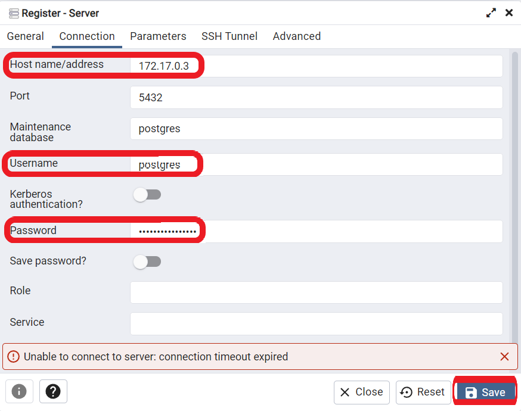

---

실습환경

AWS (By Terraform)

-> EC2 (Docker & Docker Compose)

-> EKS (Kubernetes)

---


# 시작하기 전에

일부 실습의 경우 AWS 환경에서 진행됩니다. 

관련한 AWS 환경 세팅은 Terraform을 통해서 세팅됩니다.

Terraform 사용법은 Appendix를 참조해주세요.


## Docker 설치하기

### Ubuntu

```shell
sudo apt-get update
sudo apt-get install docker.io
sudo ln -sf /usr/bin/docker.io /usr/local/bin/docker

# 권한 변경 
sudo chmod 666 /var/run/docker.sock
```


# Docker 기초

## Docker Image 관리

### Image search

- CLI

```
docker search <Keyword>
```


- Web - Docker Hub

> https://hub.docker.com/


### Image Download

```shell
# Default - latest
docker pull postgres

# By name
docker pull postgres:latest

# By digest
docker pull postgres@sha256:a2282ad0db623c27f03bab803975c9e3942a24e974f07142d5d69b6b8eaaf9e2
```


### Image List

```shell
docker image list

docker image ls

docker images
```


### Image Delete

> `docker rmi [OPTIONS] IMAGE [IMAGE...]`

```
docker rmi <IMAGE_ID> ...

docker image rm <IMAGE_ID> ...

# Remove the unused images
docker image prune
```


---

## Practice


## Docker Container 관리

### Container run

```shell
docker run [OPTIONS] IMAGE [COMMAND] [ARG...]
```


> Ubuntu

```cmd
$ docker run ubuntu:22.04 /bin/bash -c "whoami && date"
root
Sun Dec 17 07:06:20 UTC 2023
```


> Nginx 활용

```cmd
$ docker run -d -p 80:80 nginx:latest

# Result
$ CURL localhost:80
<!DOCTYPE html>
<html>
<head>
<title>Welcome to nginx!</title>
<style>
html { color-scheme: light dark; }
body { width: 35em; margin: 0 auto;
font-family: Tahoma, Verdana, Arial, sans-serif; }
</style>
</head>
<body>
<h1>Welcome to nginx!</h1>
<p>If you see this page, the nginx web server is successfully installed and
working. Further configuration is required.</p>

<p>For online documentation and support please refer to
<a href="http://nginx.org/">nginx.org</a>.<br/>
Commercial support is available at
<a href="http://nginx.com/">nginx.com</a>.</p>

<p><em>Thank you for using nginx.</em></p>
</body>
</html>
```


> Option 설명
>
> https://docs.docker.com/engine/reference/commandline/run/#options

| Name | command | description                          |
| ---- | ------- | ------------------------------------ |
|      | --rm    |                                      |
|      | -i      | Keep STDIN open even if not attached |
|      | -t      | Allocate a pseudo-TTY                |
|      | -p      | Port binding                         |
|      | -d      |                                      |
|      |         |                                      |
|      |         |                                      |

### [Publish or expose port (-p, --expose)](https://docs.docker.com/engine/reference/commandline/run/#publish)

```console
$ docker run -p 127.0.0.1:80:8080/tcp ubuntu bash
```

This binds port `8080` of the container to TCP port `80` on `127.0.0.1` of the host machine. You can also specify `udp` and `sctp` ports. The [Docker User Guide](https://docs.docker.com/network/links/) explains in detail how to use ports in Docker.

Note that ports which are not bound to the host (i.e., `-p 80:80` instead of `-p 127.0.0.1:80:80`) are externally accessible. This also applies if you configured UFW to block this specific port, as Docker manages its own iptables rules. [Read more](https://docs.docker.com/network/iptables/)


### Container List

```shell
docker ps

# Include stopped container
docker ps -a
```


```cmd
CONTAINER ID   IMAGE          COMMAND                   CREATED         STATUS                      PORTS     NAMES
803739f30047   nginx:latest   "/docker-entrypoint.…"   5 minutes ago   Exited (0) 17 seconds ago             stoic_diffie
```


### Container Log

```shell
docker logs <NAME_OR_ID>
```


### Container Access (Shell or Execute the command)

> /bin/bash

```
docker exec -it <NAME_OR_ID> <COMMAND>
```


#### Attach 와 Exec의 차이점

Attach는 실행중인 Process의 Terminal에 접근 -> Ctrl+c 할 경우 메인 프로세스가 종료되므로 Container 종료

Exec는 새로운 process의 Terminal에 접근 -> Ctrl+c를 사용하여도 메인 프로세스가 살아있으므로 Container 유지

```
docker run -it -d ubuntu
```


**Attach 사용한 경우**

```cmd
$ docker attach server
root@89834e856287:/# ps -aux
root@89834e856287:/# echo $$
1
```


**Exec 사용한 경우**

```cmd
$ docker exec -it server /bin/bash
root@89834e856287:/# echo $$
21
```


### Container Pause

> On Linux, this uses the cgroups freezer. Traditionally, when suspending a process the SIGSTOP signal is used, which is observable by the process  being suspended
>
> Send `SIGSTOP`(pause signal)

```shell
docker pause <NAME_OR_ID>
```


### Container Unpause

```shell
docker unpause <NAME_OR_ID>
```


### Container Stop

> The main process inside the container will receive SIGTERM, and after a grace period, SIGKILL.
>
> Send `SIGTERM`(termination signal), and if needed `SIGKILL`(kill signal)

```shell
docker stop <NAME_OR_IP>
```


### Container Start

```
docker start <NAME_OR_ID>
```


---

## Practice

### [연습] Ubuntu 실행 및 Package 업데이트

> 조건
>
> - Ubuntu 이미지 Tag = 22.04
> - Container 이름 = server
> - 업데이트 이후 컨테이너가 종료되면 안됩니다. 


#### **Ubuntu 실행하기**

```cmd
$ docker run -it -d --name server ubuntu:22.04
89834e856287c0875da2a9dddc5aa2905a8ad601f9348e014855badc9b345ccc
```


#### Package 업데이트하기

**방법 1 - Exec 사용하기**

Interactive 모드

```cmd
$ docker exec -it server /bin/bash
root@89834e856287:/# apt-get update && apt-get ugrade
...
```

Non-Interactive

```cmd
# Single Command
$ docker exec server apt-get update
Get:1 http://security.ubuntu.com/ubuntu jammy-security InRelease [110 kB]
...
$ docker exec server apt-get upgrade
Reading package lists...
Building dependency tree...
...

# Or Multiple Command
$ docker exec server /bin/bash -c "apt-get update && apt-get upgrade"
Get:1 http://security.ubuntu.com/ubuntu jammy-security InRelease [110 kB]
...
Reading package lists...
Building dependency tree...
...
```


방법 2 - Attach 사용하기

> Ubuntu 이미지의 경우 기본적으로 `/bin/bash`를 실행하므로 attach를 사용하여도 무방합니다. 

```cmd
$ docker attach server
root@89834e856287:/# apt-get update && apt-get ugrade
...
```


! 컨테이너에서 나올때는 `Ctrl+p+q`를 사용해야합니다.


**방법 3 - Container 실행시 Command 입력하기**

```cmd
$ docker run -it -d --name server ubuntu:22.04 /bin/bash -c "apt-get update && apt-get upgrade && /bin/bash"
Hit:1 http://security.ubuntu.com/ubuntu jammy-security InRelease
Hit:2 http://archive.ubuntu.com/ubuntu jammy InRelease
Hit:3 http://archive.ubuntu.com/ubuntu jammy-updates InRelease
Hit:4 http://archive.ubuntu.com/ubuntu jammy-backports InRelease
Reading package lists...
Reading package lists...
Building dependency tree...
Reading state information...
Calculating upgrade...
0 upgraded, 0 newly installed, 0 to remove and 0 not upgraded.
Done
```


### [실습] PostgreSQL DB에 Table 생성하기

>조건
>
>- 이미지 = postgres:16.1-bullseye
>- Container 이름 = db
>- Container 생성시 다음 환경변수가 설정되어야 합니다. 
>  - POSTGRES_PASSWORD

1. `PostgreSQL` DB 컨테이너를 실행하세요
2. `exec`를 사용하여 컨테이너 터미널에 접근하세요
3. `psql -U postgres`를 입력하여 `PostgreSQL`에 접속하세요
4. 다음 `Query`를 실행하세요

```sql
CREATE TABLE IF NOT EXISTS cloud_wave (
    id SERIAL PRIMARY KEY,
    timestamp timestamp
);
```

5. `\dt`를 실행하여 다음 결과값이 보이는지 확인하세요

```
postgres=# \dt
               List of relations
 Schema |        Name        | Type  |  Owner
--------+--------------------+-------+----------
 public | savepaint_img_data | table | postgres
(1 row)
```


---


## Docker 이미지 생성

### Image Build

> Cache & Layer 설명 필요
>
> Scratch 설명
>
> https://medium.com/analytics-vidhya/dockerizing-a-rest-api-in-python-less-than-9-mb-and-based-on-scratch-image-ef0ee3ad3f0a

```cmd
# docker build [OPTIONS] PATH | URL | - [-f <PATH_TO_FILE>]
$ docker build . [-f <PATH_TO_FILE>]

# or
$ docker buildx build [OPTIONS] PATH | URL | - [-f <PATH_TO_FILE>]
```


[따라하기]

> git clone <>

- python file(FastAPI) Or GO
- Dockerfile 
- sh file


### Change tags

```cmd
# docker tag SOURCE_IMAGE[:TAG] TARGET_IMAGE[:TAG]
$ docker tag <SOURCE_IMAGE> <TARGET_IMAGE>
```


---

## Practice

### [연습] 


### [연습] Scratch 활용하기

- Dockerfile 테스트
  - ARG
- Scratch? 활용 


### [실습] Web Application 실행하기


---


> Terraform Apply 필요함~!


## Image push

```
docker push [OPTIONS] NAME[:TAG]
```


## Practice

### [연습] Docker hub에 이미지 업로드하기

```
sudo docker login 
```


```
Login with your Docker ID to push and pull images from Docker Hub. If you don't have a Docker ID, head over to https://hub.docker.com to create one.
Username: <USERNAME>
Password: 
WARNING! Your password will be stored unencrypted in /root/.docker/config.json.
Configure a credential helper to remove this warning. See
https://docs.docker.com/engine/reference/commandline/login/#credentials-store

Login Succeeded
```


```
docker push docker_hub_id/repository:tag
```


### [연습] ECR에 이미지 업로드하기

> 연습하기에 앞서 ECR 생성이 필요합니다.

- ECR (Amazon Elastic Container Registry)

> https://docs.aws.amazon.com/ko_kr/cli/latest/userguide/getting-started-docker.html

```
# Install aws-cli
sudo apt  install awscli
```


```
aws --version
```


> docker image
>
> https://docs.aws.amazon.com/ko_kr/cli/latest/userguide/getting-started-docker.html


###### Amazon ECR 리포지토리에 Docker 이미지를 푸시하려면

이미지를 푸시하기 전에 Amazon ECR 리포지토리가 있어야 합니다. 자세한 정보는 [프라이빗 리포지토리 생성](https://docs.aws.amazon.com/ko_kr/AmazonECR/latest/userguide/repository-create.html)을 참조하세요.

1. 이미지를 푸시하려는 Amazon ECR 레지스트리에 대해 Docker 클라이언트를 인증합니다. 인증 토큰은 사용되는 레지스트리마다 필요하며, 12시간 동안 유효합니다. 자세한 정보는 [프라이빗 레지스트리 인증](https://docs.aws.amazon.com/ko_kr/AmazonECR/latest/userguide/registry_auth.html)을 참조하세요.

   Amazon ECR 레지스트리에 대해 Docker를 인증하려면 **aws ecr                            get-login-password** 명령을 실행합니다. Amazon ECR 인증 토큰을 **docker login** 명령에 전달할 때 사용자 이름으로 `AWS` 값을 사용하고, 인증하려는 Amazon ECR 레지스트리 URI를 지정합니다. 여러 레지스트리에 대해 인증하는 경우 각 레지스트리에 대해 명령을 반복해야 합니다.

   

###### 중요

오류가 발생하면 최신 버전의 AWS CLI를 설치하거나 업그레이드합니다. 자세한 내용은 *AWS Command Line Interface 사용 설명서*에서 [AWS Command Line Interface 설치](https://docs.aws.amazon.com/cli/latest/userguide/install-cliv2.html)를 참조하세요.

```
aws ecr get-login-password --region region | docker login --username AWS --password-stdin aws_account_id.dkr.ecr.region.amazonaws.com
```

푸시하려는 레지스트리에 이미지 리포지토리가 아직 없으면 하나 생성합니다. 자세한 정보는 [프라이빗 리포지토리 생성](https://docs.aws.amazon.com/ko_kr/AmazonECR/latest/userguide/repository-create.html)을 참조하세요.

푸시할 로컬 이미지를 식별합니다. **docker images** 명령을 실행하여 시스템에 있는 컨테이너 이미지를 나열합니다.

```
docker images
```

명령 결과 출력에서 `repository:tag` 값 또는 이미지 ID를 확인하여 이미지를 식별할 수 있습니다.

사용할 Amazon ECR 레지스트리, 리포지토리 및 이미지 태그 이름 조합(선택 사항)이 있는 이미지에 태그를 지정합니다. 레지스트리 형식은 `aws_account_id.dkr.ecr.us-west-2.amazonaws.com`입니다. 리포지토리 이름은 이미지에 대해 생성한 리포지토리와 일치해야 합니다. 이미지 태그를 생략하면 태그가 `latest`인 것으로 간주됩니다.

아래 예에서는 ID `e9ae3c220b23`을 `aws_account_id.dkr.ecr.us-west-2.amazonaws.com/my-repository:tag`으로 사용하여 로컬 이미지에 태그를 지정합니다.

```
docker tag e9ae3c220b23 aws_account_id.dkr.ecr.us-west-2.amazonaws.com/my-repository:tag
```

**docker push** 명령을 사용하여 이미지를 푸시합니다.

```
docker push aws_account_id.dkr.ecr.us-west-2.amazonaws.com/my-repository:tag
```


### [실습] EC2에서 Web Application 실행하기


---


> docker top

```cmd
minil@N100:~/repo$ docker top ngin
UID                 PID                 PPID                C                   STIME               TTY                 TIME                CMD
root                36968               36947               0                   16:57               ?                   00:00:00            nginx: master process nginx -g daemon off;
systemd+            37011               36968               0                   16:57               ?                   00:00:00            nginx: worker process
systemd+            37012               36968               0                   16:57               ?                   00:00:00            nginx: worker process
systemd+            37013               36968               0                   16:57               ?                   00:00:00            nginx: worker process
systemd+            37014               36968               0                   16:57               ?                   00:00:00            nginx: worker process

```


## Docker Volume 관리

```
Usage:  docker volume COMMAND

Manage volumes

Commands:
  create      Create a volume
  inspect     Display detailed information on one or more volumes
  ls          List volumes
  prune       Remove all unused local volumes
  rm          Remove one or more volumes
```


### Volume list


### volume create


### volume inspect


### volume rm


### volume prune


---

## Practice

### [연습] Volume에 DB 데이터 저장하기

>조건
>
>- 이미지 = postgres:16.1-bullseye
>- Container 이름 = db
>- Container 생성시 다음 환경변수가 설정되어야 합니다. 
>  - POSTGRES_PASSWORD
>- `db_data`라는 이름을 가진 Volume을 생성하고, 해당 볼륨을 컨테이너의 `/var/lib/postgresql/data`에 마운트합니다. 
>- Container는 `--rm` 옵션을 부여하여 생성합니다. 


`DB`에서 사용할 volume을 다음과 같이 생성합니다. 

```cmd
$ docker volume create db_data
db_data
```


생성된 volume은 `docker volume list` 명령어를 통해서 확인할 수 있습니다. 

```cmd
$ docker volume list
DRIVER    VOLUME NAME
local     db_data
```


PostgreSQL의 데이터는 `/var/lib/postgresql/data`에 저장되므로 해당 디렉토리에 `db_data` 볼륨을 마운트 시킵니다. 

```cmd
$ docker run --rm -d --name db -v db_data:/var/lib/postgresql/data -e POSTGRES_PASSWORD=mysecretpassword postgres:16.1-bullseye
```


DB에 접속하여 테이블을 생성해줍니다. 

```cmd
$ docker exec -it db /bin/bash
root@7523c983f729:/# psql -U postgres
psql (16.1 (Debian 16.1-1.pgdg110+1))
Type "help" for help.
```


```sql
CREATE TABLE IF NOT EXISTS cloud_wave (
    id SERIAL PRIMARY KEY,
    timestamp timestamp
);
```

**output**

```cmd
postgres=# \dt
               List of relations
 Schema |        Name        | Type  |  Owner
--------+--------------------+-------+----------
 public | savepaint_img_data | table | postgres
(1 row)
```


DB를 종료합니다. 

```cmd
$ docker stop db
db

# 컨테이너 이름에 `db`가 포함된 컨테이너 목록을 보여줍니다. 
$ docker ps -a -f name=db
CONTAINER ID   IMAGE     COMMAND   CREATED   STATUS    PORTS     NAMES
```


컨테이너를 재생성 합니다.

```cmd
$ docker run --rm -d --name db -v db_data:/var/lib/postgresql/data -e POSTGRES_PASSWORD=mysecretpassword postgres:16.1-bullseye
```


컨테이너 내부에서 DB 테이블이 남아있는 것을 확인합니다. 

```cmd
$ docker exec -it db2 /bin/bash
root@3f19c9efb04b:/# psql -U postgres
psql (16.1 (Debian 16.1-1.pgdg110+1))
Type "help" for help.

# Table 목록
postgres=# \dt
               List of relations
 Schema |        Name        | Type  |  Owner
--------+--------------------+-------+----------
 public | savepaint_img_data | table | postgres
(1 row)
```


### [연습] bind mount를 통해 Source Code 변경하기

> git hub에 샘플코드 업로드 해두기
>
> 조건
>
> - `./app` 폴더는 `/code/app` 폴더와 바인드 되어야 합니다. 
> - 이미지 이름은 was로 설정합니다. 
> - 

폴더 구조는 다음과 같습니다. 

```
.
├── app
│   ├── __init__.py
│   └── main.py
├── Dockerfile
└── requirements.txt
```


**main.py**

```python
from typing import Union

from fastapi import FastAPI

app = FastAPI()


@app.get("/")
def read_root():
    return {"Hello": "World"}
```


**Dockerfile**

```
FROM python:3.9

WORKDIR /code

COPY ./requirements.txt /code/requirements.txt

RUN pip install --no-cache-dir --upgrade -r /code/requirements.txt

#COPY ./app /code/app

#
CMD ["uvicorn", "app.main:app", "--host", "0.0.0.0", "--port", "80", "--reload"]

```


`Dockerfile`이 위치한 폴더에서 다음 명령어를 실행하여 이미지를 빌드합니다.

```cmd
$ docker build -t was:fast.2 .
```


다음 명령어를 통해서 `FastAPI` 서버를 실행합니다. 

```cmd
$ docker run --name bind -p 80:80 -v <FOLDER_PATH>\app:/code/app was:fast.2
```

**output**

```
INFO:     Will watch for changes in these directories: ['/code']
INFO:     Uvicorn running on http://0.0.0.0:80 (Press CTRL+C to quit)
INFO:     Started reloader process [1] using statreload
INFO:     Started server process [8]
INFO:     Waiting for application startup.
INFO:     Application startup complete.
```


`http://localhost/redoc`에 접속하여 API 목록을 확인합니다. 


**File 업데이트 하기**

`main.py`를 다음과 같이 수정합니다.

```python
import socket
from typing import Union

from fastapi import FastAPI

app = FastAPI()


@app.get("/")
def read_root():
    return {"Hello": "World"}


@app.get("/hostname")
def get_hostname():
    return {"name": socket.gethostname()}
```


`http://localhost/redoc`에 접속하여 `get_hostname` API가 추가된 것을 확인합니다.


---


## Docker Network 관리

```
Usage:  docker network COMMAND

Manage networks

Commands:
  connect     Connect a container to a network
  create      Create a network
  disconnect  Disconnect a container from a network
  inspect     Display detailed information on one or more networks
  ls          List networks
  prune       Remove all unused networks
  rm          Remove one or more networks
```


#TODO

- 복수개의 Network가 컨테이너에 할당될 수 있음
- Driver 종류? => 이 내용이 필요한가?


#### Network Driver

- `bridge`: 하나의 호스트 컴퓨터 내에서 컨테이너들간 소통할 수 있도록 한다.
- `host`: 컨터이너를 호스트 컴퓨터와 동일한 네트워크 상에 올린다.
- `overlay`: 여러 호스트에 분산되어 있는 컨테이너들 간에 연결을 위해 사용한다.


- `bridge`: The default network driver. If you don't specify a driver, this is the type of network you are creating. Bridge networks are commonly used when your application runs in a container that needs to communicate with other containers on the same host. See [Bridge network driver](https://docs.docker.com/network/drivers/bridge/).
- `host`: Remove network isolation between the container and the Docker host, and use the host's networking directly. See [Host network driver](https://docs.docker.com/network/drivers/host/).
- `overlay`: Overlay networks connect multiple Docker daemons together and enable Swarm services and containers to communicate across nodes. This strategy removes the need to do OS-level routing. See [Overlay network driver](https://docs.docker.com/network/drivers/overlay/).
- `ipvlan`: IPvlan networks give users total control over both IPv4 and IPv6 addressing. The VLAN driver builds on top of that in giving operators complete control of layer 2 VLAN tagging and even IPvlan L3 routing for users interested in underlay network integration. See [IPvlan network driver](https://docs.docker.com/network/drivers/ipvlan/).
- `macvlan`: Macvlan networks allow you to assign a MAC address to a container, making it appear as a physical device on your network. The Docker daemon routes traffic to containers by their MAC addresses. Using the `macvlan` driver is sometimes the best choice when dealing with legacy applications that expect to be directly connected to the physical network, rather than routed through the Docker host's network stack. See [Macvlan network driver](https://docs.docker.com/network/drivers/macvlan/).
- `none`: Completely isolate a container from the host and other containers. `none` is not available for Swarm services. See [None network driver](https://docs.docker.com/network/drivers/none/).


---

## Practice

### [연습] Network 연결 테스트하기

> 

사용할 Network를 다음과 같이 생성합니다. 

```cmd
$ docker volume create private
private
```


생성된 Network는 `docker network list` 명령어를 통해서 확인할 수 있습니다. 

```cmd
$ docker network list
NETWORK ID     NAME      DRIVER    SCOPE
71bf83fc2d7c   bridge    bridge    local
00c55e1a5560   host      host      local
ceedb973ae73   none      null      local
5bce335632dc   private   bridge    local
```


`PostgreSQL`과 `PgAdmin` 컨테이너를 생성합니다. 이 때, `PgAdmin` 컨테이너는 위에서 생성한 네트워크를 사용하여 생성합니다. 

```cmd
# PostgreSQL DB 생성
$ docker run --rm -d --name db -e POSTGRES_PASSWORD=mysecretpassword postgres:16.1-bullseye

# PgAdmin Application 생성
$ docker run --rm -d -p 80:80 --name pgadmin -e PGADMIN_DEFAULT_EMAIL=user@sample.com -e PGADMIN_DEFAULT_PASSWORD=SuperSecret --network private dpage/pgadmin4:7.4
```


다음 명령어를 통해서 `db` 컨테이너의 `network`별 IP 주소를 확인합니다. 

```cmd
$ docker inspect db -f '{{range $k, $v := .NetworkSettings.Networks}}{{print $k}}={{println $v.IPAddress}}{{end}}'
bridge=172.17.0.3

```


`bridge` 네트워크에 할당된 `IP`를 이용하여 `PgAdmin`에서 연결을 시도합니다. 

- `PgAdmin` 페이지에 접속합니다. 
  - http://localhost:80


- 좌측 상단 `Object > Register > Server`를 클릭합니다. 


- 접속할 `DB`서버 정보를 입력합니다. 
  - host: `bridge` 네트워크의 IP
  - Username: `postgres`
  - Password: 컨테이너 실행시 입력한 `POSTGRES_PASSWORD` 



- `DB` 연결에 실패한 것을 확인할 수 있습니다. 


이번엔 위에서 생성한 `private` 네트워크를 `DB`에 연결한 이후, `private` 네트워크에 할당된 `IP` 주소를 확인합니다. 

```cmd
$ docker network connect private db

$ docker inspect db -f '{{range $k, $v := .NetworkSettings.Networks}}{{print $k}}={{println $v.IPAddress}}{{end}}'
bridge=172.17.0.3
private=172.18.0.3

```


해당 `IP`를 이용하여 `PgAdmin`에서 연결의 시도합니다. 


정상적으로 연결이 되는 것을 확인할 수 있습니다. 


=> ping 방식으로 변경할까?

https://k1005.github.io/2023/01/29/docker-network/

https://www.daleseo.com/docker-networks/


### [실습] Hostname 설정하기? or Host network Test

```
docker run -v C:\Users\MINI\Documents\repo\cloud_wave\docker_sample\volume\fastapi\app:/code/app -p 8080:80 was:fast.2 
```

-> Host에서 해당 컨테이너 내부에서 실행중인 서비스에 접근이 되는지 체크해서 예제로 사용


---


### Docker commit

It can be useful to commit a container's file changes or settings into a new image. This allows you to debug a container by running an interactive shell, or to export a working dataset to another server. Generally, it is better to use Dockerfiles to manage your images in a documented and maintainable way. [Read more about valid image names and tags](https://docs.docker.com/engine/reference/commandline/tag/).

The commit operation will not include any data contained in volumes mounted inside the container.

By default, the container being committed and its processes will be paused while the image is committed. This reduces the likelihood of encountering data corruption during the process of creating the commit. If this behavior is undesired, set the `--pause` option to false.

The `--change` option will apply `Dockerfile` instructions to the image that is created. Supported `Dockerfile` instructions: `CMD`|`ENTRYPOINT`|`ENV`|`EXPOSE`|`LABEL`|`ONBUILD`|`USER`|`VOLUME`|`WORKDIR`


---

## Practice

### [연습] Commit을 이용하여 데이터를 유지한 Image 생성하기

`Ubuntu` 컨테이너를 실행합니다. 

```cmd
$ docker run -it -d --name server ubuntu:22.04
ebb9fe13e5cfb0747e5bea1db7c41ef30bf416bdcd643d7311e161ee4300b628
```


`curl`이 설치되어 있는지 확인합니다. 

```cmd
$ docker exec server apt list --installed "curl*"
WARNING: apt does not have a stable CLI interface. Use with caution in scripts.

Listing...
```


Curl을 설치한 이후, 설치 여부를 재확인합니다. 

```cmd
$ docker exec server /bin/bash -c "apt-get update && apt-get upgrade && apt-get install curl -y"

$ docker exec server apt list --installed "curl*"

WARNING: apt does not have a stable CLI interface. Use with caution in scripts.

Listing...
curl/jammy-updates,jammy-security,now 7.81.0-1ubuntu1.15 amd64 [installed]
```


curl이 설치된 ubuntu 컨테이너를 commit합니다. 

```cmd
$ docker commit server commit:v1
sha256:56c923d569eccda8bd094286ca7356ea2fa1a3a7794df6f22369980dd78bc943

$ docker images commit
REPOSITORY   TAG       IMAGE ID       CREATED          SIZE
commit       v1        56c923d569ec   16 seconds ago   132MB
```


저장된 Image를 실행하여 curl이 설치되어 있는지 확인합니다. 

```cmd
$ docker run --name restore commit:v1 apt list --installed "curl*"

WARNING: apt does not have a stable CLI interface. Use with caution in scripts.

Listing...
curl/jammy-updates,jammy-security,now 7.81.0-1ubuntu1.15 amd64 [installed]
```


### [연습] 기존 컨테이너에 Port 추가하기

> 새로 만들어야함

```cmd
$ docker ps

CONTAINER ID        IMAGE               COMMAND             CREATED             STATUS              PORTS              NAMES
c3f279d17e0a        ubuntu:22.04        /bin/bash           7 days ago          Up 25 hours                            desperate_dubinsky
197387f1b436        ubuntu:22.04        /bin/bash           7 days ago          Up 25 hours                            focused_hamilton

$ docker commit --change='CMD ["apachectl", "-DFOREGROUND"]' -c "EXPOSE 80" c3f279d17e0a  svendowideit/testimage:version4

f5283438590d

$ docker run -d svendowideit/testimage:version4

89373736e2e7f00bc149bd783073ac43d0507da250e999f3f1036e0db60817c0

$ docker ps

CONTAINER ID        IMAGE               COMMAND                 CREATED             STATUS              PORTS              NAMES
89373736e2e7        testimage:version4  "apachectl -DFOREGROU"  3 seconds ago       Up 2 seconds        80/tcp             distracted_fermat
c3f279d17e0a        ubuntu:22.04        /bin/bash               7 days ago          Up 25 hours                            desperate_dubinsky
197387f1b436        ubuntu:22.04        /bin/bash               7 days ago          Up 25 hours                            focused_hamilton
```


---


---

## 종합 문제

### [실습]

- Web & DB
  - EC2 환경
  - Network를 이용하여 연결
  - Volume을 이용하여 Source code 공유
  - ENV는 command를 통해서 전달
  - Web 접근을 위해 80포트 포워딩
  


- 


---


---

# Docker Compose


- DB + Web Application
  - Network & Volume 구성
  - Multi Instance인 경우?
  - Metric?
- Resource 관리
  - YAML 파일
  - OOM 케이스
- Deployment
  - GitSync?
  - Watch Tower


---

## Practice

### [연습] CLI1


### [연습] CLI2


### [연습] volume **


### [연습] network


### [연습] resource **

> 장애상황 구현
>
> JVM + Heap Memory


### [연습] depend_on **


### [연습] profile


### [연습] .env


### [연습] build

### [연습] Compose Update ***

### [연습] health_check **

### [연습] WatchTower


### [종합] WAS + GitSync -> volume


### [종합] Profile -> Multinode


### [종합] WAS + PgAdmin + DB + Nginx -> 서비스

> Depend_on
>
> Health_check


### [연습] DB + WAS 배포하기

> yaml 작성

```yaml

```


### [연습] 서로 다른 Project를 port binding 없이 연결하기

> network

```yaml
```


### [연습] Git sync와 Volume을 활용하여 배포하기

> volume

```yaml
```


### [연습] Resource 할당하기

> resource

```yaml
```


### [연습] Profile & depend_on 설정하기

```yaml
```


---


> privileged Vs. Unprivileged


## 종합 문제

### [실습]

- Web & DB
  - EC2 환경
  - Network를 이용하여 연결
  - Volume을 이용하여 Source code 공유
  - ENV는 command를 통해서 전달
  - Web 접근을 위해 80포트 포워딩


- 


# Appendix

## Terraform 실행하기

```
```


# Tip

종료된 모든 컨테이너 삭제하기 

```cmd
$ docker rm $(docker ps -a -q -f status=exited)
```


