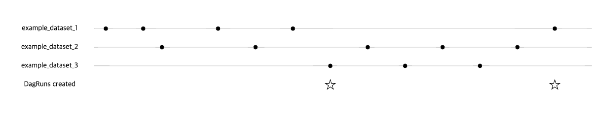

# 1. Introduction

## 1.1. Airflow란 무엇인가?

> Airflow is a platform to programmatically author, schedule and monitor workflows


Airbnb에서 개발한 워크플로우 관리 플랫폼!


## 1.2. 구성 요소

### Webserver

- A *webserver*, which presents a handy user interface to inspect, trigger and debug the behaviour of DAGs and tasks.

### Scheduler

* A [scheduler](https://airflow.apache.org/docs/apache-airflow/stable/concepts/scheduler.html), which handles both triggering scheduled workflows, and submitting [Tasks](https://airflow.apache.org/docs/apache-airflow/stable/concepts/tasks.html) to the executor to run.

### Executor

- An [executor](https://airflow.apache.org/docs/apache-airflow/stable/executor/index.html), which handles running tasks. In the default Airflow installation, this runs everything *inside* the scheduler, but most production-suitable executors actually push task execution out to *workers*.

### Worker

실제 Task를 처리하는 컴포넌트
Executor는 어떻게 실행될지에 대한 정의를 담당, Worker는 실제 프로세스 작업

### Database

- A *metadata database*, used by the scheduler, executor and webserver to store state.

Airflow의 DAG, Task 등의 메타데이터가 저장되는 데이터베이스


## 1.3. 특징

- **Dynamic**: Airflow pipelines are configuration as code (Python), allowing for dynamic pipeline generation. This allows for writing code that instantiates pipelines dynamically.
- **Extensible**: Easily define your own operators, executors and extend the library so that it fits the level of abstraction that suits your environment.
- **Elegant**: Airflow pipelines are lean and explicit. Parameterizing your scripts is built into the core of Airflow using the powerful **Jinja** templating engine.
- **Scalable**: Airflow has a modular architecture and uses a message queue to orchestrate an arbitrary number of workers. Airflow is ready to scale to infinity


## 1.4. 장점과 단점


# 2. Installation

## 2.1. Python Package

> https://github.com/apache/airflow

### 2.1.1. Requirements

|            | Main version (dev)           | Stable version (2.3.4)       |
| ---------- | ---------------------------- | ---------------------------- |
| Python     | 3.7, 3.8, 3.9, 3.10          | 3.7, 3.8, 3.9, 3.10          |
| Platform   | AMD64/ARM64(*)               | AMD64/ARM64(*)               |
| Kubernetes | 1.21, 1.22, 1.23, 1.24, 1.25 | 1.20, 1.21, 1.22, 1.23, 1.24 |
| PostgreSQL | 10, 11, 12, 13, 14           | 10, 11, 12, 13, 14           |
| MySQL      | 5.7, 8                       | 5.7, 8                       |
| SQLite     | 3.15.0+                      | 3.15.0+                      |
| MSSQL      | 2017(*), 2019 (*)            | 2017(*), 2019 (*)            |

### 2.1.2. Install with PIP

```shell
# default directory = ~/airflow
# if you want to install specific directory then
# export AIRFLOW_HOME=path/to/directory

# Install Airflow
pip install apache-airflow
```


## 2.2. Kubernetes

### 2.2.1 Requirements

- Kubernetes 1.20+ cluster
- Helm 3.0+
- PV provisioner support in the underlying infrastructure (optionally)

### 2.2.2. Install With Helm Chart

> https://airflow.apache.org/docs/helm-chart/stable/index.html

* Install with helm

```she
helm repo add apache-airflow https://airflow.apache.org
helm upgrade --install airflow apache-airflow/airflow --namespace airflow --create-namespace
```

* Install with **ArgoCD**

```yaml
# Example of overrides-values.yaml
createUserJob.useHelmHooks: false
migrateDatabaseJob.useHelmHooks: false
```


# 3. 용어 정리

## 3.1. DAG (Directed Acyclic Graph)


* Task들의 의존성 및 관계를 설정하여 구성된다.
* Task 내부에서 어떤일이 일어나는지와 관계없이 어느 순서로 Task를 실행하고, 몇번을 재시도할 것인지등 Task 실행 및 관리만 신경씀


## 3.2. Task

Airflow의 기본 실행 단위이자 DAG을 구성하는 요소이다. 

Task간의 `upstream`, `downstream` dependencies를 통해 실행 순서를 정의한다.  


## 3.3. Executor


## 3.4. Sensor


## 3.5. Control flow


# 4. Configuration

## 4.1. Airflow config


## 4.2. values.yaml (Helm Chart)


# 5. Basic

## 5.1. DAG

### 5.1.1. Parameters

* schedule_interval


* start_date


* catchup


* tags


* default_args

  * 모든 Task에서 사용할 args를 정의

  * Task의 Base 참조

### Branching


### SubDAGs

> 사실상 deprecated 되었으므로 가급적 사용하지 말 것


## Task

### BaseOperator Parameters

> [Link](https://airflow.apache.org/docs/apache-airflow/stable/_api/airflow/models/baseoperator/index.html#airflow.models.baseoperator.BaseOperator)

- **task_id** ([*str*](https://docs.python.org/3/library/stdtypes.html#str)) – a unique, meaningful id for the task

- **owner** ([*str*](https://docs.python.org/3/library/stdtypes.html#str)) – the owner of the task. Using a meaningful description (e.g. user/person/team/role name) to clarify ownership is recommended.

- **email** (*Optional**[**Union**[*[*str*](https://docs.python.org/3/library/stdtypes.html#str)*,* *Iterable**[*[*str*](https://docs.python.org/3/library/stdtypes.html#str)*]**]**]*) – the ‘to’ email address(es) used in email alerts. This can be a single email or multiple ones. Multiple addresses can be specified as a comma or semi-colon separated string or by passing a list of strings.

- **email_on_retry** ([*bool*](https://docs.python.org/3/library/functions.html#bool)) – Indicates whether email alerts should be sent when a task is retried

- **email_on_failure** ([*bool*](https://docs.python.org/3/library/functions.html#bool)) – Indicates whether email alerts should be sent when a task failed

- **retries** (*Optional**[*[*int*](https://docs.python.org/3/library/functions.html#int)*]*) – the number of retries that should be performed before failing the task

- **retry_delay** (*Union**[*[*datetime.timedelta*](https://docs.python.org/3/library/datetime.html#datetime.timedelta)*,* [*float*](https://docs.python.org/3/library/functions.html#float)*]*) – delay between retries, can be set as `timedelta` or `float` seconds, which will be converted into `timedelta`, the default is `timedelta(seconds=300)`.

- **retry_exponential_backoff** ([*bool*](https://docs.python.org/3/library/functions.html#bool)) – allow progressively longer waits between retries by using exponential backoff algorithm on retry delay (delay will be converted into seconds)

- **max_retry_delay** (*Optional**[**Union**[*[*datetime.timedelta*](https://docs.python.org/3/library/datetime.html#datetime.timedelta)*,* [*float*](https://docs.python.org/3/library/functions.html#float)*]**]*) – maximum delay interval between retries, can be set as `timedelta` or `float` seconds, which will be converted into `timedelta`.

- **start_date** (*Optional**[*[*datetime.datetime*](https://docs.python.org/3/library/datetime.html#datetime.datetime)*]*) – The `start_date` for the task, determines the `execution_date` for the first task instance. The best practice is to have the start_date rounded to your DAG’s `schedule_interval`. Daily jobs have their start_date some day at 00:00:00, hourly jobs have their start_date at 00:00 of a specific hour. Note that Airflow simply looks at the latest `execution_date` and adds the `schedule_interval` to determine the next `execution_date`. It is also very important to note that different tasks’ dependencies need to line up in time. If task A depends on task B and their start_date are offset in a way that their execution_date don’t line up, A’s dependencies will never be met. If you are looking to delay a task, for example running a daily task at 2AM, look into the `TimeSensor` and `TimeDeltaSensor`. We advise against using dynamic `start_date` and recommend using fixed ones. Read the FAQ entry about start_date for more information.

- **end_date** (*Optional**[*[*datetime.datetime*](https://docs.python.org/3/library/datetime.html#datetime.datetime)*]*) – if specified, the scheduler won’t go beyond this date

- **depends_on_past** ([*bool*](https://docs.python.org/3/library/functions.html#bool)) – when set to true, task instances will run sequentially and only if the previous instance has succeeded or has been skipped. The task instance for the start_date is allowed to run.

- **wait_for_downstream** ([*bool*](https://docs.python.org/3/library/functions.html#bool)) – when set to true, an instance of task X will wait for tasks immediately downstream of the previous instance of task X to finish successfully or be skipped before it runs. This is useful if the different instances of a task X alter the same asset, and this asset is used by tasks downstream of task X. Note that depends_on_past is forced to True wherever wait_for_downstream is used. Also note that only tasks *immediately* downstream of the previous task instance are waited for; the statuses of any tasks further downstream are ignored.

- **dag** (*Optional**[*[*airflow.models.dag.DAG*](https://airflow.apache.org/docs/apache-airflow/stable/_api/airflow/models/dag/index.html#airflow.models.dag.DAG)*]*) – a reference to the dag the task is attached to (if any)

- **priority_weight** ([*int*](https://docs.python.org/3/library/functions.html#int)) – priority weight of this task against other task. This allows the executor to trigger higher priority tasks before others when things get backed up. Set priority_weight as a higher number for more important tasks.

- **weight_rule** ([*str*](https://docs.python.org/3/library/stdtypes.html#str)) – weighting method used for the effective total priority weight of the task. Options are: `{ downstream | upstream | absolute }` default is `downstream` When set to `downstream` the effective weight of the task is the aggregate sum of all downstream descendants. As a result, upstream tasks will have higher weight and will be scheduled more aggressively when using positive weight values. This is useful when you have multiple dag run instances and desire to have all upstream tasks to complete for all runs before each dag can continue processing downstream tasks. When set to `upstream` the effective weight is the aggregate sum of all upstream ancestors. This is the opposite where downstream tasks have higher weight and will be scheduled more aggressively when using positive weight values. This is useful when you have multiple dag run instances and prefer to have each dag complete before starting upstream tasks of other dags. When set to `absolute`, the effective weight is the exact `priority_weight` specified without additional weighting. You may want to do this when you know exactly what priority weight each task should have. Additionally, when set to `absolute`, there is bonus effect of significantly speeding up the task creation process as for very large DAGs. Options can be set as string or using the constants defined in the static class `airflow.utils.WeightRule`

- **queue** ([*str*](https://docs.python.org/3/library/stdtypes.html#str)) – which queue to target when running this job. Not all executors implement queue management, the CeleryExecutor does support targeting specific queues.

- **pool** (*Optional**[*[*str*](https://docs.python.org/3/library/stdtypes.html#str)*]*) – the slot pool this task should run in, slot pools are a way to limit concurrency for certain tasks

- **pool_slots** ([*int*](https://docs.python.org/3/library/functions.html#int)) – the number of pool slots this task should use (>= 1) Values less than 1 are not allowed.

- **sla** (*Optional**[*[*datetime.timedelta*](https://docs.python.org/3/library/datetime.html#datetime.timedelta)*]*) – time by which the job is expected to succeed. Note that this represents the `timedelta` after the period is closed. For example if you set an SLA of 1 hour, the scheduler would send an email soon after 1:00AM on the `2016-01-02` if the `2016-01-01` instance has not succeeded yet. The scheduler pays special attention for jobs with an SLA and sends alert emails for SLA misses. SLA misses are also recorded in the database for future reference. All tasks that share the same SLA time get bundled in a single email, sent soon after that time. SLA notification are sent once and only once for each task instance.

- **execution_timeout** (*Optional**[*[*datetime.timedelta*](https://docs.python.org/3/library/datetime.html#datetime.timedelta)*]*) – max time allowed for the execution of this task instance, if it goes beyond it will raise and fail.

- **on_failure_callback** (*Optional**[**airflow.models.abstractoperator.TaskStateChangeCallback**]*) – a function to be called when a task instance of this task fails. a context dictionary is passed as a single parameter to this function. Context contains references to related objects to the task instance and is documented under the macros section of the API.

- **on_execute_callback** (*Optional**[**airflow.models.abstractoperator.TaskStateChangeCallback**]*) – much like the `on_failure_callback` except that it is executed right before the task is executed.

- **on_retry_callback** (*Optional**[**airflow.models.abstractoperator.TaskStateChangeCallback**]*) – much like the `on_failure_callback` except that it is executed when retries occur.

- **on_success_callback** (*Optional**[**airflow.models.abstractoperator.TaskStateChangeCallback**]*) – much like the `on_failure_callback` except that it is executed when the task succeeds.

- **pre_execute** (*Optional**[**TaskPreExecuteHook**]*) –

  a function to be called immediately before task execution, receiving a context dictionary; raising an exception will prevent the task from being executed.

  This is an [experimental feature](https://airflow.apache.org/docs/apache-airflow/stable/release-process.html#experimental).

  

- **post_execute** (*Optional**[**TaskPostExecuteHook**]*) –

  a function to be called immediately after task execution, receiving a context dictionary and task result; raising an exception will prevent the task from succeeding.

  This is an [experimental feature](https://airflow.apache.org/docs/apache-airflow/stable/release-process.html#experimental).

  

- **trigger_rule** ([*str*](https://docs.python.org/3/library/stdtypes.html#str)) – defines the rule by which dependencies are applied for the task to get triggered. Options are: `{ all_success | all_failed | all_done | all_skipped | one_success | one_failed | none_failed | none_failed_min_one_success | none_skipped | always}` default is `all_success`. Options can be set as string or using the constants defined in the static class `airflow.utils.TriggerRule`

- **resources** (*Optional**[**Dict**[*[*str*](https://docs.python.org/3/library/stdtypes.html#str)*,* *Any**]**]*) – A map of resource parameter names (the argument names of the Resources constructor) to their values.

- **run_as_user** (*Optional**[*[*str*](https://docs.python.org/3/library/stdtypes.html#str)*]*) – unix username to impersonate while running the task

- **max_active_tis_per_dag** (*Optional**[*[*int*](https://docs.python.org/3/library/functions.html#int)*]*) – When set, a task will be able to limit the concurrent runs across execution_dates.

- **executor_config** (*Optional**[**Dict**]*) –

  Additional task-level configuration parameters that are interpreted by a specific executor. Parameters are namespaced by the name of executor.

  **Example**: to run this task in a specific docker container through the KubernetesExecutor

  ```
  MyOperator(...,
      executor_config={
          "KubernetesExecutor":
              {"image": "myCustomDockerImage"}
      }
  )
  ```

  

  

- **do_xcom_push** ([*bool*](https://docs.python.org/3/library/functions.html#bool)) – if True, an XCom is pushed containing the Operator’s result

- **task_group** (*Optional**[**airflow.utils.task_group.TaskGroup**]*) – The TaskGroup to which the task should belong. This is typically provided when not using a TaskGroup as a context manager.

- **doc** (*Optional**[*[*str*](https://docs.python.org/3/library/stdtypes.html#str)*]*) – Add documentation or notes to your Task objects that is visible in Task Instance details View in the Webserver

- **doc_md** (*Optional**[*[*str*](https://docs.python.org/3/library/stdtypes.html#str)*]*) – Add documentation (in Markdown format) or notes to your Task objects that is visible in Task Instance details View in the Webserver

- **doc_rst** (*Optional**[*[*str*](https://docs.python.org/3/library/stdtypes.html#str)*]*) – Add documentation (in RST format) or notes to your Task objects that is visible in Task Instance details View in the Webserver

- **doc_json** (*Optional**[*[*str*](https://docs.python.org/3/library/stdtypes.html#str)*]*) – Add documentation (in JSON format) or notes to your Task objects that is visible in Task Instance details View in the Webserver

- **doc_yaml** (*Optional**[*[*str*](https://docs.python.org/3/library/stdtypes.html#str)*]*) – Add documentation (in YAML format) or notes to your Task objects that is visible in Task Instance details View in the Webserver


### Task Group


### Timeouts

If you want a task to have a maximum runtime, set its `execution_timeout` attribute to a `datetime.timedelta` value that is the maximum permissible runtime. This applies to all Airflow tasks, including sensors. `execution_timeout` controls the maximum time allowed for every execution. If `execution_timeout` is breached, the task times out and `AirflowTaskTimeout` is raised.

In addition, sensors have a `timeout` parameter. This only matters for sensors in `reschedule` mode. `timeout` controls the maximum time allowed for the sensor to succeed. If `timeout` is breached, `AirflowSensorTimeout` will be raised and the sensor fails immediately without retrying.

The following `SFTPSensor` example illustrates this. The `sensor` is in `reschedule` mode, meaning it is periodically executed and rescheduled until it succeeds.

- Each time the sensor pokes the SFTP server, it is allowed to take maximum 60 seconds as defined by `execution_timeout`.
- If it takes the sensor more than 60 seconds to poke the SFTP server, `AirflowTaskTimeout` will be raised. The sensor is allowed to retry when this happens. It can retry up to 2 times as defined by `retries`.
- From the start of the first execution, till it eventually succeeds (i.e. after the file 'root/test' appears), the sensor is allowed maximum 3600 seconds as defined by `timeout`. In other words, if the file does not appear on the SFTP server within 3600 seconds, the sensor will raise `AirflowSensorTimeout`. It will not retry when this error is raised.
- If the sensor fails due to other reasons such as network outages during the 3600 seconds interval, it can retry up to 2 times as defined by `retries`. Retrying does not reset the `timeout`. It will still have up to 3600 seconds in total for it to succeed.

```
sensor = SFTPSensor(
    task_id="sensor",
    path="/root/test",
    execution_timeout=timedelta(seconds=60),
    timeout=3600,
    retries=2,
    mode="reschedule",
)
```


### SLA

An SLA, or a Service Level Agreement, is an expectation for the maximum time a Task should be completed relative to the Dag Run start time. If a task takes longer than this to run, it is then visible in the "SLA Misses" part of the user interface, as well as going out in an email of all tasks that missed their SLA.

Tasks over their SLA are not cancelled, though - they are allowed to run to completion. If you want to cancel a task after a certain runtime is reached, you want [Timeouts](https://airflow.apache.org/docs/apache-airflow/stable/core-concepts/tasks.html#concepts-timeouts) instead.

To set an SLA for a task, pass a `datetime.timedelta` object to the Task/Operator's `sla` parameter. You can also supply an `sla_miss_callback` that will be called when the SLA is missed if you want to run your own logic.

If you want to disable SLA checking entirely, you can set `check_slas = False` in Airflow's `[core]` configuration.


### Executor Configuration

Some [Executors](https://airflow.apache.org/docs/apache-airflow/stable/core-concepts/executor/index.html) allow optional per-task configuration - such as the `KubernetesExecutor`, which lets you set an image to run the task on.

This is achieved via the `executor_config` argument to a Task or Operator. Here's an example of setting the Docker image for a task that will run on the `KubernetesExecutor`:

```
MyOperator(...,
    executor_config={
        "KubernetesExecutor":
            {"image": "myCustomDockerImage"}
    }
)
```


The settings you can pass into `executor_config` vary by executor, so read the [individual executor documentation](https://airflow.apache.org/docs/apache-airflow/stable/core-concepts/executor/index.html) in order to see what you can set.


## Operator

### PythonOperator


### LatestOnlyOperator

> Allows a workflow to skip tasks that are not running during the most recent schedule interval.

최근 스케쥴이 아니라면, 모든 하위 작업을 스킵합니다. 따라서, 가장 마지막의 스케쥴만 실행하게 됩니다. 

```tex
# 현재: 2023-03-25 14:00:00 
# 실행주기: hourly

# `logical_datetime` -> Status
`2023-03-23 14:00:00` -> Skip
`2023-03-25 12:00:00` -> Skip
`2023-03-25 13:00:00` -> Run  # Last
```


최근 스케쥴만 실행시킨다는 점에서 `catchup`과 매우 유사합니다. 하지만, 실행되지 않은 과거 `DAG`을 아예 스케쥴링하지 않는 `catchup`과 다르게, `LastOnlyOperator`는 DAG이 실행된 상황에서 별도로 최신 작업 여부를 확인하고 하위 작업(downstream)의 스킵합니다. 그러므로, 과거 실행되었던 `DAG`을 재실행하는 경우, `catchup`은 모든 task가 재실행되지만 `LastOnlyOperator`는 하위 작업을 실행하지 않습니다. 


**Summary**

| Name             | 적용 단위 | 과거 작업 재실행 | 외부 실행(External Trigger) |
| ---------------- | --------- | ---------------- | --------------------------- |
| catchup          | DAG       | Run              | Run                         |
| LastOnlyOperator | Task      | Skip             | Run                         |


**Example**

```python
from airflow import DAG
from airflow.operators.latest_only import LatestOnlyOperator
from airflow.operators.python import PythonOperator

with DAG(
    'daily_aggregate',,
    schedule="30 0 * * *",
    start_date=datetime(2022, 1, 1),
    catchup=False,
) as dag:
    task1 = PythonOperator(
        task_id='task1',
        python_callable=task1,
    )

    is_latest_dag_run = LatestOnlyOperator(
        task_id="is_latest_dag_run"
    )

    task2 = PythonOperator(
        task_id='task2',
        python_callable=task2,
    )
    
    # Task Relationship
    task1 >> is_latest_dag_run >> task2
```


### BranchDateTimeOperator


### BranchDayOfWeekOperator


### KubernetesPodOperator


## Sensors

Sensors are a special type of [Operator](https://airflow.apache.org/docs/apache-airflow/stable/core-concepts/operators.html) that are designed to do exactly one thing - wait for something to occur. It can be time-based, or waiting for a file, or an external event, but all they do is wait until something happens, and then *succeed* so their downstream tasks can run.

Because they are primarily idle, Sensors have two different modes of running so you can be a bit more efficient about using them:

- `poke` (default): The Sensor takes up a worker slot for its entire runtime
- `reschedule`: The Sensor takes up a worker slot only when it is checking, and sleeps for a set duration between checks

The `poke` and `reschedule` modes can be configured directly when you instantiate the sensor; generally, the trade-off between them is latency. Something that is checking every second should be in `poke` mode, while something that is checking every minute should be in `reschedule` mode.

Much like Operators, Airflow has a large set of pre-built Sensors you can use, both in core Airflow as well as via our *providers* system.


## Triggers

### List of trigger rules

- `all_success` (default): All upstream tasks have succeeded
- `all_failed`: All upstream tasks are in a `failed` or `upstream_failed` state
- `all_done`: All upstream tasks are done with their execution
- `all_skipped`: All upstream tasks are in a `skipped` state
- `one_failed`: At least one upstream task has failed (does not wait for all upstream tasks to be done)
- `one_success`: At least one upstream task has succeeded (does not wait for all upstream tasks to be done)
- `none_failed`: All upstream tasks have not `failed` or `upstream_failed` - that is, all upstream tasks have succeeded or been skipped
- `none_failed_min_one_success`: All upstream tasks have not `failed` or `upstream_failed`, and at least one upstream task has succeeded.
- `none_skipped`: No upstream task is in a `skipped` state - that is, all upstream tasks are in a `success`, `failed`, or `upstream_failed` state
- `always`: No dependencies at all, run this task at any time

## XComs


## Edge Labels

As well as grouping tasks into groups, you can also label the *dependency edges* between different tasks in the Graph view - this can be especially useful for branching areas of your DAG, so you can label the conditions under which certain branches might run.

To add labels, you can use them directly inline with the `>>` and `<<` operators:

```
from airflow.utils.edgemodifier import Label

my_task >> Label("When empty") >> other_task
```


Or, you can pass a Label object to `set_upstream`/`set_downstream`:

```
from airflow.utils.edgemodifier import Label

my_task.set_downstream(other_task, Label("When empty"))
```


Here’s an example DAG which illustrates labeling different branches:


## Dataset

>In Airflow 2.4, the URI is not used to connect to an external system and there is no awareness of the content or location of the dataset

`dataset`은 `producer` Task에 의해서 업데이트되며 `consumer` DAG을 스케쥴링하여 소비하게 합니다.


`dataset`은 `TriggerDagRunOperator`와 매우 유사합니다. 하지만, 상위 작업이 하위 작업을 **직접** 실행하여야하는 `TriggerDagRunOperator`와 다르게, `dataset`은 중간 매개체인 `dataset`을 통해서 하위 작업이 스케쥴링됩니다. 따라서, `dataset`을 사용하는 경우 상위 작업(`producer`)을 수정하지 않고도 하위 작업(`consumer`)을 추가할 수 있습니다. 


`dataset`은 `Uniform Resource Identifier (URI)`를 통해서 정의되며 다음과 같이 사용합니다. 

```py
from airflow import Dataset

# Must be Unique URI
example_dataset = Dataset(uri="s3://dataset-bucket/example.csv")
```

주의해야할 점은 다음과 같습니다. 

1.  `2.4.x` 버젼 기준 URI에 `S3`와 같은 schema가 적혀있다하더라도 외부 시스템에 연결하는 것이 아닙니다.
    ```python
    # Just Name, not connection uri
    s3_dataset = Dataset(uri="s3://dataset-bucket/example.csv")
    ```

2. URI는 단순 문자열(`string`)으로 처리되므로 정규 표현식 또는 file glob 패턴 형태로 URI를 작성한다고해서 여러개의 dataset을 만들거나 소비할 수 있는 것이 아닙니다. 
    ```python
    # URI treat as string, neither glob pattern or regex
    regular_expression = Dataset("input_\d+.csv")
    glob_pattern = Dataset("input_2022*.csv")
    ```

3. URI는 ASCII 문자열로만 이루어져 있어야 합니다. 
    ```python
    # Not Allowed
    not_ascii = Dataset("èxample_datašet")
    ```

4. `airflow` 스키마는 사용할 수 없습니다. 

    ```python
    # Not Allowed
    reserved = Dataset("airflow://example_dataset")
    ```

5. `timetable-based schedule`과 함께 사용할 수 없습니다. 

    ```python
    # Mixed is not Allowed
    with DAG(
        dag_id="mixed_dag",
        catchup=False,
        start_date=pendulum.datetime(2021, 1, 1, tz="UTC"),
        schedule=[dag1_dataset, "0 * * * *"],
    ):
    ```

6. 여러개의 `dataset`을 소비하는 경우, 모든 `dataset`이 업데이트 된 이후에만 작업이 실행됩니다. 

    >The `schedule` parameter to your DAG can take either a list of datasets to consume or a timetable-based option. The two cannot currently be mixed.
    >
    >When using datasets, in this first release (v2.4) waiting for all datasets in the list to be updated is the only option when multiple datasets are consumed by a DAG. A later release may introduce more fine-grained options allowing for greater flexibility.

    

**Example - producer**

```python
from airflow import DAG, Dataset
from airflow.operators.bash import BashOperator
import pendulum

# Define datasets
dag1_dataset = Dataset("s3://dataset1/output_1.txt")
dag2_dataset = Dataset("s3://dataset2/output_2.txt")


with DAG(
    dag_id="dataset_upstream1",
    start_date=pendulum.datetime(2021, 1, 1, tz="UTC"),
    schedule="@daily",
    catchup=False,
) as dag1:
    BashOperator(
        task_id="upstream_task_1",
        bash_command="sleep 5",
        outlets=[dag1_dataset],  # Define which dataset is updated by this task
    )

    BashOperator(
        task_id="upstream_task_2",
        bash_command="sleep 5",
        outlets=[dag2_dataset],  # Define which dataset is updated by this task
    )
```


**Example - Consumer**

```python
from airflow import DAG, Dataset
from airflow.operators.bash import BashOperator
import pendulum

dag1_dataset = Dataset("s3://dataset1/output_1.txt")
dag2_dataset = Dataset("s3://dataset2/output_2.txt")

with DAG(
    dag_id="dataset_downstream_1_2",
    catchup=False,
    start_date=pendulum.datetime(2021, 1, 1, tz="UTC"),
    schedule=[dag1_dataset, dag2_dataset],
    tags=["downstream"],
) as dag3:
    BashOperator(task_id="downstream_2", bash_command="sleep 5")
```


## Logging

```python
logger = logging.getLogger("airflow.task")
```


# 6. Advanced

## `.airflowignore`

An `.airflowignore` file specifies the directories or files in `DAG_FOLDER` or `PLUGINS_FOLDER` that Airflow should intentionally ignore. Airflow supports two syntax flavors for patterns in the file, as specified by the `DAG_IGNORE_FILE_SYNTAX` configuration parameter (*added in Airflow 2.3*): `regexp` and `glob`.

Note

The default `DAG_IGNORE_FILE_SYNTAX` is `regexp` to ensure backwards compatibility.

For the `regexp` pattern syntax (the default), each line in `.airflowignore` specifies a regular expression pattern, and directories or files whose names (not DAG id) match any of the patterns would be ignored (under the hood, `Pattern.search()` is used to match the pattern). Use the `#` character to indicate a comment; all characters on a line following a `#` will be ignored.

With the `glob` syntax, the patterns work just like those in a `.gitignore` file:

- The `*` character will any number of characters, except `/`
- The `?` character will match any single character, except `/`
- The range notation, e.g. `[a-zA-Z]`, can be used to match one of the characters in a range
- A pattern can be negated by prefixing with `!`. Patterns are evaluated in order so a negation can override a previously defined pattern in the same file or patterns defined in a parent directory.
- A double asterisk (`**`) can be used to match across directories. For example, `**/__pycache__/` will ignore `__pycache__` directories in each sub-directory to infinite depth.
- If there is a `/` at the beginning or middle (or both) of the pattern, then the pattern is relative to the directory level of the particular .airflowignore file itself. Otherwise the pattern may also match at any level below the .airflowignore level.

The `.airflowignore` file should be put in your `DAG_FOLDER`. For example, you can prepare a `.airflowignore` file using the `regexp` syntax with content

```
project_a
tenant_[\d]
```


Or, equivalently, in the `glob` syntax

```
**/*project_a*
tenant_[0-9]*
```


Then files like `project_a_dag_1.py`, `TESTING_project_a.py`, `tenant_1.py`, `project_a/dag_1.py`, and `tenant_1/dag_1.py` in your `DAG_FOLDER` would be ignored (If a directory's name matches any of the patterns, this directory and all its subfolders would not be scanned by Airflow at all. This improves efficiency of DAG finding).

The scope of a `.airflowignore` file is the directory it is in plus all its subfolders. You can also prepare `.airflowignore` file for a subfolder in `DAG_FOLDER` and it would only be applicable for that subfolder.


## Executor

### Kubernetes Executor

> https://airflow.apache.org/docs/apache-airflow/stable/core-concepts/executor/kubernetes.html


#### pod_template_file

To customize the pod used for k8s executor worker processes, you may create a pod template file. You must provide the path to the template file in the `pod_template_file` option in the `kubernetes_executor` section of `airflow.cfg`.

Airflow has two strict requirements for pod template files: base image and pod name.

**Base image**

A `pod_template_file` must have a container named `base` at the `spec.containers[0]` position, and its `image` must be specified.

You are free to create sidecar containers after this required container, but Airflow assumes that the airflow worker container exists at the beginning of the container array, and assumes that the container is named `base`.

Note

Airflow may override the base container `image`, e.g. through [pod_override](https://airflow.apache.org/docs/apache-airflow/stable/core-concepts/executor/kubernetes.html#concepts-pod-override) configuration; but it must be present in the template file and must not be blank.

**Pod name**

The pod's `metadata.name` must be set in the template file. This field will *always* be set dynamically at pod launch to guarantee uniqueness across all pods. But again, it must be included in the template, and cannot be left blank.

#### pod_override

When using the KubernetesExecutor, Airflow offers the ability to override system defaults on a per-task basis. To utilize this functionality, create a Kubernetes V1pod object and fill in your desired overrides. Please note that the scheduler will override the `metadata.name` and `containers[0].args` of the V1pod before launching it.

To overwrite the base container of the pod launched by the KubernetesExecutor, create a V1pod with a single container, and overwrite the fields as follows:

airflow/example_dags/example_kubernetes_executor.py[[source\]](https://airflow.apache.org/docs/apache-airflow/stable/_modules/airflow/example_dags/example_kubernetes_executor.html)

```
        executor_config_volume_mount = {
            "pod_override": k8s.V1Pod(
                spec=k8s.V1PodSpec(
                    containers=[
                        k8s.V1Container(
                            name="base",
                            volume_mounts=[
                                k8s.V1VolumeMount(mount_path="/foo/", name="example-kubernetes-test-volume")
                            ],
                        )
                    ],
                    volumes=[
                        k8s.V1Volume(
                            name="example-kubernetes-test-volume",
                            host_path=k8s.V1HostPathVolumeSource(path="/tmp/"),
                        )
                    ],
                )
            ),
        }

        @task(executor_config=executor_config_volume_mount)
        def test_volume_mount():
            """
            Tests whether the volume has been mounted.
            """

            with open("/foo/volume_mount_test.txt", "w") as foo:
                foo.write("Hello")

            return_code = os.system("cat /foo/volume_mount_test.txt")
            if return_code != 0:
                raise ValueError(f"Error when checking volume mount. Return code {return_code}")

        volume_task = test_volume_mount()
```


Note that the following fields **will all be extended** instead of overwritten. From *spec*: volumes, and init_containers. From *container*: volume mounts, environment variables, ports, and devices.

To add a sidecar container to the launched pod, create a V1pod with an empty first container with the name `base` and a second container containing your desired sidecar.

airflow/example_dags/example_kubernetes_executor.py[[source\]](https://airflow.apache.org/docs/apache-airflow/stable/_modules/airflow/example_dags/example_kubernetes_executor.html)

```
        executor_config_sidecar = {
            "pod_override": k8s.V1Pod(
                spec=k8s.V1PodSpec(
                    containers=[
                        k8s.V1Container(
                            name="base",
                            volume_mounts=[k8s.V1VolumeMount(mount_path="/shared/", name="shared-empty-dir")],
                        ),
                        k8s.V1Container(
                            name="sidecar",
                            image="ubuntu",
                            args=['echo "retrieved from mount" > /shared/test.txt'],
                            command=["bash", "-cx"],
                            volume_mounts=[k8s.V1VolumeMount(mount_path="/shared/", name="shared-empty-dir")],
                        ),
                    ],
                    volumes=[
                        k8s.V1Volume(name="shared-empty-dir", empty_dir=k8s.V1EmptyDirVolumeSource()),
                    ],
                )
            ),
        }

        @task(executor_config=executor_config_sidecar)
        def test_sharedvolume_mount():
            """
            Tests whether the volume has been mounted.
            """
            for i in range(5):
                try:
                    return_code = os.system("cat /shared/test.txt")
                    if return_code != 0:
                        raise ValueError(f"Error when checking volume mount. Return code {return_code}")
                except ValueError as e:
                    if i > 4:
                        raise e

        sidecar_task = test_sharedvolume_mount()
```


You can also create custom `pod_template_file` on a per-task basis so that you can recycle the same base values between multiple tasks. This will replace the default `pod_template_file` named in the airflow.cfg and then override that template using the `pod_override`.

Here is an example of a task with both features:

```
import os

import pendulum

from airflow import DAG
from airflow.decorators import task
from airflow.example_dags.libs.helper import print_stuff
from airflow.settings import AIRFLOW_HOME

from kubernetes.client import models as k8s

with DAG(
    dag_id="example_pod_template_file",
    schedule=None,
    start_date=pendulum.datetime(2021, 1, 1, tz="UTC"),
    catchup=False,
    tags=["example3"],
) as dag:
    executor_config_template = {
        "pod_template_file": os.path.join(AIRFLOW_HOME, "pod_templates/basic_template.yaml"),
        "pod_override": k8s.V1Pod(metadata=k8s.V1ObjectMeta(labels={"release": "stable"})),
    }

    @task(executor_config=executor_config_template)
    def task_with_template():
        print_stuff()
```


### Celery Executor


### Celery Kubernetes Executor


## SubDAGs Vs. TaskGroup

> SubDAG is deprecated hence TaskGroup is always the preferred choice.

SubDAGs, while serving a similar purpose as TaskGroups, introduces both performance and functional issues due to its implementation.

- The SubDagOperator starts a BackfillJob, which ignores existing parallelism configurations potentially oversubscribing the worker environment.
- SubDAGs have their own DAG attributes. When the SubDAG DAG attributes are inconsistent with its parent DAG, unexpected behavior can occur.
- Unable to see the "full" DAG in one view as SubDAGs exists as a full fledged DAG.
- SubDAGs introduces all sorts of edge cases and caveats. This can disrupt user experience and expectation.

TaskGroups, on the other hand, is a better option given that it is purely a UI grouping concept. All tasks within the TaskGroup still behave as any other tasks outside of the TaskGroup.

You can see the core differences between these two constructs.

| TaskGroup                                                    | SubDAG                                                       |
| ------------------------------------------------------------ | ------------------------------------------------------------ |
| Repeating patterns as part of the same DAG                   | Repeating patterns as a separate DAG                         |
| One set of views and statistics for the DAG                  | Separate set of views and statistics between parent and child DAGs |
| One set of DAG configuration                                 | Several sets of DAG configurations                           |
| Honors parallelism configurations through existing SchedulerJob | Does not honor parallelism configurations due to newly spawned BackfillJob |
| Simple construct declaration with context manager            | Complex DAG factory with naming restrictions                 |


## DAG

### DAG Dependencies

While dependencies between tasks in a DAG are explicitly defined through upstream and downstream relationships, dependencies between DAGs are a bit more complex. In general, there are two ways in which one DAG can depend on another:

- triggering - [`TriggerDagRunOperator`](https://airflow.apache.org/docs/apache-airflow/stable/_api/airflow/operators/trigger_dagrun/index.html#airflow.operators.trigger_dagrun.TriggerDagRunOperator)
- waiting - `ExternalTaskSensor`

Additional difficulty is that one DAG could wait for or trigger several runs of the other DAG with different data intervals. The **Dag Dependencies** view `Menu -> Browse -> DAG Dependencies` helps visualize dependencies between DAGs. The dependencies are calculated by the scheduler during DAG serialization and the webserver uses them to build the dependency graph.

The dependency detector is configurable, so you can implement your own logic different than the defaults in `DependencyDetector`


## Task


## Security

### Oauth 

**Example - using team based Authorization with GitHub OAuth**

There are a few steps required in order to use team-based authorization with GitHub OAuth.

- configure OAuth through the FAB config in webserver_config.py
- create a custom security manager class and supply it to FAB in webserver_config.py
- map the roles returned by your security manager class to roles that FAB understands.

Here is an example of what you might have in your webserver_config.py:

```python
from flask_appbuilder.security.manager import AUTH_OAUTH
import os

AUTH_TYPE = AUTH_OAUTH
AUTH_ROLES_SYNC_AT_LOGIN = True  # Checks roles on every login
AUTH_USER_REGISTRATION = True  # allow users who are not already in the FAB DB to register
# Make sure to replace this with the path to your security manager class
FAB_SECURITY_MANAGER_CLASS = "your_module.your_security_manager_class"
AUTH_ROLES_MAPPING = {
    "Viewer": ["Viewer"],
    "Admin": ["Admin"],
}
# If you wish, you can add multiple OAuth providers.
OAUTH_PROVIDERS = [
    {
        "name": "github",
        "icon": "fa-github",
        "token_key": "access_token",
        "remote_app": {
            "client_id": os.getenv("OAUTH_APP_ID"),
            "client_secret": os.getenv("OAUTH_APP_SECRET"),
            "api_base_url": "https://api.github.com",
            "client_kwargs": {"scope": "read:user, read:org"},
            "access_token_url": "https://github.com/login/oauth/access_token",
            "authorize_url": "https://github.com/login/oauth/authorize",
            "request_token_url": None,
        },
    },
]
```


Here is an example of defining a custom security manager. This class must be available in Python's path, and could be defined in webserver_config.py itself if you wish.

```python
from airflow.www.security import AirflowSecurityManager
import logging
from typing import Any, List, Union
import os

log = logging.getLogger(__name__)
log.setLevel(os.getenv("AIRFLOW__LOGGING__FAB_LOGGING_LEVEL", "INFO"))

FAB_ADMIN_ROLE = "Admin"
FAB_VIEWER_ROLE = "Viewer"
FAB_PUBLIC_ROLE = "Public"  # The "Public" role is given no permissions
TEAM_ID_A_FROM_GITHUB = 123  # Replace these with real team IDs for your org
TEAM_ID_B_FROM_GITHUB = 456  # Replace these with real team IDs for your org


def team_parser(team_payload: dict[str, Any]) -> list[int]:
    # Parse the team payload from GitHub however you want here.
    return [team["id"] for team in team_payload]


def map_roles(team_list: list[int]) -> list[str]:
    # Associate the team IDs with Roles here.
    # The expected output is a list of roles that FAB will use to Authorize the user.

    team_role_map = {
        TEAM_ID_A_FROM_GITHUB: FAB_ADMIN_ROLE,
        TEAM_ID_B_FROM_GITHUB: FAB_VIEWER_ROLE,
    }
    return list(set(team_role_map.get(team, FAB_PUBLIC_ROLE) for team in team_list))


class GithubTeamAuthorizer(AirflowSecurityManager):

    # In this example, the oauth provider == 'github'.
    # If you ever want to support other providers, see how it is done here:
    # https://github.com/dpgaspar/Flask-AppBuilder/blob/master/flask_appbuilder/security/manager.py#L550
    def get_oauth_user_info(self, provider: str, resp: Any) -> dict[str, Union[str, list[str]]]:

        # Creates the user info payload from Github.
        # The user previously allowed your app to act on their behalf,
        #   so now we can query the user and teams endpoints for their data.
        # Username and team membership are added to the payload and returned to FAB.

        remote_app = self.appbuilder.sm.oauth_remotes[provider]
        me = remote_app.get("user")
        user_data = me.json()
        team_data = remote_app.get("user/teams")
        teams = team_parser(team_data.json())
        roles = map_roles(teams)
        log.debug(f"User info from Github: {user_data}\nTeam info from Github: {teams}")
        return {"username": "github_" + user_data.get("login"), "role_keys": roles}
```


## Monitoring


# API


# 9. Trouble Shooting


