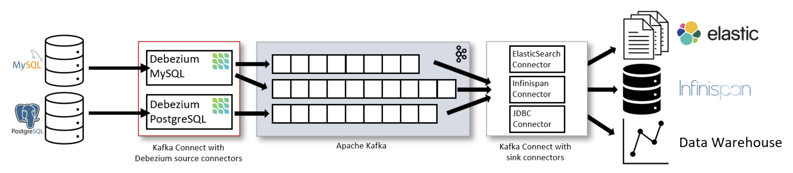
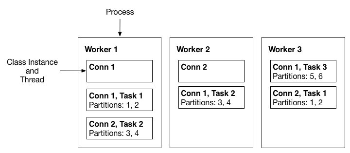

# 1. Introduction

## Kafka Connect 란?




Kafka Connect is a tool for scalably and reliably streaming data between Apache Kafka® and other data systems. It makes it simple to quickly define connectors that move large data sets in and out of Kafka. Kafka Connect can ingest entire databases or collect metrics from all your application servers into Kafka topics, making the data available for stream processing with low latency. An export connector can deliver data from Kafka topics into secondary indexes like Elasticsearch, or into batch systems–such as Hadoop for offline analysis.

Kafka Connect is a free, open-source component of Apache Kafka® that works as a centralized data hub for simple data integration between databases, key-value stores, search indexes, and file systems. The information in this page is specific to Kafka Connect for Confluent Platform

Kafka Connect provides the following benefits:

- **Data-centric pipeline**: Connect uses meaningful data abstractions to pull or push data to Kafka.
- **Flexibility and scalability**: Connect runs with streaming and batch-oriented systems on a single node (standalone) or scaled to an organization-wide service (distributed).
- **Reusability and extensibility**: Connect leverages existing connectors or extends them to fit your needs and provides lower time to production.

Kafka Connect is focused on streaming data to and from Kafka, making it simpler for you to write high quality, reliable, and high performance connector plugins. Kafka Connect also enables the framework to make guarantees that are difficult to achieve using other frameworks. It is an integral component of an ETL pipeline, when combined with Kafka and a stream processing framework.


카프카와 다른 시스템 사이에서 데이터를 복사하기 위해, 해당 시스템의 데이터를 Push 또는 Pull할 카프카 커넥터를 인스턴스화(instantiate) 해야한다. 


**주요 컨셉** 

- 데이터 중심 파이프라인 : 카프카 커넥트를 이용해 카프카로 데이터를 보내거나, 카프카로 데이터를 가져옴
- 유연성 : 커넥트는 테스트를 위한 단독 모드(standalone mode)와 대규모 운영 환경을 위한 분산 모드(distributed mode)를 제공
- 재사용성과 확장성 : 커넥트는 기존 커넥터를 활용할 수도 있고 운영 환경에서의 요구사항에 맞춰 확장이 가능
- 편리한 운영과 관리 : 카프카 커넥트가 제공하는 REST API로 빠르고 간단하게 커넥트 운영 가능
- 장애 및 복구 : 카프카 커넥트를 분산 모드로 실행하면 워커 노드의 장애 상황에도 메타데이터를 백업함으로써 대응 가능하며 고가용성 보장


**Connectors and tasks**

Implementations of the `Connector` class do not perform data copying themselves: their configuration describes the set of data to be copied, and the `Connector` is responsible for breaking that job into a set of [Tasks](https://docs.confluent.io/platform/7.3/connect/javadocs/javadoc/org/apache/kafka/connect/connector/Task.html) that can be distributed to Kafka Connect workers. Tasks also come in two corresponding flavors: [SourceTask](https://docs.confluent.io/platform/7.3/connect/javadocs/javadoc/org/apache/kafka/connect/source/SourceTask.html) and [SinkTask](https://docs.confluent.io/platform/7.3/connect/javadocs/javadoc/org/apache/kafka/connect/sink/SinkTask.html). Optionally, the implementation of the `Connector` class can monitor the data changes of external systems and request task reconfiguration.

With an assignment of data to be copied in hand, each `Task` must copy its subset of the data to or from Kafka. The data that a connector copies must be represented as a **partitioned stream**, similar to the model of a Kafka topic, where each partition is an ordered sequence of records with offsets. Each task is assigned a subset of the partitions to process. Sometimes this mapping is clear: each file in a set of log files can be considered a partition, each line within a file is a record, and offsets are simply the position in the file. In other cases it may require a bit more effort to map to this model: a JDBC connector can map each table to a partition, but the offset is less clear. One possible mapping uses a timestamp column to generate queries to incrementally return new data, and the last queried timestamp can be used as the offset.

**사용 목적**


## **작동원리**


## 장점

#### 소스 DB의 변경분을 스트림으로 캡처해서 이벤트화

MongoDB와 Redis, MySQL 등 대부분의 DB는 Oplog나 Binary Log 등 부르는 이름은 달라도 모두 리플리케이션(replication)을 위해서 데이터 변경 로그를 남깁니다. 데이터 변경 로그는 위 그림에서 스트림에 해당하기 때문에 접근할 수 있는 권한과 수집할 수 있는 방법이 있다면 데이터 스트리밍 파이프라인을 구축하는 용도로 사용할 수 있는데요. Kafka Connect는 Connector라는 이름으로 각 DB에 맞는 수집 방법을 제공합니다. Connector는 작동 방식에 따라 크게 두 가지로 나뉘며, 이렇게 DB나 기타 소스에서 데이터를 수집하는 Connector를 Source Connector라고 합니다. 만일 원하는 Connector가 없을 경우 커스텀 Connector를 제작해 사용할 수도 있습니다.


#### 스트림 데이터를 타깃에 반영해 상태를 변경

앞서 설명한 기능과 반대 방향으로 작동하는 경우입니다. 수집한 스트림 데이터가 Kafka 토픽에 저장돼 있는 경우 이 스트림을 타깃에 저장할 수 있습니다. Kafka Connect의 Sink Connector가 바로 이렇게 작동합니다. 이때 타깃이 반드시 DB일 필요는 없습니다. 예를 들어 HTTP Sink Connector는 스트림 데이터를 HTTP로 전송합니다.


## 지원 목록

> Confluent ([링크](https://www.confluent.io/product/confluent-connectors/?utm_medium=sem&utm_source=google&utm_campaign=ch.sem_br.nonbrand_tp.prs_tgt.kafka-connectors_mt.mbm_rgn.apac_lng.eng_dv.all_con.kafka-connectors&utm_term=%2Bkafka%20%2Bconnector&creative=&device=c&placement=&gclid=CjwKCAjw5s6WBhA4EiwACGncZSdMmVKLpOkwwHaaAI9amznnuhigrv1fZ6PWJyCt2cOD-yKcOEBx9BoCQQ4QAvD_BwE))
>
> Confluent Hub ([링크](https://www.confluent.io/hub/))

- MySQL
- MongoDB
- Amazon S3
- Redis
- Elasticsearch
- PostgreSQL


# 2. 용어

## Kafka Connect(Connect Cluster)

`Kafka Connect(카프카 커넥트)`는 Kafka를 대상으로 스트림 데이터를 처리(관리)하는 프레임워크입니다. 다수의 `Worker`로 구성되며 `Connector`를 이용해 외부 데이터(DB, ...)와 카프간의 데이터 파이프라인을 쉽게 구성할 수 있습니다. 


## Worker

> Connectors and tasks are logical units of work and must be scheduled to execute in a process

`Worker`란 `Connector`와 `Task`가 실행되는 서버를 의미하며, 구성에 따라 2가지 유형( `standalone`, `distributed`)으로 나뉩니다.


**Standalone Workers**

단일 서버 또는 인스턴스로 구성된 가장 단순한 형태입니다. 주로 개발 환경이나 로그 수집과 같은 단순한 작업만 필요한 경우에 사용됩니다. 단일 프로세스이므로 확장성(`Scalability`)이나 내결함성(`fault tolerance`)에 있어서 제한사항이 많습니다. 


**Distributed Workers**

> **Important**
>
> >  All workers with the same `group.id` will be in the same connect cluster. For example, if worker-a has `group.id=connect-cluster-a` and worker-b has the same `group.id`, worker-a and worker-b will form a cluster called `connect-cluster-a`.

2개 이상의 서버 또는 인스턴스로 구성된 형태이며, `Kafka Connect`를 위한 확장성(`Scalability`)과 내결함성(`fault tolerance`)을 제공합니다. 

`Distributed mode`에서는 동일한 `group.id`를 이용하여 많은 `worker` 프로세스를 실행하며, 가용 가능한 `worker`에서 `connector`와 `task`를 자동으로 관리 및 스케쥴링 합니다. `Worker`가 변경(생성, 삭제, 중지)되는 경우, 가용 가능한 나머지 worker들이 해당 변경사항을 탐지하여 `connector`와 `task`를 재분배합니다. 이러한 과정은 Consumer Group Rebalancing과 유사하며, 실제로 consumer group을 이용하여 coordinate and rebalance를 처리합니다. 


다음은 3개의 노드(Worker)로 구성된 카프카 커넥트 클러스터를 나타냅니다. 




## Connector

> the high level abstraction that coordinates data streaming by managing tasks


`Kafka Connect`에서 `Connector`는 데이터를 어디서(from) 또는 어디로(to) 복사 또는 전달할지를 정의합니다. `Connector`에서 사용, 실행하는 모든 `code(Class)`는 `Connector plugin`에 정의되어 있으며 `jar` 파일 또는 `CLI`를 사용하여 설치할 수 있습니다.

```shell
# CLI Example - Confluent Hub
confluent-hub install confluentinc/kafka-connect-aws-cloudwatch-logs:1.2.3

# Manual Install Example - Jar file
cp <path>/kafka-connect-hdfs-3.0.1-package.jar <plugin_path>
```


`Connector instance`는 카프카와 다른 시스템 간의 데이터 전달을 관리하는 책임을 가지고 있는 논리적인 작업을 의미합니다. `Connector instance`와 `Connector plugin`은 일반적으로 `connector`라고 혼용되어 지칭됩니다. 하지만, `instance`와 `plugin`은 다른 개념이므로 맥락에 따라서 구분하여야 합니다. 예를 들어,  `connector`를 설치하는 상황에서 `connector`는 `plugin`을 의미하며, `connector`의 상태를 체크하는 상황에서는 `instance`를 의미합니다. 


**Source Connector**

- `Source connector`는 데이터베이스의 변경사항 또는 어플리케이션의 메트릭 등을 `Kafka`에 발행하여, 스트림 데이터를 실시간(낮은 지연시간)으로 처리할 수 있도록 해줍니다.
- 일반적으로 데이터베이스용 `connector`의 경우 `log` 또는 `query`를 사용합니다.
  - query를 기반으로 작동하는 `connector`의 경우 
    - `id`, `timestamp`와 같은 정렬이 가능한 `column`을 이용하여 Insert와 Update 이벤트를 발행합니다. 
    - `Delete` 이벤트를 발행할 수 없습니다. 
    - `query`를 사용하므로 `log`기반에 비해 상대적으로 CPU, Ram 사용량이 더 많습니다. 
  - log(`op log`, `bin log`, `WAL`, ...)을 기반으로 작동하는 `connector`의 경우
    - `Delete` 이벤트도 발행할 수 있습니다. 
    - `log`를 기반으로 작동하므로 CPU, Ram 사용량이 거의 증가하지 않습니다. 
    - IO 사용량이 증가할 수 있습니다. 


**Sink Connector**

- `Sink connector`는 `Kafka` 토픽에서 데이터베이스(`MySQL`, `PostgreSQL`, `MongoDB`, ...), `Elasticsearch`, `S3`와 같은 `Data Source`로 데이터를 전달합니다. 


## Task

> the implementation of how data is copied to or from Kafka

`Task`는 `Connect`의 데이터 모델에서 가장 중요한 요소입니다. 각 인스턴스(`connector instance`)에 의해서 관리되는 `Task`들은 실제로 데이터를 처리하는 주체입니다. `Kafka Connect`는 단일 작업을 다수의 `Task`로 분할하여, 병렬 처리와 확장성을 손쉽게 사용할 수 있도록 제공합니다. 


`Task`는 작업 상태와 관련한 정보를 `Task` 내부에 보관하지 않습니다. 연관된 `Connector`에서 관리하는 별도의 Kafka Topic(`config.storage.topic`, `status.storage.topic`)에 저장합니다. 그로 인해, 언제든지 `Task`가 실행, 중지, 재시작하더라도 탄력적이고 확장 가능한 데이터 파이프라인을 제공할 수 있습니다. 


## Converters

> the code used to translate data between Connect and the system sending or receiving data

`Converter`는 `Kafka Connect`가 특정 데이터 포맷을 읽거나 쓰기위해 꼭 필요한 요소입니다. `Task`는 `Converter`를 이용하여 `byte`를 특정 데이터 포맷으로 변환하거나, 반대로 `byte`로 변환합니다. (Kafka는 Byte 형태로 데이터를 저장합니다. )

기본적으로 제공되는 `Converter`는 다음과 같습니다. 

| 종류                | Data Format | Class Name                                           | Schema Registry |
| ------------------- | ----------- | ---------------------------------------------------- | --------------- |
| AvroConverter       | Avro        | `io.confluent.connect.avro.AvroConverter`            | O               |
| ProtobufConverter   | Protobuf    | `io.confluent.connect.protobuf.ProtobufConverter`    | O               |
| JsonSchemaConverter | Json        | `io.confluent.connect.json.JsonSchemaConverter`      | O               |
| JsonConverter       | Json        | `io.confluent.connect.json.JsonConverter`            | X               |
| StringConverter     | String      | `io.confluent.connect.storage.StringConverter`       | O               |
| ByteArrayConverter  | ByteArray   | `io.confluent.connect.converters.ByteArrayConverter` | O               |


`Converter`는 `Connector`와 분리(Decouple)되어 있으므로 `Connector`와 관계없이 재사용할 수 있습니다. 예를 들어, 동일한 `Avro Converter`를 사용하여 `JDBC Source Connector`에서 원본 데이터를 Avro로 변환하고, 그와 동시에 `HDFS Sink Connector`에서 Avro 데이터를 읽을 수 있습니다.

다음은 `Converter`가 어떠한 형태로 작동하는지를 보여줍니다. 


## Transforms


- ValueToKey
  - https://docs.confluent.io/platform/current/connect/transforms/valuetokey.html#valuetokey
- 


# 3. Connector && Configurations

> https://docs.confluent.io/kafka-connectors/self-managed/userguide.html#producer-and-consumer-overrides

## 3.1. Connector Configuration (공통)

> https://docs.confluent.io/platform/current/connect/references/allconfigs.html#override-the-worker-configuration

#### **Worker Configuration**

```
bootstrap.servers
```

A list of host/port pairs to use for establishing the initial connection to the Kafka cluster. The client will make use of all servers irrespective of which servers are specified here for bootstrapping - this list only impacts the initial hosts used to discover the full set of servers. This list should be in the form `host1:port1,host2:port2,...`. Since these servers are just used for the initial connection to discover the full cluster membership (which may change dynamically), this list need not contain the full set of servers (you may want more than one, though, in case a server is down).

- Type: list
- Default: [localhost:9092]
- Importance: high

```
key.converter
```

Converter class for key Connect data. This controls the format of the data that will be written to Kafka for source connectors or read from Kafka for sink connectors. Popular formats include Avro and JSON.

- Type: class
- Default:
- Importance: high

```
value.converter
```

Converter class for value Connect data. This controls the format of the data that will be written to Kafka for source connectors or read from Kafka for sink connectors. Popular formats include Avro and JSON.

- Type: class
- Default:
- Importance: high

```
internal.key.converter
```

Converter class for internal key Connect data that implements the `Converter` interface. Used for converting data like offsets and configs.

- Type: class
- Default:
- Importance: low

```
internal.value.converter
```

Converter class for offset value Connect data that implements the `Converter` interface. Used for converting data like offsets and configs.

- Type: class
- Default:
- Importance: low

```
offset.flush.interval.ms
```

Interval at which to try committing offsets for tasks.

- Type: long
- Default: 60000
- Importance: low

```
offset.flush.timeout.ms
```

Maximum number of milliseconds to wait for records to flush and partition offset data to be committed to offset storage before cancelling the process and restoring the offset data to be committed in a future attempt.

- Type: long
- Default: 5000
- Importance: low

```
plugin.path
```

The comma-separated list of paths to directories that contain [Kafka Connect plugins](https://docs.confluent.io/kafka-connectors/self-managed/userguide.html#installing-kconnect-plugins).

- Type: string
- Default:
- Importance: low

```
rest.advertised.host.name
```

If this is set, this is the hostname that will be given out to other Workers to connect to.

- Type: string
- Importance: low

```
rest.advertised.listener
```

Configures the listener used for communication between Workers. Valid values are either `http` or `https`. If the listeners property is not defined or if it contains an HTTP listener, the default value for this field is `http`. When the listeners property is defined and contains only HTTPS listeners, the default value is `https`.

- Type: string
- Importance: low

```
rest.advertised.port
```

If this is set, this is the port that will be given out to other Workers to connect to.

- Type: int
- Importance: low

```
listeners
```

List of REST listeners in the format `protocol://host:port,protocol2://host2:port2`, where the protocol is either HTTP and HTTPS.

- Type: list
- Importance: low

```
response.http.headers.config
```

Used to select which HTTP headers are returned in the HTTP response for Confluent Platform components. Specify multiple values in a comma-separated string using the format `[action][header name]:[header value]` where `[action]` is one of the following: `set`, `add`, `setDate`, or `addDate`. You must use quotation marks around the header value when the header value contains commas. For example:

```
response.http.headers.config="add Cache-Control: no-cache, no-store, must-revalidate", add X-XSS-Protection: 1; mode=block, add Strict-Transport-Security: max-age=31536000; includeSubDomains, add X-Content-Type-Options: nosniff
```


- Type: string
- Default: “”
- Importance: low

```
task.shutdown.graceful.timeout.ms
```

Amount of time to wait for tasks to shutdown gracefully. This is the total amount of time, not per task. All task have shutdown triggered, then they are waited on sequentially.

- Type: long
- Default: 5000
- Importance: low


#### **Producer**

```
producer.override.<Producer_Config>
```

**Example - Gzip Compression**

```
"producer.override.compression.type": "gzip"
```


#### Consumer

```
consumer.override.<Producer_Config>
```

**Example - Gzip Compression**

```
"consumer.override.auto.offset.reset": "latest"
```


## 3.2. Debezium

### 3.2.1. MongoDB 

**사전 준비 사항**


#### Source Connector

**장점**

- 다른 Debezium Connector도 함께 사용하는 경우 관리 포인트 감소

- Debezium UI를 통한 Connector 관리


**주의 사항**

- `filtering`이 `connector` 내부에서 이루어지므로 Change Stream을 통해서 전체 Document를 받게되어 네트워크 비용 증가

- Full document가 `16Mb`에 근접한 경우,  Change Stream을 통해 데이터를 받는 과정에서 사이즈 초과로인한 `BSONObjectTooLarge`에러가 발생할 수 있다. 

```tex
2023-02-08 07:57:49,961 ERROR  MongoDB|balis3|streaming  Producer failure   [io.debezium.pipeline.ErrorHandler]
org.apache.kafka.connect.errors.ConnectException: Error while attempting to read from change stream on ‘<database>/<Host>:27017,<Host>:27017,<Host>:27017’
        at io.debezium.connector.mongodb.MongoDbStreamingChangeEventSource.lambda$establishConnection$3(MongoDbStreamingChangeEventSource.java:170)
        at io.debezium.connector.mongodb.ConnectionContext$MongoPreferredNode.execute(ConnectionContext.java:381)
        at io.debezium.connector.mongodb.MongoDbStreamingChangeEventSource.streamChangesForReplicaSet(MongoDbStreamingChangeEventSource.java:115)
        at io.debezium.connector.mongodb.MongoDbStreamingChangeEventSource.execute(MongoDbStreamingChangeEventSource.java:96)
        at io.debezium.connector.mongodb.MongoDbStreamingChangeEventSource.execute(MongoDbStreamingChangeEventSource.java:52)
        at io.debezium.pipeline.ChangeEventSourceCoordinator.streamEvents(ChangeEventSourceCoordinator.java:174)
        at io.debezium.pipeline.ChangeEventSourceCoordinator.executeChangeEventSources(ChangeEventSourceCoordinator.java:141)
        at io.debezium.pipeline.ChangeEventSourceCoordinator.lambda$start$0(ChangeEventSourceCoordinator.java:109)
        at java.base/java.util.concurrent.Executors$RunnableAdapter.call(Executors.java:515)
        at java.base/java.util.concurrent.FutureTask.run(FutureTask.java:264)
        at java.base/java.util.concurrent.ThreadPoolExecutor.runWorker(ThreadPoolExecutor.java:1128)
        at java.base/java.util.concurrent.ThreadPoolExecutor$Worker.run(ThreadPoolExecutor.java:628)
        at java.base/java.lang.Thread.run(Thread.java:829)
Caused by: com.mongodb.MongoQueryException: Query failed with error code 10334 with name ‘BSONObjectTooLarge’ and error message ‘BSONObj size: 17236670 (0x10702BE) is invalid. Size must be between 0 and 16793600(16MB) First element: _id: { _data: “8263E35293000001282B022C0100296E5A1004907AB287AA1844CF9C1F4A940CE2F13046645F69640064638F3AD9302A3102341AE88E0004” }’ on server <Host>:27017
        at com.mongodb.internal.operation.QueryHelper.translateCommandException(QueryHelper.java:29)
        at com.mongodb.internal.operation.QueryBatchCursor.lambda$getMore$1(QueryBatchCursor.java:298)
        at com.mongodb.internal.operation.QueryBatchCursor$ResourceManager.executeWithConnection(QueryBatchCursor.java:532)
        at com.mongodb.internal.operation.QueryBatchCursor.getMore(QueryBatchCursor.java:286)
        at com.mongodb.internal.operation.QueryBatchCursor.tryHasNext(QueryBatchCursor.java:239)
        at com.mongodb.internal.operation.QueryBatchCursor.lambda$tryNext$0(QueryBatchCursor.java:222)
        at com.mongodb.internal.operation.QueryBatchCursor$ResourceManager.execute(QueryBatchCursor.java:417)
        at com.mongodb.internal.operation.QueryBatchCursor.tryNext(QueryBatchCursor.java:221)
        at com.mongodb.internal.operation.ChangeStreamBatchCursor$3.apply(ChangeStreamBatchCursor.java:107)
        at com.mongodb.internal.operation.ChangeStreamBatchCursor$3.apply(ChangeStreamBatchCursor.java:103)
        at com.mongodb.internal.operation.ChangeStreamBatchCursor.resumeableOperation(ChangeStreamBatchCursor.java:200)
        at com.mongodb.internal.operation.ChangeStreamBatchCursor.tryNext(ChangeStreamBatchCursor.java:103)
        at com.mongodb.client.internal.MongoChangeStreamCursorImpl.tryNext(MongoChangeStreamCursorImpl.java:87)
        at io.debezium.connector.mongodb.MongoDbStreamingChangeEventSource.readChangeStream(MongoDbStreamingChangeEventSource.java:244)
        at io.debezium.connector.mongodb.MongoDbStreamingChangeEventSource.lambda$streamChangesForReplicaSet$0(MongoDbStreamingChangeEventSource.java:116)
        at io.debezium.connector.mongodb.ConnectionContext$MongoPreferredNode.execute(ConnectionContext.java:377)
        ... 11 more
```

- `groovy`를 사용하는 경우 `!=`가 정상적으로 작동되지 않는 것으로 보인다. `!condition` 형태로 작성하자


**Example: **

```json
{
    "name": "deb-product-source-raw",
    "config": {
        "connector.class": "io.debezium.connector.mongodb.MongoDbConnector",
        "collection.include.list": "<database>.<collection>",
        "mongodb.name": "connector",
        "mongodb.hosts": "<host1>:27017,<host2>:27017,<host3>:27017",
        "mongodb.user": "<username>",
        "mongodb.password": "<password>",
        "capture.mode": "change_streams_update_full",
        "snapshot.mode": "never",
        "topic.prefix": "raw",
        "field.exclude.list": "hub.confirmed._diff,hub.confirmed._dt,hub.confirmed._t",
        "producer.override.compression.type": "gzip",
        "transforms": "filter",
        "transforms.filter.type": "io.debezium.transforms.Filter",
        "transforms.filter.language": "jsr223.groovy",
        "transforms.filter.condition": "value.op == 'u' && value.updateDescription.updatedFields != '{}' && value.updateDescription.removedFields != null",
        "tombstones.on.delete": false,
        "tasks.max": 3
    }
}
```


### 3.1.2. PostgreSQL 

#### **사전 준비 사항**

- [AWS RDS] `logical_replication` = 1
  - `SELECT name,setting FROM pg_settings WHERE name IN ('wal_level','rds.logical_replication');`
- [AWS RDS] `wal_level ` = `logical`
  - `logical_replication`를 1로 설정하면 자동적으로 설정된다.
- [AWS RDS] `rds_replication` 권한을 가진 계정 생성
  - 특정 테이블에 대해 `Snapshot`을 사용하는 경우, 해당 테이블에 `SELECT` 권한 부여가 필요하다. 
- Plugin 설정
- 계정 생성


#### Source Connector

> https://debezium.io/documentation/reference/stable/connectors/postgresql.html#postgresql-connector-properties


**Example: **

```json
{
  "name": "fulfillment-connector",  
  "config": {
    "connector.class": "io.debezium.connector.postgresql.PostgresConnector", 
    "database.hostname": "192.168.99.100", 
    "database.port": "5432", 
    "database.user": "postgres", 
    "database.password": "postgres", 
    "database.dbname" : "postgres", 
    "topic.prefix": "fulfillment", 
    "table.include.list": "public.inventory" 
  }
}
```


### 3.1.3. MySQL(MariaDB) 

#### Source Connector


## 3.2. Mongo

### 3.2.1. MongoDB 

> https://www.mongodb.com/docs/kafka-connector/current/

#### Source Connector


**주요 Configuration**

`pipeline`

> An array of aggregation pipelines to run in your change stream

- 별도의 `Index`가 설정되어 있지 않으므로, 복잡한 형태의 `$match`는 **지양**하여야 한다. 
- `_id`에 Resume Token이 기입되어있으므로 제거하여서는 안된다. 

```tex
# Https를 통해 Conncetor를 설정하는 경우
[{\"$match\": { \"$and\": [{\"operationType\": \"insert\"}, {\"fullDocument.eventId
": 1404 }] } }]
```


`change.stream.full.document`

> Determines what values your change stream returns on update operations.
>
> The default setting returns the differences between the original document and the updated document.

- `updateLookup`
  -  `document` 변경 내역과 해당 시점의 변경이 반영된 `updated document`를 같이 반환
- `whenAvailable` 
  - 가능한 경우 `updated document`를 반환
- `required`
  - `updated document`를 반환하지 못하는 경우 `error` 발생


`startup.mode.copy.existing.pipeline`

>


**장점**

- `Pipeline`을 이용하여 불필요한 필드를 제거할 수 있다. 
  - MongoDB에서 Project되는 것이므로 Document 사이즈를 줄여 네트워크 비용을 절감할 수 있다. 
  - `_id`(Resume token)는 변경 불가능하다.


**주의 사항**

- 기본적으로 Key에 Resume Token이 기입되어있다.
- Value to key를 사용하여 Key를 변경하는 경우, Schema Registry가 반 필수로 보인다. 


**Example**

```json
{
    "name": "connector-cdc",
    "config": {
        "connector.class": "com.mongodb.kafka.connect.MongoSourceConnector",
        "connection.uri": "mongodb://<username>:<password>@<host1>:27017,<host2>:27017,<host3>:27017/",
        "database": "<database>",
        "topic.prefix":"<prefix>",
        "collection": "<collection>",
        "change.stream.full.document": "updateLookup",
        "producer.override.compression.type": "gzip",
        "startup.mode": "latest",
        "publish.full.document.only": false,
        "key.converter": "org.apache.kafka.connect.storage.StringConverter",
        "value.converter": "org.apache.kafka.connect.storage.StringConverter",
        "key.converter.schemas.enable": false,
        "value.converter.schemas.enable": false,
        "pipeline": "[{\"$project\": { \"fullDocument.id\": 0 } }]",
        "output.format.value": "json",
        "output.format.key":"json"
    }
}
```


## 3.3. Confluent


## 3.4 주의 사항

**공통**

- Worker의 JVM Heap Memory가 부족한 경우 문제가 발생할 수 있다. 


**MongoDB**

- Pre image를 사용하는 경우 사실상 Document 사이즈를 8MB이하로 관리하여야한다. 
  - pre + post하는 경우 16MB를 초과할 수 있음
- 전체 Document를 같이 받는 경우 네트워크 문제가 발생할 수 있으므로, 트랜잭션이 많은 Collection이라면 주의하여야 한다. 
  - 초당 500개 * 100Kb = 50Mb/s


# Reference

- https://engineering.linecorp.com/ko/blog/advanced-data-pipeline-with-confluent-platform-on-kubernetes