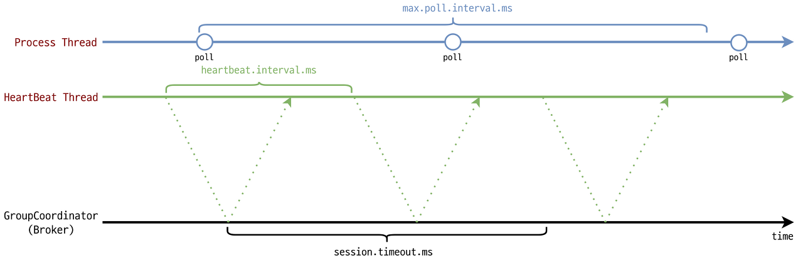
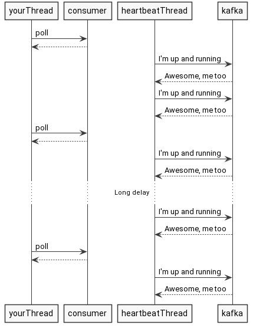
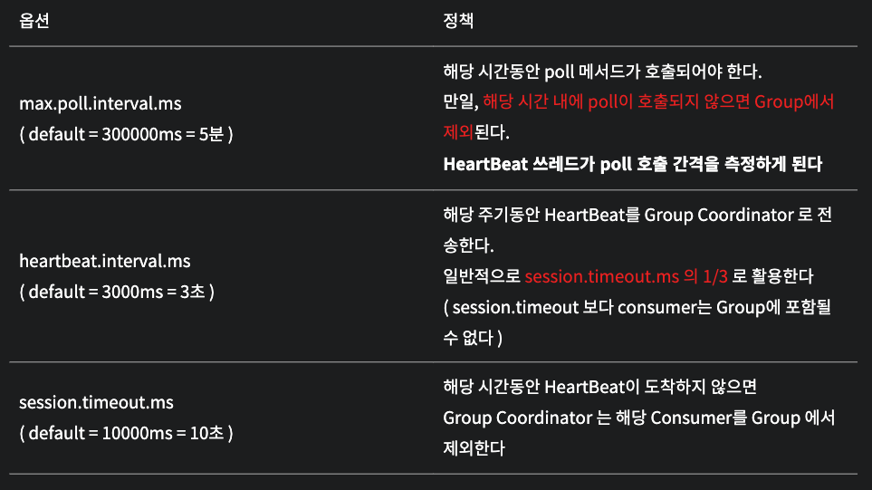
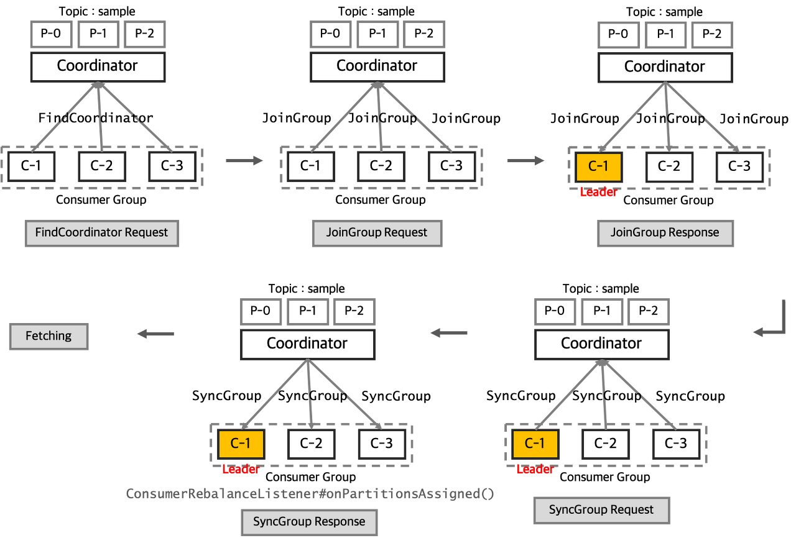

[TOC]


# 1. Introduction

## 1.1. Kafka 란?


> **Apache Kafka**는 빠르고 확장 가능한 작업을 위해 데이터 피드의 분산 스트리밍, 파이프 라이닝 및 재생을 위한 실시간 스트리밍 데이터를 처리하기 위한 목적으로 설계된 오픈 소스 분산형 게시-구독 메시징 플랫폼입니다.
>
> Kafka는 서버 클러스터 내에서 데이터 스트림을 레코드로 유지하는 방식으로 작동하는 브로커 기반 솔루션입니다. Kafka 서버는 여러 데이터 센터에 분산되어 있을 수 있으며 여러 서버 인스턴스에 걸쳐 레코드 스트림(메시지)을 토픽으로 저장하여 데이터 지속성을 제공할 수 있습니다. 토픽은 레코드 또는 메시지를 키, 값 및 타임 스탬프로 구성된 일련의 튜플, 변경 불가능한 Python 객체 시퀀스로 저장합니다.
>
> https://www.tibco.com/ko/reference-center/what-is-apache-kafka


## 1.2. 특징

* Pull 방식

`Consumer`가 `Broker`로부터 메세지를 가져가는(**Pull**) 형태이므로 Consumer의 처리능력만큼 메세지를 가져가므로 최적의 성능을 발휘할 수 있다. 


* 파일 시스템 기반

`Consumer`가 메세지를 처리하더라도 정해진 **보관 주기** 동안 디스크에 메시지를 저장하므로 안정적이며, 차후 장애등으로 문제가 생긴 경우에도 특정 시점부터 메세지를 다시 사용할 수 있다. 


* Commit && Offset

* Commit && Offset

기존 메시징 시스템의 경우, `Message`를 소비하는 경우 즉시 큐에서 삭제되므로  `Queue`를 하나의 Consumer만 활용할 수 있다. 

`Kafka`의 경우, `Message`를 `Consumer`가 **Commit**하는 경우에만 소비한 것으로 취급한다.

또한,  동일한 `Topic`에 대해 각 `Consumer Group` 마다 **Offset**정보를 저장하고 있으므로 하나의 `Topic`에 대해 여러 `Consumer`가 존재할 수 있다. 


## 1.3. 장점과 단점


Apache Kafka는 만족을 위해 구성한 설계 목표로 인해 몇 가지 중요한 이점이 있습니다. Apache Kafka는 다음과 같은 세 가지 주요 요구 사항을 염두에 두고 설계되었습니다.

- 데이터 분배 및 이용을 위한 게시/구독 메시징 모델 제공
- 오랜 시간에 걸쳐 액세스하고 재생할 수 있는 데이터의 장기 저장 허용
- 실시간 스트림 처리를 위해 실시간으로 데이터에 액세스하는 기능 지원

이것이 Apache Kafka가 진정으로 빛을 발하는 곳입니다. 일부 메시징 시스템과 달리 트랜잭션 또는 다른 배포 모델에 대한 매력적인 부가 기능을 제공하지는 않습니다. 스트림 처리를 지원하는 게시/구독 모델에 대한 데이터 분배를 제공하는 데 중점을 둡니다.

둘째, 처음부터 장기간 데이터 저장 및 데이터 재생을 제공하도록 설계되었으므로 Apache Kafka는 데이터 영속성, 내결함성 및 재생에 고유하게 접근할 수 있습니다. 이는 Apache Kafka가 클러스터에서 데이터 복제 영속성, 데이터 볼륨 및 로드 증가를 위해 파티션 간 데이터 공유, 토픽/파티션, 데이터 오프셋 및 컨슈머 그룹 이름을 사용하여 데이터 액세스를 허용함으로써 확장성을 처리하는 방법에서 알아볼 수 있습니다.

마지막으로 Apache Kafka는 원래 실시간 로그 처리를 위한 통신 계층 역할을하도록 설계되었기 때문에 자연스럽게 실시간 스트림 처리 애플리케이션에 어울립니다. 따라서 Apache Kafka는 대량의 데이터를 실시간으로 배포할 수있는 통신 인프라를 활용하는 애플리케이션에 이상적으로 적합합니다.

**원활한 메시징 및 스트리밍 기능 :** 대용량 데이터를 처리할 때 메시징은 레거시 통신 모델에 비해 통신 및 확장성에 상당한 이점을 제공할 수 있습니다. 메시징 및 스트리밍 기능을 결합함으로써 Apache Kafka는 실시간으로 레코드를 게시, 구독, 저장 및 처리하는 고유한 기능을 제공합니다.

**데이터 재생을 위한 시간 기반 데이터 보존 :** Apache Kafka는 기본적으로 클러스터 전체의 디스크에 데이터를 지속적으로 저장하는 기능을 통해 내결함성에 대한 간단한 접근 방식을 허용합니다. 시간 기반 보존 기간을 기반으로 저장된 데이터를 회수하고 순차적 오프셋을 기반으로 데이터에 액세스하는 기능과 함께 Apache Kafka는 클러스터 설정에서 데이터 저장 및 검색에 대한 강력한 접근 방식을 제공합니다.

**스트림 처리를 위한 기본 접근 방식 :** 데이터를 빠르고 효율적으로 이동할 수 있게 하는 것이 상호 연결성의 핵심입니다. Apache Kafka는 데이터를 레코드, 메시지 또는 스트림으로 원활하게 이동할 수 있는 기반을 제공합니다. 데이터를 검사, 변환 및 활용하려면 데이터를 실시간으로 다른 위치로 이동할 수 있는 기능이 필요하며 Apache Kafka는 실시간으로 데이터를 이동하고 저장하기위한 기본 접근 방식을 제공합니다.

**기본 통합 지원 :** 모든 것에 적용하는 것은 결코 좋은 접근 방식이 아니며 Apache Kafka는 Connector API를 사용하여 기본 통합 지점을 제공함으로써 확장 및 성장할 수 있는 기본 기능을 제공합니다. Apache Kafka Connector API를 사용하여 애플리케이션은 사전 구축된 커넥터 또는 오픈 소스 도구를 통해 타사 솔루션, 기타 메시징 시스템 및 레거시 애플리케이션과 통합하거나 애플리케이션 요구 사항에 따라 의도적으로 커넥터를 구축할 수 있습니다.

-> 정리 필요 


## 1.4. Rabbit MQ, Pulsar 와 비교


# 2. Installation

## 2.1. Kubernetes

### 2.1.1. Confluent ([helm Chart](https://github.com/confluentinc/cp-helm-charts))


### 2.1.2. Bitnami ([helm Chart](https://bitnami.com/stack/kafka/helm))


## 2.2. Docker Compose


## 2.3. MSK


# 3. 용어 정리

.png)

## 3.1. Broker

`Kafka` 어플리케이션이 설치되어 있는 서버 또는 노드를 의미한다. 

## 3.2. Zookeeper

분산 어플리케이션을 위한 코디네이션 시스템이다. 분산 어플리케이션이 안정적인 서비스를 할 수 있도록 분산되어 있는 각 어플리케이션의 정보를 중앙에 집중하고 구성 관리, 그룹 네이밍, 동기화 등의 서비스를 제공한다. 

`Leader`역할을 수행하던 서버에 장애가 발생한 경우 과반수 선출(majority voting/quorums)를 통해 다음 `Leader`를 선출한다. 이 때, 남아있는 서버의 갯수가 과반수를 넘지 못하는 경우 서비스가 불가능하며, 서버의 갯수가 짝수로 구성하든, 홀수로 구성하든 결함 허용 수준이 동일하므로 `Zookeeper`의 서버 갯수는 홀수로 설정한다. 

Ex) 4대로 구성 -> 서버 2개가 고장난 경우 잔여 서버(2대)가 과반수(2대)를 넘지 못하므로 장애 

Ex) 3대로 구성 -> 서버 2개가 고장난 경우 잔여 서버(1대)가 과반수(2대)를 넘지 못하므로 장애

## 3.3. Topic

`Message`를 구분하는 단위이자 데이터를 구분하기 위한 추상화 계층

`Topic` 이름은 249자 미만으로 영문, 숫자, `.`, `_`, `-`를 조합하여 만들 수 있다. 

`Topic`내에 `Partition`이 여러개인 경우, 별도로 `Partition`번호를 지정하지 않는다면 `Round-Robin`방식을 통해 메세지가 할당된다. 


## 3.4. Producer

`Message`를 발행하여 생산하는 주체

Apache Kafka에서 프로듀서 개념은 대부분의 메시징 시스템과 다르지 않습니다. 데이터(레코드/메시지) 프로듀서는 주어진 레코드/메시지가 게시되어야 하는 토픽(데이터 스트림)를 정의합니다. 파티션은 추가 확장성을 제공하는 데 사용되므로 프로듀서는 주어진 레코드/메시지가 게시되는 파티션도 정의할 수 있습니다. 프로듀서는 주어진 파티션을 정의할 필요가 없으며 파티션을 정의하지 않음으로써 토픽 파티션에서 순차 순환 대기 방식의 로드 밸런싱을 달성할 수 있습니다.

## 3.5. Consumer

`Message`를 구독하여 소비하 는 주체

대부분의 메시징 시스템과 마찬가지로 Kafka의 컨슈머는 레코드/메시지를 처리하는 엔터티입니다. 컨슈머는 개별 워크로드에서 독립적으로 작업하거나 지정된 워크로드에서 다른 컨슈머와 협력하여 작업하도록 구성할 수 있습니다(로드 밸런싱). 컨슈머는 컨슈머 그룹 이름을 기반으로 워크로드를 처리하는 방법을 관리합니다. 컨슈머 그룹 이름을 사용하면 컨슈머를 단일 프로세스 내, 여러 프로세스, 심지어 여러 시스템에 분산시킬 수 있습니다. 컨슈머 그룹 이름을 사용하여 컨슈머는 컨슈머 집합 전체에서 레코드/메시지 소비를 로드 밸런싱(동일한 컨슈머 그룹 이름을 가진 여러 컨슈머)하거나 토픽/파티션을 구독하는 각 컨슈머가 처리 메시지를 받도록 각 레코드/메시지를 고유하게 (고유한 컨슈머 그룹 이름을 가진 여러 컨슈머) 처리할 수 있습니다.


## 3.6. Consumer Group

`Consumer Group` 마다 Offset 정보가 따로 관리되므로, 하나의 `Topic`에 여러개의 그룹이 동시에 접속하여 메세지를 가져올 수 있으며 서로에게 영향을 주지 않는다. 

`Consumer Group`내의 `Consumer`들은 메세지를 가져오고 있는 `Topic`의 파티션에 대해 소유권을 공유한다. 

`Consumer`가 추가 또는 삭제되는 경우, 기존에 할당된 파티션의 소유권이 자동으로 재조정되며 이를 `rebalance`라고 한다. 단, `Consumer Group`내의 `Consumer`의 숫자는 `partition`의 갯수를 넘을 수 없으며, 초과된 수량의 `Consumer`는 파티션을 할당받지 못한다. 


## 3.7. Partition


파티션과 `Consumer`는 **N:1** 관계이므로 , 두개 이상의 `Consumer`가 동일한 `Partition`을 공유할 수 없다. 

`Offset`을 통해 파티션 내에서는 항상 메세지의 순서가 보장된다. 하지만, `Topic`이 2개 이상의 파티션으로 구성된 경우, `Topic`내에서는 메세지의 순서가 보장되지 않는다. 

파티션의 갯수는 추가만 가능하며, 감소는 불가능하다. 따라서, 파티션의 갯수를 줄이고 싶은 경우 `Topic`을 삭제한 후 재생성 해야한다. 

Message의 Key가 동일한 경우, 별도로 partition을 지정한 것이 아니라면, 동일한 Key를 가진 Message는 동일한 파티션으로 들어간다. 


## 3.8. Replication

`Topic`내 파티션의 복제본을 의미하며, `Topic`별로 다르게 설정할 수 있다. 

`replication factor` 만큼 파티션이 생성되므로 복제본은 `replication factor - 1`만큼 생긴다.  


## 3.9. Leader && Followers

`Topic`의 모든 Read/Write는 Leader에서 이루어진다. 

`Follower`는 `Leader`의 복제본을 의미하며, Leader와 동일한 상태값 또는 데이터를 가지고 있을 경우 ISR(In Sync Replica)로 설정되며, `Leader`가 다운된 경우 ISR 중에서 다음 `Leader`르를 선출하게 된다 


## 3.10. Offset

파티션내 각 메세지의 저장된 상대적 위치를 의미한다. 

새로운 메세지가 발행되는 경우 파티션의 맨 뒤에 추가되며, `Consumer`는 `Offset`을 기준으로 마지막 커밋 시점부터 순서대로 처리한다. 


# 4. Config

> [공식문서](https://kafka.apache.org/31/documentation.html#configuration)에 있는 Configuration을 기준으로 설명되었으며, helm-chart 또는 Docker Image 별로 이름이 다를 수 있습니다. 

## 4.1. [Broker](https://kafka.apache.org/31/documentation.html#brokerconfigs)

* #### auto.create.topics.enable

    * Enable auto creation of topic on the server

        |         Type: | boolean   |
        | ------------: | --------- |
        |      Default: | true      |
        | Valid Values: |           |
        |   Importance: | high      |
        |  Update Mode: | read-only |

* #### auto.leader.rebalance.enable

    * Enables auto leader balancing. A background thread checks the distribution of partition leaders at regular intervals, configurable by `leader.imbalance.check.interval.seconds`. If the leader imbalance exceeds `leader.imbalance.per.broker.percentage`, leader rebalance to the preferred leader for partitions is triggered.

        |         Type: | boolean   |
        | ------------: | --------- |
        |      Default: | true      |
        | Valid Values: |           |
        |   Importance: | high      |
        |  Update Mode: | read-only |

* #### compression.type

    * Specify the final compression type for a given topic. This configuration accepts the standard compression codecs ('gzip', 'snappy', 'lz4', 'zstd'). It additionally accepts 'uncompressed' which is equivalent to no compression; and 'producer' which means retain the original compression codec set by the producer.

        |         Type: | string       |
        | ------------: | ------------ |
        |      Default: | producer     |
        | Valid Values: |              |
        |   Importance: | high         |
        |  Update Mode: | cluster-wide |

* #### Delete.topic.enable

    * Enables delete topic. Delete topic through the admin tool will have no effect if this config is turned off

        |         Type: | boolean   |
        | ------------: | --------- |
        |      Default: | true      |
        | Valid Values: |           |
        |   Importance: | high      |
        |  Update Mode: | read-only |

* #### Log.dirs

    * The directories in which the log data is kept. If not set, the value in log.dir is used

        | Type:         | string    |
        | :------------ | --------- |
        | Default:      | null      |
        | Valid Values: |           |
        | Importance:   | high      |
        | Update Mode:  | read-only |

* #### message.max.bytes

    * The largest record batch size allowed by Kafka (after compression if compression is enabled). If this is increased and there are consumers older than 0.10.2, the consumers' fetch size must also be increased so that they can fetch record batches this large. In the latest message format version, records are always grouped into batches for efficiency. In previous message format versions, uncompressed records are not grouped into batches and this limit only applies to a single record in that case.This can be set per topic with the topic level `max.message.bytes` config.

        | Type:         | int          |
        | :------------ | ------------ |
        | Default:      | 1048588      |
        | Valid Values: | [0,...]      |
        | Importance:   | high         |
        | Update Mode:  | cluster-wide |

* #### default.replication.factor

    * The default replication factors for automatically created topics

        | Type:         | int       |
        | :------------ | --------- |
        | Default:      | 1         |
        | Valid Values: |           |
        | Importance:   | medium    |
        | Update Mode:  | read-only |

* #### num.partitions

    * The default number of log partitions per topic

        | Type:         | int       |
        | :------------ | --------- |
        | Default:      | 1         |
        | Valid Values: | [1,...]   |
        | Importance:   | medium    |
        | Update Mode:  | read-only |

## 4.2. Topic

Compact Vs. Delete


## 4.3. Producer

- max.request.size

`Producer`에서 `kafka(broker)`로 메세지를 전송시 가능한 최대 사이즈(bytes)를 의미한다. 

예를들어 `max.request.size`가 1024KB인 경우, 1KB 메세지를 최대 1024개까지 보낼수 있다. 단, 단일 메세지가 1024KB를 넘는 경우 제한을 넘어서게 되므로 전송에 실패한다. 

관련하여 `broker`에 `message.max.bytes`, `Topic`에  `max.message.bytes` 관련 설정이 존재한다. 

단, 해당 설정값은 압축이 설정된 경우, 압축 후 크기에 적용되지만, `max.request.size`는 압축 전 메세지에 적용되는 제한이라는 차이점이 있다. 

**Kafka Setting: `message.max.bytes` and `fetch.max.bytes`**

The Kafka broker limits the maximum size (total size of messages in a batch, if messages are published in batches) of a message that can be produced, configured by the cluster-wide property `message.max.bytes` (defaults to 1 MB). A producer that tries to send a message larger than this will receive an error back from the broker, and the message will not be accepted. As with all byte sizes specified on the broker, this configuration deals with compressed message size, which means that producers can send messages that are much larger than this value uncompressed, provided they compress it under the configured `message.max.bytes` size.

Note: This setting can be overridden by a specific topic (but with name `max.message.bytes`).

The maximum message size, `message.max.bytes`, configured on the Kafka broker must be coordinated with the cluster-wide property `fetch.max.bytes` (defaults to 1 MB) on consumer clients. It configures the maximum number of bytes of messages to attempt to fetch for a request. If this value is smaller than `message.max.bytes`, then consumers that encounter larger messages will fail to fetch those messages, resulting in a situation where the consumer gets stuck and cannot proceed.

The configuration setting `replica.fetch.max.bytes` (defaults to 1MB) determines the rough amount of memory you will need for each partition on a broker.

**Producer Setting: `max.request.size`**

This setting controls the size of a produce request sent by the producer. It caps both the size of the largest message that can be sent and the number of messages that the producer can send in one request. For example, with a default maximum request size of 1 MB, the largest message you can send is 1MB or the producer can batch 1000 messages of size 1k each into one request.

In addition, the broker has its own limit on the size of the largest message it will accept `message.max.bytes`). It is usually a good idea to have these configurations match, so the producer will not attempt to send messages of a size that will be rejected by the broker.

Note that `message.max.bytes` (broker level) and `max.requrest.size` (producer level) **puts a cap on the maximum size of request in a batch**, but `batch.size` (which should be lower than previous two) and `linger.ms` are the settings which actually **govern the size of the batch**.

**Producer Setting: `batch.size` and `linger.ms`**

When multiple records are sent to the same partition, the producer will batch them together. The parameter `batch.size` controls the maximum amount of memory in bytes (not the number of messages!) that will be used for each batch. If a batch has become full, all the message in the batch has to be sent. This helps in throughput on both the client and the server.

A small batch size will make batching less common and may reduce throughput. A very large size may use memory a bit more wastefully as we will always allocate a buffer of the specified batch size in anticipation of additional messages.

The `linger.ms` (defaults to 0) setting controls the amount of time to wait for additional messages before sending the current batch.

By default, the producer will send messages as soon as there is a sender thread available to send them, even if there's just one message in the batch (note that `batch.size` only specifies the maximum limit on the size of a batch). By setting linger.ms higher than 0, we instruct the producer to wait a few milliseconds to add additional messages to the batch before sending it to the brokers, even if a sender thread is available. This increases latency but also increases throughput (because we send more messages at once, there is less overhead per message).

linger.ms

batch.size

## 4.4. Consumer

## 4.5. Admin Client


## ACKS

- 0
  - `Producer`가 어떤 acks 응답도 기다리지 않는다. 즉, 카프카 서버가 데이터를 받았는지를 보장하지 않았으므로 전송 (요청) 실패에 따른 재요청도 없다.
- 1
  - 리더 노드가 메시지 발행 요청을 받은 건 확인하지만, 팔로워 노드가 그걸 복제해갔는지에 대해선 확인하지 않는다. 속도와 안정성 측면에서 가장 많이 쓰인다고 한다.
- -1 (all)
  - 리더 노드 뿐만 아니라 모든 팔로워 노드들의 응답을 기다리므로 데이터가 손실되지 않는다.

## max.in.flight.requests.per.connection

The maximum number of unacknowledged requests the client will send on a single connection before blocking.

- 프로듀서가 입력하는 데이터의 최소 단위는 `batch.size` 에 지정한 값이 되는데, 이 옵션으로는 발행될 이벤트에 대한 batch 단위의 순서를 보장할 수 있다. (물론 1개 파티션 내에서의 이야기가 되겠다.)
- 예를 들어, 2개의 batch 레코드 셋이 1개 파티션으로 발행 요청된 상황이 있다고 가정해보자. 이 상황에서 첫번째에 발행된 레코드 셋은 요청에 실패하여 retry 를 시도하고 있지만, 두번째 발행된 레코드 셋은 곧바로 성공하였다.
- 주어진 상황에서 **`max.in.flight.requests.per.connection` 이 1 보다 큰 값으로 설정**되어 있다면, 두번째 batch 레코드셋이 먼저 발행에 성공할 수 있게 된다.
- **`max.in.flight.requests.per.connection` 을 1 로 설정**한다면, 두번째 레코드셋은 첫번째에서 retry 를 성공할 때까지 발행 요청을 진행하지 않으므로, 파티션 내에서 프로듀서가 이벤트 발행을 요청한 순서를 보장한다. 다만 개인적으로는, 이렇게 되면 flexible 한 가용성을 충족시켜주진 못할 것 같다.

## connections_max_idle_ms

The idle socket timeout is reset on poll and heartbeat connections and could be considered an upper bound for any protocol request

https://stackoverflow.com/questions/71208769/difference-between-connections-max-idle-ms-and-max-poll-interval-ms-in-kafka-con

It's per *partition*. Kafka internally might multiplex connections (e.g. to send several requests using a single connect for different topics/partitions that are handled by the same broker), or have an individual connection per partition, but these are performance concerns which are *mostly* dealt within the client.

The documentation of `retries`, sheds some more light (and clarifies that is per partition)

> Setting a value greater than zero will cause the client to resend any record whose send fails with a potentially transient error. Note that this retry is no different than if the client resent the record upon receiving the error. Allowing retries without setting max.in.flight.requests.per.connection to 1 will potentially change the ordering of records because if two batches are sent to a single partition, and the first fails and is retried but the second succeeds, then the records in the second batch may appear first. Note additionally that produce requests will be failed before the number of retries has been exhausted if the timeout configured by [delivery.timeout.ms](http://delivery.timeout.ms) expires first before successful acknowledgement. Users should generally prefer to leave this config unset and instead use [delivery.timeout.ms](http://delivery.timeout.ms) to control retry behavior.

## heartbeat_interval_ms

- 그룹 코디네이터에게 얼마나 자주 KafkaConsumer poll() 메소드로 하트비트를 보낼것인지 조정
- session.timeout.ms보다 낮아야 하고 일반적으론 1/3 정도로 설정
- Python에서 메세지를 처리하는 중에도 별도의 Thread?를 통해서 heartbeat 체크를 진행함

## session_timeout_ms

- 카프카 브로커가 컨슈머에게 장애가 생겼다고 판단하는데 걸리는 시간
- 컨슈머는 주기적으로 그룹 코디네이터에게 하트비트를 전송해 자신이 살아있음을 알림
- 컨슈머가 그룹 코디네이터에게 하트비트를 보내지 않고 session.timeout.ms가 지나면 리밸런싱
- 값이 작은 경우 이상상황 빠르게 감지. 불필요한 리밸런싱이 자주 발생

## request_timeout_ms

• 요청에 대해 응답을 기다리는 최대 시간

## max_poll_interval_ms



- 컨슈머는 실제 데이터 polling 을 진행하고 있지 않을 때에도 컨슈머 그룹 멤버로서 지속적으로 존재하기 위해 **카프카 클러스터 (coordinator) 에게 heartbeat request 를 전송**한다.
- 하지만 컨슈머 클라이언트가 클러스터에 heartbeat 는 보내지만 실제 데이터는 읽어가지 않는 상황이 길어질 경우, **파티션이 무한정으로 점유**될 수 있다.
- **이 같은 상황을 방지하기 위해 이 설정을 추가**하여, 해당 값 (시간) 이 만료될 때 까지 message polling 을 시도하지 않는다면 컨슈머 그룹 구성에 변화가 생겼음 (해당 컨슈머가 장애라고 판단하고 그룹에서 제외시킬 수 있다) 을 인지할 수 있도록 한다.

## consumer_timeout_ms

## max_poll_records

- 컨슈머 클라이언트가 특정 토픽을 구독한 뒤부터 poll 작업이 이루어질 수 있는데, 이 때 **`poll()` 한 번에 따라 가져올 수 있는 최대 레코드 수**를 지정한다.
- 이 때 카프카를 사용하는 애플리케이션에서는 `poll` 메소드를 호출해서 레코드를 가져오고, 특정 스레드에서 그걸 전부 처리해준 뒤 다시 `poll` 메소드를 호출해 새로운 레코드를 가져오게 된다.
- 이 속성의 기본값은 `500`이므로, 기본 값을 사용하는 경우 poll 메소드로 한번에 최대 `500개 레코드`까지 가져올 수 있다.


# 5. Body

## 5.1. batching


### 목적 

**Producer**의 네트워크 요청 횟수를 줄여 **Kafka**의 처리량을 높인다. 

하지만, 네트워크 요청 횟수를 줄인 만큼 **지연시간은 증가**하므로 지연시간과 처리량 사이에서 적절한 균형점을 찾아야한다. 


### 관련 Configuration

1. #### batch.size

    - 메세지의 묶음이 임계값을 넘는 순간 메시지를 발행한다. 
    - 메세지의 사이즈가 임계값보다 작더라도 다른 조건(`linger.ms`, ...)에 의해 발행될 수 있다. 

2. #### linger.ms

    - 메세지가 `batch.size`를 넘을 때까지 기다리는 최대 시간
    - 값이 0으로 설정된 경우, 메세지를 즉시 발행한다.


## 5.2. HeartBeat



heartbeat와 poll은 서로 다른쓰레드에서 동작한다.  [KIP-62](https://cwiki.apache.org/confluence/display/KAFKA/KIP-62%3A+Allow+consumer+to+send+heartbeats+from+a+background+thread) 이전에는 poll이 호출되는경우 heartbeat가 호출됐다. 하지만 [KIP-62](https://cwiki.apache.org/confluence/display/KAFKA/KIP-62%3A+Allow+consumer+to+send+heartbeats+from+a+background+thread) 이후부턴 위 그림과 같이 heartbeat 쓰레드가 분리되어 poll에 더이상 영향을 받지 않게 되었다. 따라서 session.timeout.ms와 heartbeat.interval.ms는 긴밀한 관련이 있어서 보통 함께 고려하고, max.poll.interval.ms 옵션의 경우 poll에 관해서만 설정해준다.


## 5.3. Timeout && Interval




## 5.4. Rebalancing && STW (stop the world)



전체적인 흐름은

1. FindCoordinator Request: Consumer Coordinator 가 Join Group 요청을 보낼 Group Coordinator를 찾는다
2. JoinGroup Request: Group의 정보와 Subscription 정보를 수집하고, 리더를 선출한다
3. SyncGroup Request: 리더가 그룹내에 Consumer에게 Partition을 할당하고, Group Coordinator에게 해당 정보를 보낸다

Kafka가 Rebalancing 되는 과정 중에서는 모든 Consuming( Data Fetching ) 작업이 멈춰지는

**STW(Stop The World) 현상**이 이루어지게 된다


## 5.5. request quota


## Offset, Commit 관련

### enable.auto.commit (default=true)

- true일 경우 백그라운드로 주기적으로 오프셋을 커밋
- true일 경우 편리하지만 데이터 누락이나 중복 처리가 발생할 수 있음
- poll(), close() 메서드 호출시 자동 커밋 실행
- [auto.commit.interval.ms](http://auto.commit.interval.ms): 자동 커밋 주기
- false 일 경우 : commitSync() - 동기, commitAsync() - 비동기로 커밋해줘야한다


# 6. CLI

> bitnamin/kafka → `opt/bitnami/kafka/bin/`

## 6.1. Topic

### 목록

```shell
kafka-topics.sh --bootstrap-server localhost:9092 --list
```

### 정보 보기

```shell
kafka-topics.sh --bootstrap-server localhost:9092 --topic <topic_name> --describe
```

### 생성하기

```shell
kafka-topics.sh --bootstrap-server localhost:9092 --replication-factor 1 --partitions 1 --topic my_topic --create 
```

### 제거하기

```shell
kafka-topics.sh --bootstrap-server localhost:9092 --topic <topic_name> --delete
```


## 6.2. Producer

### Message 생성하기

```shell
kafka-console-producer.sh --broker-list localhost:9092 --topic <topic_name>
```

 

## 6.3. Consumer

### Message 소비하기

```shell
kafka-console-consumer.sh --bootstrap-server localhost:9092 --from-beginning --topic <topic_name>
```

### 특정 Partition의 Message 소비하기

```shell
kafka-console-consumer.sh --bootstrap-server localhost:9092 --from-beginning --partition <partition_number> --topic <topic_name>
```

### 특정 Consumer Group의 Message 소비하기

```shell
kafka-console-consumer.sh --bootstrap-server localhost:9092 --from-beginning --group group_name --topic <topic_name>
```

 

## 6.4. Consumer Group

### Consumer Group List

```shell
kafka-consumer-groups.sh --bootstrap-server localhost:9092 --list
```

### 상태

```shell
kafka-consumer-groups.sh --bootstrap-server localhost:9092 --group <group_name> --describe
```

### 삭제하기

```shell
kafka-consumer-groups.sh --bootstrap-server localhost:9092 --group <group_name> --delete
```


# 


# 7. Kafka Connect

> 자세한 내용은 `kafka connect.md` 참조


## 7.1. Connector 란?


### 7.1.1. Sink Connector

* Consumer 역할
* topic에 담긴 데이터를 특정 data source로 보내는 역할을 하는 connector

### 7.1.2. Source Connector

* Producer 역할
* data source에 담긴 데이터를 topic에 담는 역할을 하는 connector
    * op log (bin log)를 활용하여 모든 operation에 대해 Message를 발행
    * 또는, Query를 사용하여 id, timestamp를 사용하여 Insert, Update에 대해 Message를 발행


## 7.3. 지원 목록

> Confluent ([링크](https://www.confluent.io/product/confluent-connectors/?utm_medium=sem&utm_source=google&utm_campaign=ch.sem_br.nonbrand_tp.prs_tgt.kafka-connectors_mt.mbm_rgn.apac_lng.eng_dv.all_con.kafka-connectors&utm_term=%2Bkafka%20%2Bconnector&creative=&device=c&placement=&gclid=CjwKCAjw5s6WBhA4EiwACGncZSdMmVKLpOkwwHaaAI9amznnuhigrv1fZ6PWJyCt2cOD-yKcOEBx9BoCQQ4QAvD_BwE))
>
> Confluent Hub ([링크](https://www.confluent.io/hub/))

- MySQL
- MongoDB
- Amazon S3
- Redis
- Elasticsearch
- PostgreSQL


# 8. Schema Registry

> 자세한 내용은 `schema registry.md` 참조


# 9. Kafka Streams


# 10. KSQL DB


# 11. Monitoring & Dashboard

## 11.1. Prometheus & grafana

**사용 목적**


**장단점**


**추천하는 Dashboard(Grafana)**


## 11.2. UI for Kafka

**사용 목적**


**장단점**


### 11.2.1. Installation

> Github: https://github.com/provectus/kafka-ui
>
> Docker Image: https://hub.docker.com/r/provectuslabs/kafka-ui
>
> Helm Chart: https://github.com/provectus/kafka-ui/tree/master/charts/kafka-ui

```shell
# Helm chart Example
helm repo add kafka-ui https://provectus.github.io/kafka-ui
helm install kafka-ui kafka-ui/kafka-ui --set envs.config.KAFKA_CLUSTERS_0_NAME=local --set envs.config.KAFKA_CLUSTERS_0_BOOTSTRAPSERVERS=kafka:9092
```

### 11.2.2. Configuration(helm chart)

> 23년 1월 31일 기준으로 v0.5.0 tag를 사용하면 Google auth Error가 발생하므로 master tag를 사용하여야 한다. 

**Cluster**

```yaml
yamlApplicationConfig:
  kafka:
    clusters:
      - name: <cluster_name>
        bootstrapServers: <broker_urls>
```


**Connect**


**KSQL**


**Schema Registry**


**Auth - ID/Password**

```yaml
yamlApplicationConfig:
  auth:
    type: "LOGIN_FORM"

  spring:
    security:
      user:
        name: <username>
        password: <password>
```


**Auth - Google Oauth**

> GCP - OAuth 2.0 클라이언트 ID 설정법
>
> 1. `Oauth 동의화면` 생성
> 2. `사용자 인증 정보 만들기` > `Oauth 클라이언트 ID` 클릭
>    1. 애플리케이션 유형 - 웹 어플리케이션
>    2. 승인된 리디렉션 URI - `<URL>/login/oauth2/code/google`

```yaml
yamlApplicationConfig:
  auth:
    type: OAUTH2
    oauth2:
      client:
        google:
          provider: google
          clientId: <client_id>
          clientSecret: <client_secret>
          user-name-attribute: email
          custom-params:
            type: google
            allowedDomain: <domain>
```


**RBAC**

```yaml
yamlApplicationConfig:
  # Cluster 세팅
  kafka:
    clusters:
      - name: <cluster_name>
        bootstrapServers: <broker_urls>
  # 권한 관리
  rbac:
    roles:
      - name: "admin"
        clusters:
          - dev-kafka
        subjects:
          - provider: oauth_google
            type: user
            value: "<email>"
        permissions:
          - resource: clusterconfig
            actions: all
          - resource: topic
            value: ".*"
            actions: ["view", "create", "edit", "delete", "messages_produce"]
          - resource: consumer
            value: ".*"
            actions: all
          - resource: schema
            value: ".*"
            actions: all
          - resource: connect
            value: ".*"
            actions: all
          - resource: ksql
            actions: all

```


# 12. How to Use

Library & Package

| Language | Name            | Schema Registry | Difficulty | require |
| -------- | --------------- | --------------- | ---------- | ------- |
| Python   | kafka-python    | X               |            |         |
| Python   | confluent-kafka | O               |            |         |
| NodeJS   |                 |                 |            |         |
|          |                 |                 |            |         |


## 12.1. [Python] kafka-python


## 12.2. [Python] confluent-kafka


## 12.3. [NodeJS] 


# 기타

## Production에 배포시 주의 사항

* 보안
* Auto Create
* Storage Class
* IOPS
* Resource (CPU/RAM)

## Local Test 방법 (Kubernetes + Internal LB)

1. Telepresence를 사용하여 Cluster에 연결
    1. [Telepresence 설치 및 사용법](https://balaan-dev.atlassian.net/wiki/spaces/DDAT/pages/289472556) 
2. Internal LB 주소를 사용하여 테스트 


## **Kafka Broker 설정 예제**

https://data-engineer-tech.tistory.com/11


## Producer 설정 관련 TIP


# Trouble Shooting(좌충우돌 경험기)


## Session Timeout && Max Polling Interval


## Cleanup Policy


## Helm Chart


# Reference

1. https://kafka.apache.org/31/documentation.html
2. https://www.popit.kr/kafka-%EC%9A%B4%EC%98%81%EC%9E%90%EA%B0%80-%EB%A7%90%ED%95%98%EB%8A%94-topic-replication/
3. https://www.tibco.com/ko/reference-center/what-is-apache-kafka
4. https://stackoverflow.com/questions/61207633/how-to-process-a-kafka-message-for-a-long-time-4-60-mins-without-auto-commit
5. https://kafka.apache.org/20/documentation.html
6. [중요] https://velog.io/@hyeondev/Apache-Kafka-의-기본-아키텍쳐
7. [중요] https://rangerang.tistory.com/75
8. https://sungjk.github.io/2021/01/10/kafka-consumer.html
9. https://huisam.tistory.com/entry/kafka-consumer?category=849126
10. https://d2.naver.com/helloworld/0974525