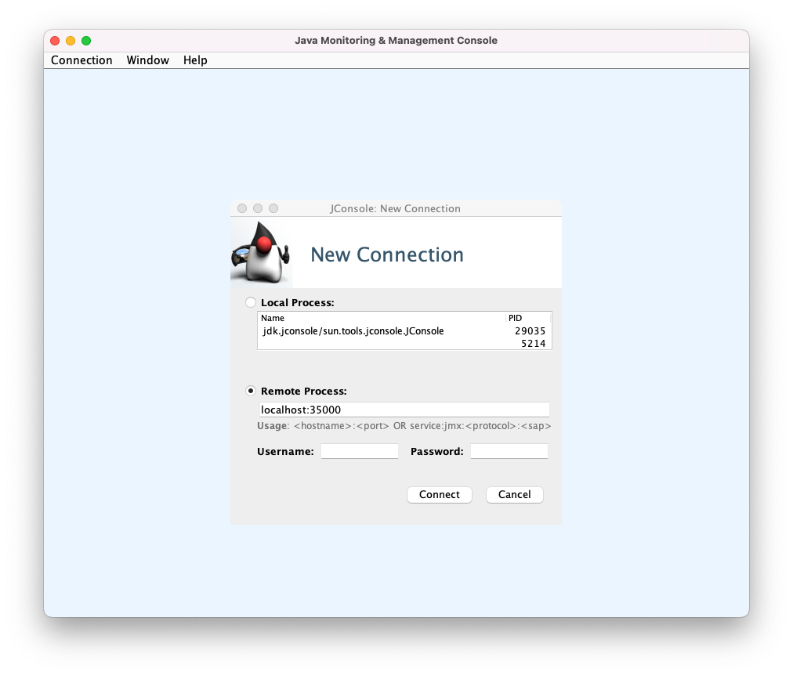
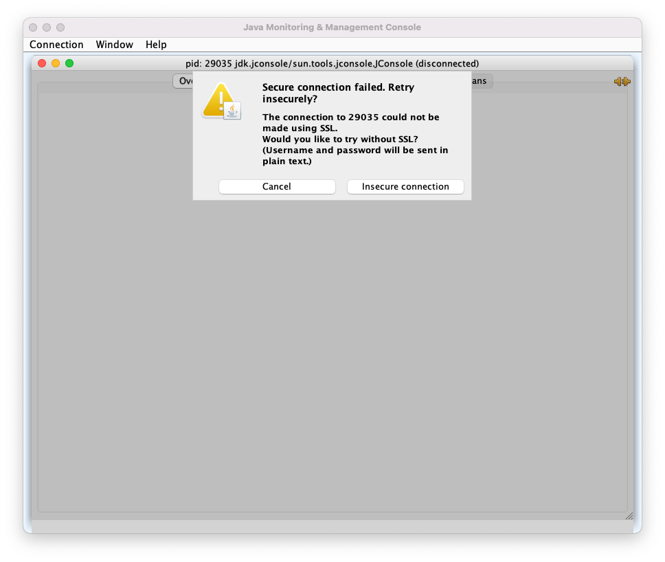
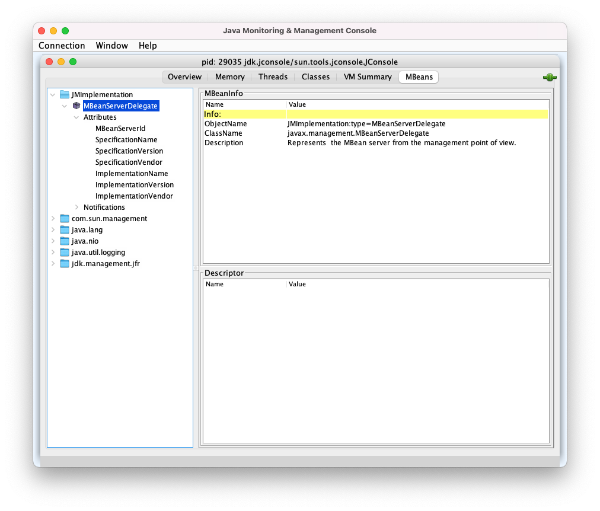

# Prometheus란 무엇인가?

> https://prometheus.io/docs/introduction/overview/

`Prometheus`는 `SoundCloud`에서 만든 오픈소스 시스템 모니터링 솔루션이며 `CNCF`에서 졸업한 프로젝트중 하나입니다. `Prometheus`의  대부분의 컴포넌트들은 `GO`로 작성되었으며 강력한 `Community`를 기반으로 개선 및 유지되고 있습니다.

  

`Prometheus`는`time series`형태로  `Metric`을 수집 및 저장하며, `PromQL`을 통해서 분석 및 집계할 수 있습니다.


## **Architecture**


- the main [Prometheus server](https://github.com/prometheus/prometheus) which scrapes and stores time series data
- [client libraries](https://prometheus.io/docs/instrumenting/clientlibs/) for instrumenting application code
- a [push gateway](https://github.com/prometheus/pushgateway) for supporting short-lived jobs
- special-purpose [exporters](https://prometheus.io/docs/instrumenting/exporters/) for services like HAProxy, StatsD, Graphite, etc.
- an [alertmanager](https://github.com/prometheus/alertmanager) to handle alerts
- various support tools


## 작동 방식

`Prometheus`는 `Pull`방식으로 작동함으로서, 여러 장점을 가집니다.

첫번째로,  

따라서, 수집을 하고자하는 서버를 수정하지 않고도 `Metric`수집과 관련된 설정을 변경 및 


 `yaml`파일에 정의되어 있는 `Job`을 기반으로 주기적으로 `Metric`을 수집하며 `HTTP endpoint`만 지원합니다. 일부 `Helm chart`의 경우, 별도의 `Job` 설정 없이  `Pod`의 `Annotation`을 기반으로 수집과 관련된 사항을 정의할 수 있습니다. 하지만, 기존과는 다른 방식으로 작동한다고 오해하여서는 안됩니다. 단순히 `yaml` 내에서 `Annotation`을 기반으로 수집 여부를 체크하도록 `Job`이 설정되어 있는 것입니다. 


Job

pull && Push gateway


**Push Vs. Pull**

- Push: 데이터를 가진 곳에서, 필요한 곳으로 보내준다.
- Pull: 데이터가 필요한 곳에서, 가진 곳에 접속하여 데이터를 긁어간다.


보통 모니터링 시스템의 에이전트들은 에이전트가 모니터링 시스템으로 메트릭을 보내는 Push 방식을 사용한다. 특히 Push 방식은 서비스가 오토 스켈링등으로 가변적일 경우에 유리하다. **Pulling 방식은 모니터링 대상이 가변적으로 변경될 경우, 모니터링 대상의 IP 주소들을 알 수 없기 때문에 어려운 점이 존재**한다.


Push 방식은 중앙집중형이기에, 중앙 모니터링 시스템이 데이터 수집 항목, 수집할 서버를 모두 관리하고 있다.
반면 Pull 방식은 분산형으로, 중앙시스템은 에이전트가 보내주는 데이터를 긁어갈 수만 있으며, 어떤 데이터를 수집할지 중앙에서 변경할 수 없다.

두 방식의 장단점은 관점에 따라 다르다.
수 많은 관점들이 있겠지만, 일부 관점들을 서술하자면 아래와 같다.

**수집 대상이 Auto-scaling 등으로 가변적일 경우, Push 방식이 Pull 방식보다 유리하다.**
만약 새로운 수집 Host가 추가될 경우, Push방식에서는 Host가 Data-Backend로 수집데이터를 보내주기에, 전송된 데이터를 받기만 하면된다. 하지만 Pull 방식에선 Data-Backend가 수집 Host로 접속하여 데이터를 긁어가야 하기에, 중앙서버에서 pull해갈 Host/Service의 목록들을 관리하여야 한다.

**수집 대상의 유연성 측면에서는 Pull 방식이 Push 방식보다 유리하다.**
Pull 방식에서 중앙서버는 데이터를 수동적으로 긁어가기만 하기에, Pull system에서 Data-Backend는 언제든지 새로운 데이터(unplanned metrics)들을 수용할 수 있으며 모든 메트릭을 요청할 수 있도록 구현되어있다. 하지만 Push 방식에선 메트릭을 중앙에서 정의하고 에이전트로 푸시하는 구조이며, 새로운 메트릭 수용을 위해서는 중앙 서버에서 해당 변경사항을 반영해줘야한다.

**보안 측면에서는 Push가 Pull보다 유리하다**
Pull방식은 수집 대상 서버에서 중앙 폴러가 접근할 수 있는 포트, IP 등을 수신 대기해야 한다.

**HA 측면에서 Pull이 Push 방식보다 유리하다.**
Data-Backend에서 장애가 발생하더라도, Pull 방식에선 수집 Host에 영향이 없으나 Push 방식에선 데이터 전송 재시도 등 Host에 영향이 생긴다.


## 요약

- 전반적인 추세 및 상태를 확인하기에는 매우 강력하나, `Pull` 방식의 한계로 인해 100% 정확성을 확보할 수는 없다. 예를 들어, `Pod`이나 `Job`이 짧은 시간동안만 지속되거나, 수집 간격 사이에 발생한 피크의 경우 `Metric`이 수집되지 않을 수 있다. 
- 물론, `Pushgateway`를 통해서 `Metric`을 `Push`함으로서 일부 문제를 해결할 수 있습니다. 하지만, 결국 `Prometheus`가 중개자인 `Pushgateway`를 대상으로 수집하는 것이므로 100%의 정확성이 필요한 상황에서는 사용을 지양하는 것이 좋습니다.   
- `HA`를 고려하지 않고 설계되어 있으므로, 고가용성이 필요한 경우 `Thanos`와 같은 오픈소스를 활용하여야 한다. 


## When does it fit?

Prometheus works well for recording any purely numeric time series. It fits both machine-centric monitoring as well as monitoring of highly dynamic service-oriented architectures. In a world of microservices, its support for multi-dimensional data collection and querying is a particular strength.

Prometheus is designed for reliability, to be the system you go to during an outage to allow you to quickly diagnose problems. Each Prometheus server is standalone, not depending on network storage or other remote services. You can rely on it when other parts of your infrastructure are broken, and you do not need to setup extensive infrastructure to use it.

## When does it not fit?

Prometheus values reliability. You can always view what statistics are available about your system, even under failure conditions. If you need 100% accuracy, such as for per-request billing, Prometheus is not a good choice as the collected data will likely not be detailed and complete enough. In such a case you would be best off using some other system to collect and analyze the data for billing, and Prometheus for the rest of your monitoring.


# Installation

## Helm Chart

> annotation 기반 vs rule? 기반


# 용어 or 개념

## Time Series

> Side note: time series name can be referred as `__name__` pseudo-label in Prometheus. So, `temperature{city="Paris"}` and `{__name__="temperature",city="Paris"}` refer to the same time series.

`Prometheus`에서 `time series`란 `timestamp`로 정렬되어있는 `(timestamp, value)` 형태로 구성된 쌍(`pair`)을 의미합니다. 이 때, `value`는 숫자를 의미하며 `interger` 또는 `fractional` 중 하나입니다. 모든 `time series`는 이름과 함께 key, value로 구성된 `label`들을 가지고 있습니다. 예를 들어 `requests_total{instance="fastapi",ip="127.0.0.1"}`은 이름이 `request_total`이며 2개의 라벨(`instance`, `ip`)을 가지고 있습니다. 

`time series`는 이름과 라벨을 이용하여 식별됩니다. 따라서, 동일한 이름을 가지더라도 label이 다르다면 서로 다른 `time series`로 취급됩니다. 

```
# different time series
requests_total{instance="fastapi",ip="127.0.0.1"}
requests_total{instance="fastapi",ip="127.0.0.2"}
```


## Counter

Counter is a time series starting from zero and containing non-decreasing sequence of values over time. The only exception is when the counter resets to zero after service restart. Counters are usually used for counting some events such as served requests. For example, `http_requests_total{method="GET",path="/foo/bar"}` counts the number of `GET` requests served at `/foo/bar` path.

Prometheus provides useful functions for counter metrics such as [rate()](https://docs.victoriametrics.com/MetricsQL.html#rate) and [increase()](https://docs.victoriametrics.com/MetricsQL.html#increase):

- `increase(m[d])` calculates the increase of counters matching `m` series selector over the given lookbehind window `d`. For example, `increase(http_requests_total[1h])` returns the number of requests over the last hour for time series with the name `http_requests_total`. It returns results individually per each time series matching `m`.
- `rate(m[d])` calculates the average per-second increase rate for counter metrics matching `m` series selector over the given lookbehind window `d`. For example, `rate(http_requests_total[1h])` calculates the average per-second requests rate over the last hour for time series with the name `http_requests_total`.

Important note: `increase()` and `rate()` functions expect only counters as their input. If you pass non-counter time series to these functions, then they may return unexpected (aka garbage) results.


## Range Vector


## Instant Vector


# JMX Exporter

> Repository: https://github.com/prometheus/jmx_exporter

## 사용 목적

`Kafka`, `Kafka Connect`등 `Java`로 구성된 어플리케이션의 경우, JMX(`Java Management Extensions`)을 통해서 실행중인 어플리케이션의 상태를 모니터링 할 수 있다. 하지만, `Prometheus`는 `HTTP endpoint`를 통해서만 `Metric`을 수집할 수 있으므로, `JMX Exporter`를 사용하여  `JMX`의 `Metric`을 수집 가능한 상태로 변경한다.


## Jconsole(Mbean) 을 통한 확인 방법

1. `Jconsole` 다운로드

    ```
    # linux
    https://www.oracle.com/java/technologies/downloads/#jdk19-linux
    
    # mac
    https://www.oracle.com/java/technologies/downloads/#jdk19-mac
    ```

2. `Jconsole` 실행 

    ```shell
    jconsole
    ```

3. `JMX server` 연결

    - Ex) `localhost:35000`에 연결하기

    

4. [Optional] 경고창이 뜨는 경우 `Insecure connection` 클릭
    

5. `Metric` 확인

    - 목록에 `Connector`관련 `Metric`이 없는 경우, 해당 `Connector`가 실행중인지 체크!

     

## 

## Config.yaml 작성법

```yaml
# Example
startDelaySeconds: 0
hostPort: 127.0.0.1:1234
username: 
password: 
jmxUrl: service:jmx:rmi:///jndi/rmi://127.0.0.1:1234/jmxrmi
ssl: false
lowercaseOutputName: false
lowercaseOutputLabelNames: false
whitelistObjectNames: ["org.apache.cassandra.metrics:*"]
blacklistObjectNames: ["org.apache.cassandra.metrics:type=ColumnFamily,*"]
rules:
  - pattern: 'org.apache.cassandra.metrics<type=(\w+), name=(\w+)><>Value: (\d+)'
    name: cassandra_$1_$2
    value: $3
    valueFactor: 0.001
    labels: {}
    help: "Cassandra metric $1 $2"
    cache: false
    type: GAUGE
    attrNameSnakeCase: false
```

| Name                      | Description                                                  |
| ------------------------- | ------------------------------------------------------------ |
| startDelaySeconds         | start delay before serving requests. Any requests within the delay period will result in an empty metrics set. |
| hostPort                  | The host and port to connect to via remote JMX. If neither this nor jmxUrl is specified, will talk to the local JVM. |
| username                  | The username to be used in remote JMX password authentication. |
| password                  | The password to be used in remote JMX password authentication. |
| jmxUrl                    | A full JMX URL to connect to. Should not be specified if hostPort is. |
| ssl                       | Whether JMX connection should be done over SSL. To configure certificates you have to set following system properties: `-Djavax.net.ssl.keyStore=/home/user/.keystore` `-Djavax.net.ssl.keyStorePassword=changeit` `-Djavax.net.ssl.trustStore=/home/user/.truststore` `-Djavax.net.ssl.trustStorePassword=changeit` |
| lowercaseOutputName       | Lowercase the output metric name. Applies to default format and `name`. Defaults to false. |
| lowercaseOutputLabelNames | Lowercase the output metric label names. Applies to default format and `labels`. Defaults to false. |
| whitelistObjectNames      | A list of [ObjectNames](http://docs.oracle.com/javase/6/docs/api/javax/management/ObjectName.html) to query. Defaults to all mBeans. |
| blacklistObjectNames      | A list of [ObjectNames](http://docs.oracle.com/javase/6/docs/api/javax/management/ObjectName.html) to not query. Takes precedence over `whitelistObjectNames`. Defaults to none. |

Metric names and label names are sanitized. All characters other than `[a-zA-Z0-9:_]` are replaced with underscores, and adjacent underscores are collapsed. There's no limitations on label values or the help text.

A minimal config is `{}`, which will connect to the local JVM and collect everything in the default format. Note that the scraper always processes all mBeans, even if they're not exported.

**Rule 설정법**

| rules             | A list of rules to apply in order, processing stops at the first matching rule. Attributes that aren't matched aren't collected. If not specified, defaults to collecting everything in the default format. |
| ----------------- | ------------------------------------------------------------ |
| pattern           | Regex pattern to match against each bean attribute. The pattern is not anchored. Capture groups can be used in other options. Defaults to matching everything. |
| attrNameSnakeCase | Converts the attribute name to snake case. This is seen in the names matched by the pattern and the default format. For example, anAttrName to an_attr_name. Defaults to false. |
| name              | The metric name to set. Capture groups from the `pattern` can be used. If not specified, the default format will be used. If it evaluates to empty, processing of this attribute stops with no output. |
| value             | Value for the metric. Static values and capture groups from the `pattern` can be used. If not specified the scraped mBean value will be used. |
| valueFactor       | Optional number that `value` (or the scraped mBean value if `value` is not specified) is multiplied by, mainly used to convert mBean values from milliseconds to seconds. |
| labels            | A map of label name to label value pairs. Capture groups from `pattern` can be used in each. `name` must be set to use this. Empty names and values are ignored. If not specified and the default format is not being used, no labels are set. |
| help              | Help text for the metric. Capture groups from `pattern` can be used. `name` must be set to use this. Defaults to the mBean attribute description, domain, and name of the attribute. |
| cache             | Whether to cache bean name expressions to rule computation (match and mismatch). Not recommended for rules matching on bean value, as only the value from the first scrape will be cached and re-used. This can increase performance when collecting a lot of mbeans. Defaults to `false`. |
| type              | The type of the metric, can be `GAUGE`, `COUNTER` or `UNTYPED`. `name` must be set to use this. Defaults to `UNTYPED`. |

**Pattern 설정법**

The format of the input matches against the pattern is

```
domain<beanpropertyName1=beanPropertyValue1, beanpropertyName2=beanPropertyValue2, ...><key1, key2, ...>attrName: value
```

| Part                   | Description                                                  |
| ---------------------- | ------------------------------------------------------------ |
| domain                 | Bean name. This is the part before the colon in the JMX object name. |
| beanPropertyName/Value | Bean properties. These are the key/values after the colon in the JMX object name. |
| keyN                   | If composite or tabular data is encountered, the name of the attribute is added to this list. |
| attrName               | The name of the attribute. For tabular data, this will be the name of the column. If `attrNameSnakeCase` is set, this will be converted to snake case. |
| value                  | The value of the attribute.                                  |

No escaping or other changes are made to these values, with the exception of if `attrNameSnakeCase` is set. The default help includes this string, except for the value.


# PromQL(Prometheus Query Language)

## Basic

### Expression Language data types

- **Instant vector**
    - a set of time series containing a single sample for each time series, all sharing the same timestamp
- **Range vector**
    - a set of time series containing a range of data points over time for each time series
- **Scalar**
    - a simple numeric floating point value
- ~~**String**~~
    - a simple string value
    - currently unused

사용 목적(그래프 작성, 수치 표기, ...)에 따라서 일부 타입들만 사용할 수 있습니다. 예를 들어 `instant vector`를 반환하는 표현법(`expression`)은 그래프로 변환할 수 있는 유일한 타입입니다. 

Depending on the use-case (e.g. when graphing vs. displaying the output of an expression), only some of these types are legal as the result from a user-specified expression. For example, an expression that returns an instant vector is the only type that can be directly graphed.


---

### Instant vector selectors

Instant vector selectors allow the selection of a set of time series and a single sample value for each at a given timestamp (instant): in the simplest form, only a metric name is specified. This results in an instant vector containing elements for all time series that have this metric name.

This example selects all time series that have the `http_requests_total` metric name:

```
http_requests_total
```

It is possible to filter these time series further by appending a comma separated list of label matchers in curly braces (`{}`).

This example selects only those time series with the `http_requests_total` metric name that also have the `job` label set to `prometheus` and their `group` label set to `canary`:

```
http_requests_total{job="prometheus",group="canary"}
```

It is also possible to negatively match a label value, or to match label values against regular expressions. The following label matching operators exist:

- `=`: Select labels that are exactly equal to the provided string.
- `!=`: Select labels that are not equal to the provided string.
- `=~`: Select labels that regex-match the provided string.
- `!~`: Select labels that do not regex-match the provided string.

Regex matches are fully anchored. A match of `env=~"foo"` is treated as `env=~"^foo$"`.

For example, this selects all `http_requests_total` time series for `staging`, `testing`, and `development` environments and HTTP methods other than `GET`.

```
http_requests_total{environment=~"staging|testing|development",method!="GET"}
```

Label matchers that match empty label values also select all time series that do not have the specific label set at all. It is possible to have multiple matchers for the same label name.

Vector selectors must either specify a name or at least one label matcher that does not match the empty string. The following expression is illegal:

```
{job=~".*"} # Bad!
```

In contrast, these expressions are valid as they both have a selector that does not match empty label values.

```
{job=~".+"}              # Good!
{job=~".*",method="get"} # Good!
```

Label matchers can also be applied to metric names by matching against the internal `__name__` label. For example, the expression `http_requests_total` is equivalent to `{__name__="http_requests_total"}`. Matchers other than `=` (`!=`, `=~`, `!~`) may also be used. The following expression selects all metrics that have a name starting with `job:`:

```
{__name__=~"job:.*"}
```

The metric name must not be one of the keywords `bool`, `on`, `ignoring`, `group_left` and `group_right`. The following expression is illegal:

```
on{} # Bad!
```

A workaround for this restriction is to use the `__name__` label:

```
{__name__="on"} # Good!
```


### Range Vector Selectors

Range vector literals work like instant vector literals, except that they select a range of samples back from the current instant. Syntactically, a [time duration](https://prometheus.io/docs/prometheus/latest/querying/basics/#time-durations) is appended in square brackets (`[]`) at the end of a vector selector to specify how far back in time values should be fetched for each resulting range vector element.

In this example, we select all the values we have recorded within the last 5 minutes for all time series that have the metric name `http_requests_total` and a `job` label set to `prometheus`:

```
http_requests_total{job="prometheus"}[5m]
```

### Time Durations

Time durations are specified as a number, followed immediately by one of the following units:

- `ms` - milliseconds
- `s` - seconds
- `m` - minutes
- `h` - hours
- `d` - days - assuming a day has always 24h
- `w` - weeks - assuming a week has always 7d
- `y` - years - assuming a year has always 365d

Time durations can be combined, by concatenation. Units must be ordered from the longest to the shortest. A given unit must only appear once in a time duration.

Here are some examples of valid time durations:

```
5h
1h30m
5m
10s
```


### Offset modifier

The `offset` modifier allows changing the time offset for individual instant and range vectors in a query.

For example, the following expression returns the value of `http_requests_total` 5 minutes in the past relative to the current query evaluation time:

```
http_requests_total offset 5m
```

Note that the `offset` modifier always needs to follow the selector immediately, i.e. the following would be correct:

```
sum(http_requests_total{method="GET"} offset 5m) // GOOD.
```

While the following would be *incorrect*:

```
sum(http_requests_total{method="GET"}) offset 5m // INVALID.
```

The same works for range vectors. This returns the 5-minute rate that `http_requests_total` had a week ago:

```
rate(http_requests_total[5m] offset 1w)
```

For comparisons with temporal shifts forward in time, a negative offset can be specified:

```
rate(http_requests_total[5m] offset -1w)
```

Note that this allows a query to look ahead of its evaluation time.


## Operator

### Binary operators

Prometheus's query language supports basic logical and arithmetic operators. For operations between two instant vectors, the [matching behavior](https://prometheus.io/docs/prometheus/latest/querying/operators/#vector-matching) can be modified.

#### Arithmetic binary operators

The following binary arithmetic operators exist in Prometheus:

- `+` (addition)
- `-` (subtraction)
- `*` (multiplication)
- `/` (division)
- `%` (modulo)
- `^` (power/exponentiation)

Binary arithmetic operators are defined between scalar/scalar, vector/scalar, and vector/vector value pairs.

**Between two scalars**, the behavior is obvious: they evaluate to another scalar that is the result of the operator applied to both scalar operands.

**Between an instant vector and a scalar**, the operator is applied to the value of every data sample in the vector. E.g. if a time series instant vector is multiplied by 2, the result is another vector in which every sample value of the original vector is multiplied by 2. The metric name is dropped.

**Between two instant vectors**, a binary arithmetic operator is applied to each entry in the left-hand side vector and its [matching element](https://prometheus.io/docs/prometheus/latest/querying/operators/#vector-matching) in the right-hand vector. The result is propagated into the result vector with the grouping labels becoming the output label set. The metric name is dropped. Entries for which no matching entry in the right-hand vector can be found are not part of the result.

#### Trigonometric binary operators

The following trigonometric binary operators, which work in radians, exist in Prometheus:

- `atan2` (based on https://pkg.go.dev/math#Atan2)

Trigonometric operators allow trigonometric functions to be executed on two vectors using vector matching, which isn't available with normal functions. They act in the same manner as arithmetic operators.

#### Comparison binary operators

The following binary comparison operators exist in Prometheus:

- `==` (equal)
- `!=` (not-equal)
- `>` (greater-than)
- `<` (less-than)
- `>=` (greater-or-equal)
- `<=` (less-or-equal)

Comparison operators are defined between scalar/scalar, vector/scalar, and vector/vector value pairs. By default they filter. Their behavior can be modified by providing `bool` after the operator, which will return `0` or `1` for the value rather than filtering.

**Between two scalars**, the `bool` modifier must be provided and these operators result in another scalar that is either `0` (`false`) or `1` (`true`), depending on the comparison result.

**Between an instant vector and a scalar**, these operators are applied to the value of every data sample in the vector, and vector elements between which the comparison result is `false` get dropped from the result vector. If the `bool` modifier is provided, vector elements that would be dropped instead have the value `0` and vector elements that would be kept have the value `1`. The metric name is dropped if the `bool` modifier is provided.

**Between two instant vectors**, these operators behave as a filter by default, applied to matching entries. Vector elements for which the expression is not true or which do not find a match on the other side of the expression get dropped from the result, while the others are propagated into a result vector with the grouping labels becoming the output label set. If the `bool` modifier is provided, vector elements that would have been dropped instead have the value `0` and vector elements that would be kept have the value `1`, with the grouping labels again becoming the output label set. The metric name is dropped if the `bool` modifier is provided.

#### Logical/set binary operators

These logical/set binary operators are only defined between instant vectors:

- `and` (intersection)
- `or` (union)
- `unless` (complement)

`vector1 and vector2` results in a vector consisting of the elements of `vector1` for which there are elements in `vector2` with exactly matching label sets. Other elements are dropped. The metric name and values are carried over from the left-hand side vector.

`vector1 or vector2` results in a vector that contains all original elements (label sets + values) of `vector1` and additionally all elements of `vector2` which do not have matching label sets in `vector1`.

`vector1 unless vector2` results in a vector consisting of the elements of `vector1` for which there are no elements in `vector2` with exactly matching label sets. All matching elements in both vectors are dropped.

### Vector matching

Operations between vectors attempt to find a matching element in the right-hand side vector for each entry in the left-hand side. There are two basic types of matching behavior: One-to-one and many-to-one/one-to-many.

#### Vector matching keywords

These vector matching keywords allow for matching between series with different label sets providing:

- `on`
- `ignoring`

Label lists provided to matching keywords will determine how vectors are combined. Examples can be found in [One-to-one vector matches](https://prometheus.io/docs/prometheus/latest/querying/operators/#one-to-one-vector-matches) and in [Many-to-one and one-to-many vector matches](https://prometheus.io/docs/prometheus/latest/querying/operators/#many-to-one-and-one-to-many-vector-matches)

#### Group modifiers

These group modifiers enable many-to-one/one-to-many vector matching:

- `group_left`
- `group_right`

Label lists can be provided to the group modifier which contain labels from the "one"-side to be included in the result metrics.

*Many-to-one and one-to-many matching are advanced use cases that should be carefully considered. Often a proper use of `ignoring(<labels>)` provides the desired outcome.*

*Grouping modifiers can only be used for [comparison](https://prometheus.io/docs/prometheus/latest/querying/operators/#comparison-binary-operators) and [arithmetic](https://prometheus.io/docs/prometheus/latest/querying/operators/#arithmetic-binary-operators). Operations as `and`, `unless` and `or` operations match with all possible entries in the right vector by default.*

#### One-to-one vector matches

**One-to-one** finds a unique pair of entries from each side of the operation. In the default case, that is an operation following the format `vector1 <operator> vector2`. Two entries match if they have the exact same set of labels and corresponding values. The `ignoring` keyword allows ignoring certain labels when matching, while the `on` keyword allows reducing the set of considered labels to a provided list:

```
<vector expr> <bin-op> ignoring(<label list>) <vector expr>
<vector expr> <bin-op> on(<label list>) <vector expr>
```

Example input:

```
method_code:http_errors:rate5m{method="get", code="500"}  24
method_code:http_errors:rate5m{method="get", code="404"}  30
method_code:http_errors:rate5m{method="put", code="501"}  3
method_code:http_errors:rate5m{method="post", code="500"} 6
method_code:http_errors:rate5m{method="post", code="404"} 21

method:http_requests:rate5m{method="get"}  600
method:http_requests:rate5m{method="del"}  34
method:http_requests:rate5m{method="post"} 120
```

Example query:

```
method_code:http_errors:rate5m{code="500"} / ignoring(code) method:http_requests:rate5m
```

This returns a result vector containing the fraction of HTTP requests with status code of 500 for each method, as measured over the last 5 minutes. Without `ignoring(code)` there would have been no match as the metrics do not share the same set of labels. The entries with methods `put` and `del` have no match and will not show up in the result:

```
{method="get"}  0.04            //  24 / 600
{method="post"} 0.05            //   6 / 120
```

#### Many-to-one and one-to-many vector matches

**Many-to-one** and **one-to-many** matchings refer to the case where each vector element on the "one"-side can match with multiple elements on the "many"-side. This has to be explicitly requested using the `group_left` or `group_right` [modifiers](https://prometheus.io/docs/prometheus/latest/querying/operators/#group-modifiers), where left/right determines which vector has the higher cardinality.

```
<vector expr> <bin-op> ignoring(<label list>) group_left(<label list>) <vector expr>
<vector expr> <bin-op> ignoring(<label list>) group_right(<label list>) <vector expr>
<vector expr> <bin-op> on(<label list>) group_left(<label list>) <vector expr>
<vector expr> <bin-op> on(<label list>) group_right(<label list>) <vector expr>
```

The label list provided with the [group modifier](https://prometheus.io/docs/prometheus/latest/querying/operators/#group-modifiers) contains additional labels from the "one"-side to be included in the result metrics. For `on` a label can only appear in one of the lists. Every time series of the result vector must be uniquely identifiable.

Example query:

```
method_code:http_errors:rate5m / ignoring(code) group_left method:http_requests:rate5m
```

In this case the left vector contains more than one entry per `method` label value. Thus, we indicate this using `group_left`. The elements from the right side are now matched with multiple elements with the same `method` label on the left:

```
{method="get", code="500"}  0.04            //  24 / 600
{method="get", code="404"}  0.05            //  30 / 600
{method="post", code="500"} 0.05            //   6 / 120
{method="post", code="404"} 0.175           //  21 / 120
```

### Aggregation operators

Prometheus supports the following built-in aggregation operators that can be used to aggregate the elements of a single instant vector, resulting in a new vector of fewer elements with aggregated values:

- `sum` (calculate sum over dimensions)
- `min` (select minimum over dimensions)
- `max` (select maximum over dimensions)
- `avg` (calculate the average over dimensions)
- `group` (all values in the resulting vector are 1)
- `stddev` (calculate population standard deviation over dimensions)
- `stdvar` (calculate population standard variance over dimensions)
- `count` (count number of elements in the vector)
- `count_values` (count number of elements with the same value)
- `bottomk` (smallest k elements by sample value)
- `topk` (largest k elements by sample value)
- `quantile` (calculate φ-quantile (0 ≤ φ ≤ 1) over dimensions)

These operators can either be used to aggregate over **all** label dimensions or preserve distinct dimensions by including a `without` or `by` clause. These clauses may be used before or after the expression.

```
<aggr-op> [without|by (<label list>)] ([parameter,] <vector expression>)
```

or

```
<aggr-op>([parameter,] <vector expression>) [without|by (<label list>)]
```

`label list` is a list of unquoted labels that may include a trailing comma, i.e. both `(label1, label2)` and `(label1, label2,)` are valid syntax.

`without` removes the listed labels from the result vector, while all other labels are preserved in the output. `by` does the opposite and drops labels that are not listed in the `by` clause, even if their label values are identical between all elements of the vector.

`parameter` is only required for `count_values`, `quantile`, `topk` and `bottomk`.

`count_values` outputs one time series per unique sample value. Each series has an additional label. The name of that label is given by the aggregation parameter, and the label value is the unique sample value. The value of each time series is the number of times that sample value was present.

`topk` and `bottomk` are different from other aggregators in that a subset of the input samples, including the original labels, are returned in the result vector. `by` and `without` are only used to bucket the input vector.

`quantile` calculates the φ-quantile, the value that ranks at number φ*N among the N metric values of the dimensions aggregated over. φ is provided as the aggregation parameter. For example, `quantile(0.5, ...)` calculates the median, `quantile(0.95, ...)` the 95th percentile. For φ = `NaN`, `NaN` is returned. For φ < 0, `-Inf` is returned. For φ > 1, `+Inf` is returned.

Example:

If the metric `http_requests_total` had time series that fan out by `application`, `instance`, and `group` labels, we could calculate the total number of seen HTTP requests per application and group over all instances via:

```
sum without (instance) (http_requests_total)
```

Which is equivalent to:

```
 sum by (application, group) (http_requests_total)
```

If we are just interested in the total of HTTP requests we have seen in **all** applications, we could simply write:

```
sum(http_requests_total)
```

To count the number of binaries running each build version we could write:

```
count_values("version", build_version)
```

To get the 5 largest HTTP requests counts across all instances we could write:

```
topk(5, http_requests_total)
```

### Binary operator precedence

The following list shows the precedence of binary operators in Prometheus, from highest to lowest.

1. `^`
2. `*`, `/`, `%`, `atan2`
3. `+`, `-`
4. `==`, `!=`, `<=`, `<`, `>=`, `>`
5. `and`, `unless`
6. `or`

Operators on the same precedence level are left-associative. For example, `2 * 3 % 2` is equivalent to `(2 * 3) % 2`. However `^` is right associative, so `2 ^ 3 ^ 2` is equivalent to `2 ^ (3 ^ 2)`.

### Operators for native histograms

Native histograms are an experimental feature. Ingesting native histograms has to be enabled via a [feature flag](https://prometheus.io/docs/prometheus/latest/querying/feature_flags/#native-histograms). Once native histograms have been ingested, they can be queried (even after the feature flag has been disabled again). However, the operator support for native histograms is still very limited.

Logical/set binary operators work as expected even if histogram samples are involved. They only check for the existence of a vector element and don't change their behavior depending on the sample type of an element (float or histogram).

The binary `+` operator between two native histograms and the `sum` aggregation operator to aggregate native histograms are fully supported. Even if the histograms involved have different bucket layouts, the buckets are automatically converted appropriately so that the operation can be performed. (With the currently supported bucket schemas, that's always possible.) If either operator has to sum up a mix of histogram samples and float samples, the corresponding vector element is removed from the output vector entirely.

All other operators do not behave in a meaningful way. They either treat the histogram sample as if it were a float sample of value 0, or (in case of arithmetic operations between a scalar and a vector) they leave the histogram sample unchanged. This behavior will change to a meaningful one before native histograms are a stable feature.

## Functions

### increase

`increase`는 `range vector`내의 `time series`의 증분을 계산합니다. `increase`는 지정된 `range vector`의 전체 시간 범위에 대해 외삽(추정)하므로, `counter`와 같은 정수 형태의 값을 대상으로 사용하더라도 실수가 반환될 수 있습니다. 

The following example expression returns the number of HTTP requests as measured over the last 5 minutes, per time series in the range vector:

```
increase(http_requests_total{job="api-server"}[5m])
```


`increase(v range-vector)` calculates the increase in the time series in the range vector. Breaks in monotonicity (such as counter resets due to target restarts) are automatically adjusted for. The increase is extrapolated to cover the full time range as specified in the range vector selector, so that it is possible to get a non-integer result even if a counter increases only by integer increments.

The following example expression returns the number of HTTP requests as measured over the last 5 minutes, per time series in the range vector:

```
increase(http_requests_total{job="api-server"}[5m])
```

`increase` acts on native histograms by calculating a new histogram where each compononent (sum and count of observations, buckets) is the increase between the respective component in the first and last native histogram in `v`. However, each element in `v` that contains a mix of float and native histogram samples within the range, will be missing from the result vector.

`increase` should only be used with counters and native histograms where the components behave like counters. It is syntactic sugar for `rate(v)` multiplied by the number of seconds under the specified time range window, and should be used primarily for human readability. Use `rate` in recording rules so that increases are tracked consistently on a per-second basis.


### rate

`rate`는 `range vector`내의 `time series`의 증분을 기반으로 초당 평균 증가량을 계산합니다. 


`rate(v range-vector)` calculates the per-second average rate of increase of the time series in the range vector. Breaks in monotonicity (such as counter resets due to target restarts) are automatically adjusted for. Also, the calculation extrapolates to the ends of the time range, allowing for missed scrapes or imperfect alignment of scrape cycles with the range's time period.

The following example expression returns the per-second rate of HTTP requests as measured over the last 5 minutes, per time series in the range vector:

```
rate(http_requests_total{job="api-server"}[5m])
```

`rate` acts on native histograms by calculating a new histogram where each compononent (sum and count of observations, buckets) is the rate of increase between the respective component in the first and last native histogram in `v`. However, each element in `v` that contains a mix of float and native histogram samples within the range, will be missing from the result vector.

`rate` should only be used with counters and native histograms where the components behave like counters. It is best suited for alerting, and for graphing of slow-moving counters.

Note that when combining `rate()` with an aggregation operator (e.g. `sum()`) or a function aggregating over time (any function ending in `_over_time`), always take a `rate()` first, then aggregate. Otherwise `rate()` cannot detect counter resets when your target restarts.


### irate

`irate(v range-vector)` calculates the per-second instant rate of increase of the time series in the range vector. This is based on the last two data points. Breaks in monotonicity (such as counter resets due to target restarts) are automatically adjusted for.

The following example expression returns the per-second rate of HTTP requests looking up to 5 minutes back for the two most recent data points, per time series in the range vector:

```
irate(http_requests_total{job="api-server"}[5m])
```

`irate` should only be used when graphing volatile, fast-moving counters. Use `rate` for alerts and slow-moving counters, as brief changes in the rate can reset the `FOR` clause and graphs consisting entirely of rare spikes are hard to read.

Note that when combining `irate()` with an [aggregation operator](https://prometheus.io/docs/prometheus/latest/querying/operators/#aggregation-operators) (e.g. `sum()`) or a function aggregating over time (any function ending in `_over_time`), always take a `irate()` first, then aggregate. Otherwise `irate()` cannot detect counter resets when your target restarts.


## Query Example


# Alerting

> https://prometheus.io/docs/alerting/latest/overview/


# Reference

- https://prometheus.io/docs/prometheus/latest/querying/basics/
- https://stackoverflow.com/questions/73686756/trying-to-understand-prometheus-data-model-in-a-more-simplified-way-and-how-does
- https://github.com/prometheus/jmx_exporter


